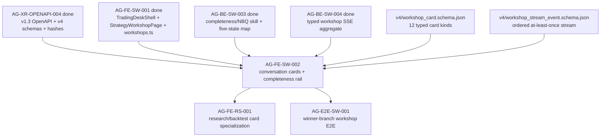

# AG-FE-SW-002 Sidecar Acceptance Packet

| Field | Value |
|---|---|
| Task ID | `AG-FE-SW-002-SIDECAR-ACCEPTANCE` |
| Helper kind | `acceptance_packet` |
| Parent task | `AG-FE-SW-002` - Conversation/result cards + completeness rail |
| Parent owner / reviewer | `Claude` / `Codex` |
| Sidecar owner / reviewer | `Codex` / `Claude` |
| Date | `2026-06-22` |
| Mutates canonical truth | `false` |
| Status | Ready for review |

## Purpose

This packet supports `AG-FE-SW-002` by spelling out the acceptance checklist,
dependency state, card-contract guardrails, stream handling guardrails, and
handoff notes for the Strategy Workshop conversation cards and completeness
rail.

It is support-only. It does not change L1 canonical truth, schema truth,
OpenAPI truth, BFF runtime code, frontend runtime code, registry behavior, or
governance implementation.

## Sources Used

| Source | Relevance |
|---|---|
| `AI_NAME=Codex ./scripts/ai-status.sh show AG-FE-SW-002` | Parent task title, owner/reviewer, dependencies, acceptance, and artifact scope. |
| `AI_NAME=Codex ./scripts/ai-status.sh show AG-FE-SW-002-SIDECAR-ACCEPTANCE` | Sidecar task identity, support-only boundary, and reviewer. |
| `AI_NAME=Codex ./scripts/ai-status.sh show AG-FE-SW-001` | Confirms TradingDeskShell, StrategyWorkshopPage, and workshops BFF client are merged/done. |
| `AI_NAME=Codex ./scripts/ai-status.sh show AG-XR-OPENAPI-004` | Confirms additive Agora v1.3 OpenAPI/capability/schema bundle is merged/done. |
| `AI_NAME=Codex ./scripts/ai-status.sh show AG-BE-SW-003` | Confirms completeness/NBQ skill and five-state state map are merged/done. |
| `AI_NAME=Codex ./scripts/ai-status.sh show AG-BE-SW-004` | Confirms workshop SSE aggregate stream is merged/done. |
| `docs/04/pantheon_agora_cross_repo_2026-06-20/design-closure-round2/03_workshop_sse_contract.md` | Typed SSE envelope, event catalogue, replay, heartbeat, sequence, and privacy rules. |
| `docs/04/pantheon_agora_cross_repo_2026-06-20/design-closure-round2/05_workshop_card_contracts.md` | Field-level workshop card envelope and payload contracts. |
| `docs/04/pantheon_agora_cross_repo_2026-06-20/design-closure-round2/07_dispatch_unblock_matrix.md` | Confirms `AG-FE-SW-002` unblocks after CARD + SSE contracts are available. |
| `services/control-plane/openapi/agora_v1_3.openapi.yaml` | Canonical v1.3 route and schema references for cards/readiness/research/stream surfaces. |
| `services/control-plane/specs/agora/v4/workshop_card.schema.json` | Canonical `WorkshopCard` enum, required envelope fields, and typed payload definitions. |
| `services/control-plane/specs/agora/v4/workshop_stream_event.schema.json` | Canonical stream event envelope and event type enum. |
| `services/control-plane/specs/agora/v4/strategy_readiness.schema.json` | Canonical readiness gate projection fields. |
| `services/control-plane/specs/agora/strategy_completeness.schema.json` | Existing completeness assessment schema for grade/dimensions/research readiness. |
| `execute-plans/src/lib/bff-v1/agora/workshops.ts` | Current frontend BFF helper for workshops/completeness/readiness/cards. |
| `execute-plans/src/agora/pages/strategy-workshop/StrategyWorkshopPage.tsx` | Current shell skeleton to compose conversation and rail components into. |

## Current Dependency State

| Dependency | Current state | Acceptance consequence for `AG-FE-SW-002` |
|---|---|---|
| `AG-FE-SW-001` | Archived `done`; `StrategyWorkshopPage`, `TradingDeskLayout`, and `workshops.ts` are merged. | Parent should extend the existing workshop page and BFF helper pattern. It should not create a parallel route tree or call raw `fetch()` from page/components. |
| `AG-XR-OPENAPI-004` | Archived `done`; v1.3 OpenAPI, v4 schemas, capability manifest, and bundle hashes are merged. | Parent must use the v1.3 `WorkshopCard`, `WorkshopStreamEvent`, `StrategyReadinessAssessment`, and research projection contracts. No local enum/route drift is allowed. |
| `AG-BE-SW-003` | Archived `done`; completeness/NBQ skill implements `confirmed`, `inferred_needs_confirmation`, `missing`, `weak`, `conflicting`, `not_applicable`. | The rail may display the five active states plus `not_applicable`, but must not write those display states back into `StrategyCompleteness.overall_grade` or dimension grade enums. |
| `AG-BE-SW-004` | Archived `done`; workshop SSE aggregate stream is implemented. | Parent can consume `/bff/agora/workshops/{workshop_id}/stream`, but must handle duplicate/gap/out-of-order events and avoid persisting raw private content in browser storage. |
| `AG-FE-RS-001` | Active `todo`; research-specific card work is planned after `AG-FE-SW-002`. | Parent should provide the generic `WorkshopCard` rendering hooks and only implement research/result presentation to the extent required by the current v1.3 card payload. Specialized research card polish can remain for RS001. |

## Contract Mismatch To Guard

The parent brief lists `EvidenceSummary` and `BacktestResult` cards. The merged
v1.3 `WorkshopCard.card_type` enum does **not** include `evidence_summary` or
`backtest_result`.

Canonical card types are:

```text
user_strategy_description
servant_reconstruction
completeness_update
missing_definition
next_question
research_plan_proposal
research_progress
research_result
consult_result
version_patch_proposal
version_compare
readiness_gate
```

Acceptance rule: `AG-FE-SW-002` must not add local card types, local enum
aliases, or route-specific ad hoc cards for `evidence_summary` /
`backtest_result`. If the parent owner believes those must be distinct
canonical cards, the correct action is to open a blocker/contract follow-up.
Within the current contract, evidence and backtest output should be represented
through `research_result` payload fields such as `metrics`, `findings`,
`artifact_refs`, `evidence_refs`, `backend`, and `data_cutoff`.

## Parent Acceptance Checklist

| Area | Acceptance rule | Reviewer check |
|---|---|---|
| Contract source | Use `WorkshopCard` semantics from `services/control-plane/specs/agora/v4/workshop_card.schema.json` and v1.3 route `/bff/agora/workshops/{workshop_id}/cards`. | No local card enum with `evidence_summary`, `backtest_result`, camelCase aliases, or fields absent from the schema. |
| Card envelope | Every rendered card respects `spec_version`, `card_id`, `card_type`, `workshop_id`, `sequence_no`, `status`, `title`, `payload`, `created_at`, plus optional `source_event_ids`, `workshop_version_id`, `strategy_spec_registry_id`, `summary`, `evidence_refs`, `allowed_actions`, `updated_at`. | Tests include at least one canonical envelope fixture and fail if required fields are ignored or renamed. |
| Card coverage | Conversation renderer has deliberate handling for all 12 canonical card types. Unsupported payload details may render a safe typed fallback, but unknown `card_type` must not be treated as trusted LLM markdown. | No card type is inferred from free text; renderer switches on `card_type` and displays unknowns as contract errors/fallbacks. |
| User description privacy | `user_strategy_description.payload.owner_visible_content` is owner-visible only and never placed in `localStorage`, `sessionStorage`, URL params, trace text, or cross-user cache keys. | Code search shows no browser storage write of card payload or message raw text. |
| Servant reconstruction | `servant_reconstruction` visibly separates trader-stated facts, servant inferences that need confirmation, uncertainties, contradictions, and proposed next actions. | UI does not present inferred fields as confirmed facts. |
| Completeness update | `completeness_update` uses payload fields `overall_grade`, `dimension_updates`, `blockers`, `research_ready`, `readiness_gates`, and `change_since_previous`. | No new `overallGrade`, `complete_score`, or custom scoring fields. |
| Missing definition / next question | `missing_definition` and `next_question` ask one material decision at a time and surface `why_it_matters` / `why_now`, answer options, deferral options, and consequences when present. | UI does not turn the card into a generic form containing every open gap. |
| Research plan/progress/result | `research_plan_proposal`, `research_progress`, and `research_result` render from typed payload fields and visibly label backend `mode` when result payload includes it. | No direct calls to research routes from the page; any helpers stay under `src/lib/bff-v1/agora/*`. |
| Consult result | `consult_result` renders participant refs, status, consensus, disagreements, risk notes, conditions, evidence, and freshness when present. | Central persona outputs do not imply access to unrelated raw user content. |
| Version patch/compare | `version_patch_proposal` and `version_compare` preserve proposal/version identifiers, validation state, conflicts/warnings, metric evidence class, and readiness diffs. | Accept/validate/reject/open-diff actions are disabled unless `allowed_actions` and BFF contract support them. |
| Readiness gate | `readiness_gate` and `StrategyReadinessAssessment` display three gates: `preliminary_research`, `full_validation`, `trading_room`, plus requirement states, blockers, assumptions, staleness, and `highest_ready_gate`. | No boolean `ready` shortcut replaces the gate model. |
| Completeness rail | `StrategyCompletenessRail` displays confirmed, inferred-needs-confirmation, missing, weak, conflicting, plus not-applicable/provisional treatment when available from the completeness skill projection; it also surfaces the next high-value decision. | The rail distinguishes display state map from `StrategyCompleteness.overall_grade` (`complete`, `mostly_complete`, `partial`, `incomplete`) and dimension grade (`complete`, `partial`, `missing`). |
| SSE application | Stream consumer accepts only `WorkshopStreamEvent` event types, dedupes by `event_id`, applies per-workshop `sequence_no` in order, refreshes snapshot on gaps, and ignores duplicates. | Tests cover duplicate event, gap event, and snapshot refresh path. |
| SSE replay/heartbeat | Client uses `Last-Event-ID` on reconnect, treats 45 seconds without event/heartbeat as degraded, and applies exponential backoff capped at 30 seconds. | No code assumes global ordering or keeps POST requests open for long-running work. |
| Cache key isolation | React Query/store/cache keys include tenant/user/workshop where available, or avoid cross-workshop shared card state if tenant/user is not exposed. | A guessed workshop ID must not let data leak across sessions in local client state. |
| BFF boundary | Pages/components use `src/lib/bff-v1/agora/*`; no component calls raw `fetch()` directly. | `rg -n "fetch\\(" execute-plans/src/agora` should not find new component/page fetches. |
| Agora safety boundary | Cards and rail never place broker orders, bind capital, write RuntimeBinding, or call Management routes. | No `/management`, broker, RuntimeBinding, capital, or order route appears in this slice. |

## Suggested Component Boundary For Parent Owner

The current `StrategyWorkshopPage` already fetches workshop, completeness,
readiness, and cards through `execute-plans/src/lib/bff-v1/agora/workshops.ts`
and renders a skeleton conversation/rail inline.

Recommended parent shape:

```text
execute-plans/src/agora/components/WorkshopCardRenderer.tsx
execute-plans/src/agora/components/StrategyCompletenessRail.tsx
execute-plans/src/agora/components/ResearchPlanCard.tsx
execute-plans/src/agora/components/ConsultResultCard.tsx
execute-plans/src/agora/pages/strategy-workshop/StrategyWorkshopPage.tsx
execute-plans/src/lib/bff-v1/agora/workshops.ts
```

This is a suggested composition boundary, not a new canonical artifact list.
If the parent owner needs extra small card components, they should remain under
`execute-plans/src/agora/components/` and keep all network logic in the BFF
helper layer.

## Dependency Map



## Suggested Parent Verification

Focused checks once parent implementation exists:

```bash
cd execute-plans
npx vitest run src/agora/pages/strategy-workshop/StrategyWorkshopPage.test.tsx src/agora/components/
rg -n "evidence_summary|backtest_result|EvidenceSummary|BacktestResult" src/agora src/lib/bff-v1/agora
rg -n "fetch\\(" src/agora
```

Repository-level checks that should remain part of parent closeout:

```bash
git diff --check
cd execute-plans
npx tsc --noEmit
npm run build:agora
PANTHEON_CONTRACT_ROOT=.. npm run test:contract
```

If repo-wide TypeScript, build, or contract tests have unrelated failures,
parent closeout should record the exact focused tests that passed and the
unrelated failure signature.

## Reviewer Handoff

To `Claude`, sidecar reviewer:

- Verify this packet accurately reflects the v1.3 workshop card enum, typed
  payloads, SSE event contract, completeness/NBQ state-map distinction, and
  support-only boundary.
- Pay particular attention to the `EvidenceSummary` / `BacktestResult` mismatch
  warning. That guardrail is intentionally strong because the parent task brief
  names cards that are not canonical v1.3 `WorkshopCard.card_type` values.
- If accepted, approve this sidecar and let the parent owner use it as the
  `AG-FE-SW-002` acceptance guardrail.

Suggested reviewer command:

```bash
AI_NAME=Claude REVIEW_FILE=support/sidecars/AG-FE-SW-002/AG-FE-SW-002-SIDECAR-ACCEPTANCE.md ./scripts/ai-status.sh approve AG-FE-SW-002-SIDECAR-ACCEPTANCE "Review approved: AG-FE-SW-002 acceptance packet captures v1.3 workshop card/SSE contracts, dependency state, completeness rail state-map boundary, no invented card enums, and support-only scope."
```

Prepared by `Codex` for the `AG-FE-SW-002-SIDECAR-ACCEPTANCE` support slice.
