# AG-TEST-ID-001 Sidecar Acceptance Packet

**Sidecar task:** `AG-TEST-ID-001-SIDECAR-ACCEPTANCE`
**Helper parent:** `AG-TEST-ID-001`
**Helper kind:** `acceptance_packet`
**Parent title:** User Route Isolation E2E
**Sidecar owner:** `Claude`
**Sidecar reviewer:** `Codex`
**Date:** `2026-06-22`
**Status:** `accepted`

> Scope constraint: support artifact only. This packet summarizes acceptance
> criteria, dependency routing, verification evidence, and reviewer attention
> points for `AG-TEST-ID-001`. It does not modify canonical truth, L1 policy,
> runtime code, registry code, governance implementation, or BFF implementation.

---

## 1. Executive Summary

`AG-TEST-ID-001` implements the **User Route Isolation E2E** test suite for the
Agora sub-system. Its responsibility is to assert all F2–F7 isolation guarantees
defined in the v1.3 design closure:

- **F2** Cross-repo contract/hash compatibility
- **F3** Cross-user workshop, private-content, SSE and intent isolation
- **F4** Agora token vs Management command-route isolation
- **F5** App/build isolation (monorepo short-term; dual-entry target-state)
- **F6** Privacy and storage: raw text absence, opaque refs, owner-decrypt audit
- **F7** Event and concurrency: sequence monotonicity, replay, idempotency

The canonical authority document for every test assertion is:

```
docs/04/pantheon_agora_cross_repo_2026-06-20/design-closure-round2/06_winner_branch_e2e_and_isolation.md
```

> [!NOTE]
> **Gate Status (updated 2026-06-22):** `AG-TEST-ID-001` implementation is now
> **in progress** — PR #2230 is merged/in review. The prior gate (isolation
> matrix spec §F2–F7 must be merged as `AG-DES-E2E-001` before test authoring)
> has lifted. Section 3A below records the original gate conditions as
> finalization checks; the parent owner should verify each path is present before
> closing the PR.

---

## 2. Sources Used

| Source File / Directory | Role |
|---|---|
| `docs/04/pantheon_agora_cross_repo_2026-06-20/design-closure-round2/06_winner_branch_e2e_and_isolation.md` | Authority spec: F1 winner-branch E2E steps and F2–F7 isolation matrix |
| `docs/04/pantheon_agora_cross_repo_2026-06-20/design-closure-round2/MASTER_SD_RESPONSE.md` | SD team's comprehensive v1.3 design response, §F isolation summary |
| `docs/04/pantheon_agora_cross_repo_2026-06-20/OPEN_DESIGN_GAPS_ROUND2_FOR_SD_TEAM_2026-06-21.md` | Gap inventory mapping AG-TEST-ID-001 to group F; confirms gated-not-blocked status |
| `docs/04/pantheon_agora_cross_repo_2026-06-20/design-closure-round2/07_dispatch_unblock_matrix.md` | Unblock condition: isolation matrix merged |
| `support/sidecars/AG-BE-ID-002/AG-BE-ID-002-SIDECAR-ACCEPTANCE.md` | Upstream sidecar listing AG-TEST-ID-001 as downstream dependency of servant provisioning |
| `support/sidecars/AG-DES-E2E-001/AG-DES-E2E-001-SIDECAR-ACCEPTANCE.md` | Upstream sidecar explicitly recording AG-TEST-ID-001 as an unblock downstream of AG-DES-E2E-001 |
| `support/sidecars/AG-BE-ID-004/AG-BE-ID-004-SIDECAR-BFF-HANDOFF.md` | BFF handoff packet for ContextBundle redaction, management_projection routes, and `RAW_PRIVATE_CONTENT_FORBIDDEN` error code required by ISO-M02/ISO-M03/ISO-M04/ISO-M08 |
| `support/sidecars/AG-FE-ID-001/AG-FE-ID-001-SIDECAR-BFF-HANDOFF-FOLLOWUP-43.md` | Latest execute-plans/Agora shell handoff; source for BFF client facade paths (execute-plans/src/lib/bff-v1/agora/) and Agora page targets (execute-plans/src/agora/) required by XR-05 and F5 checks |
| `services/control-plane/specs/agora/` | Schema bundle directory; test assertions must reference merged v4 schemas after AG-XR-OPENAPI-004 merges |
| `services/control-plane/openapi/` | OpenAPI directory; test assertions must reference merged `agora_v1_3.openapi.yaml` |

---

## 3. Attention Items (Preconditions & Safety Constraints)

Finalization checklist — verify the following before closing the parent PR:

### A. Isolation Matrix Merge Gate (Finalization Check)

The gate has lifted — PR #2230 for AG-TEST-ID-001 is merged/in review. The
following paths should still be confirmed present on `pantheon@dev` before the
PR is closed; if any are absent, the parent owner must record a blocker before
marking the task done:

| Required merge | Source task | Check |
|---|---|---|
| `docs/.../06_winner_branch_e2e_and_isolation.md` | AG-DES-E2E-001 | `git log --oneline -- docs/04/.../06_winner_branch_e2e_and_isolation.md` |
| `services/control-plane/specs/agora/v4/*.schema.json` | AG-DES-VERS-001 through AG-DES-CARD-001 | `ls services/control-plane/specs/agora/v4/` |
| `services/control-plane/openapi/agora_v1_3.openapi.yaml` | AG-XR-OPENAPI-004 | `git log --oneline -- services/control-plane/openapi/agora_v1_3.openapi.yaml` |
| `services/control-plane/specs/agora/bundle_index.v1_3.json` | AG-XR-OPENAPI-004 | `git log --oneline -- services/control-plane/specs/agora/bundle_index.v1_3.json` |

**Action required:** If any of the above paths are absent when closing PR #2230,
the parent owner must record a blocker rather than merging with stubs that could
silently pass.

### B. Explicit No-Order-Route Assertion (Safety-Critical)

ISO-M05 and the F1 Step 11 assertion are explicit safety gates:

- `ISO-M05`: Agora cannot create RuntimeBinding, capital binding, or broker order.
- F1 Step 11(f): `assert_no_broker_order_or_runtime_binding()` or an
  equivalent negative assertion must be present in the E2E test.

**Action required:** Every test class covering Agora-vs-Management isolation
must include this explicit negative assertion. A test that only checks HTTP 403
on the command route is insufficient — the test must also verify that no
RuntimeBinding, capital binding, or broker-order record was created as a side
effect.

### C. Private Content Never Leaks Into Management Projection

ISO-P01, ISO-M02, and ISO-M04 require verifying that raw workshop text never
appears in DB rows, logs, traces, audit entries, or Management-facing
projections.

**Action required:** Tests asserting redaction must verify the actual field
content (assert raw text absent from response/storage), not only the HTTP
status code.

### D. F5 Target-State Items (Deferred Marker Policy)

F5 target-state items (separate Agora/Management bundles, separate auth
audiences/CSP, independent deployment manifests) apply only after the dual-entry
migration completes. Until then:

- Mark each target-state F5 assertion with `pytest.mark.skip(reason="deferred: dual-entry migration")`
  or a clearly labelled `# TODO(dual-entry):` comment.
- Do not omit them entirely; the marker is the audit record that the test is
  intentionally deferred, not forgotten.

---

## 4. Parent Acceptance Checklist

### F2 — Cross-Repo Compatibility

| ID | Assertion | Test Required | Verification Method |
|---|---|---|---|
| XR-01 | Frontend manifest names exact backend v1.3 bundle index hash | Assert manifest `bundle_hash` == sha256 of `bundle_index.v1_3.json` bytes | Hash comparison test; must fail on any byte mutation |
| XR-02 | Generated TypeScript records source contract commit and schema hashes | Assert `__contract_commit` and `__schema_hash` fields present in generated types | Inspect generated file headers |
| XR-03 | CI fails on missing required capability | Remove a required capability; assert CI/test fails | Negative test parametrized over capability list |
| XR-04 | CI fails on schema/OpenAPI hash drift | Mutate a schema byte; assert hash mismatch error raised | Negative: mutate + verify error |
| XR-05 | `execute-plans` pages use BFF client facade; no direct API fetch | Assert no raw `fetch`/`axios` calls to `/api/agora/` in page code | AST/grep check in test or CI lint |
| XR-06 | Additive bundle does not modify prior frozen bundle hashes | Assert v1.2 hash embedded in v1.3 equals exact v1.2 bytes sha256 | Hash comparison against frozen values |
| XR-07 | Frontend build declares minimum compatible backend bundle version | Assert `minBackendBundle` field present in frontend manifest | Inspect manifest schema |

### F3 — Cross-User Isolation

| ID | Assertion | Expected HTTP Status | Test Required |
|---|---|---|---|
| ISO-U01 | User A cannot list/get/update User B workshop | 403 or 404 | Cross-user workshop CRUD test |
| ISO-U02 | User A cannot read User B private content, cards, SSE, or replay | 403 or 404; no content leakage | Content leakage test (assert body empty/redacted) |
| ISO-U03 | User A cannot read/modify User B DashboardRecipe | 403 or 404 | Cross-user dashboard recipe test |
| ISO-U04 | User A cannot read User B candidate pool, decision event, or intent | 403 or 404 | Cross-user candidate pool and intent test |
| ISO-U05 | Guessed IDs return 404/403 without existence leakage | 404 or 403; no body hint | Assert response body does not disclose resource existence |
| ISO-U06 | Frontend query/cache keys include tenant + user + aggregate | Key format includes all three scope components | Inspect cache key construction in client code |
| ISO-U07 | SSE authorization checked before connect and replay | 401 on unauthorized connect; 403 on wrong-user replay | SSE auth test |
| ISO-U08 | Idempotency keys scoped by tenant/user/operation | Two users with same operation-id get independent results | Idempotency isolation test |

### F4 — Agora vs Management Isolation

| ID | Assertion | Expected Result | Test Required |
|---|---|---|---|
| ISO-M01 | Agora user token denied all Management command routes | 403 | Parametrized over Management command route list |
| ISO-M02 | Management projection receives redacted workshop content only | Raw text absent from Management-visible projection | Assert projection body; check raw text field absent |
| ISO-M03 | Management cannot decrypt private content through normal APIs | Private content ref is opaque; decrypt path requires break-glass | Assert /private-content endpoint returns opaque ref only |
| ISO-M04 | Institutional persona receives minimized/redacted ContextBundle | ContextBundle fields are subset; raw private content absent | Assert ContextBundle schema; raw text field absent |
| ISO-M05 | Agora cannot create RuntimeBinding, capital binding, or broker order | 403 or error; no side-effect record created | **Explicit negative assertion required** |
| ISO-M06 | Canary/live actions are handoff requests only | action type = `governed_handoff_request`; no direct execution record | Assert action record type |
| ISO-M07 | Break-glass access separate, audited, unavailable to ordinary Management users | Elevated scope required; audit log entry created | Break-glass route test; check audit log |
| ISO-M08 | Institutional learning requires consent/privacy gates; never extends raw-content retention | Writebacks contain only redacted refs; raw text absent | Assert writeback schema |

### F5 — App/Build Isolation

**Short-term monorepo acceptance (must pass):**

| Check | Criterion | Status |
|---|---|---|
| Route guard + BFF auth both tested | Hiding a menu is not security; auth enforced at BFF layer | Must pass |
| Agora code does not call Management command clients | No Management import path in Agora page/component code | Must pass |

**Target-state acceptance (after dual-entry migration — mark as `deferred`):**

| Check | Criterion | Deferred Condition |
|---|---|---|
| Agora and Management produce separate bundles | Separate build output directories | Until dual-entry migration completes |
| Agora bundle contains no Management page chunks | Bundle analysis shows no cross-app chunks | Until dual-entry migration completes |
| Separate auth audiences and CSP | Each app has independent audience claim and CSP header | Until dual-entry migration completes |
| Independent deployment manifests | Each app has its own manifest file | Until dual-entry migration completes |

### F6 — Privacy and Storage

| ID | Assertion | Test Required |
|---|---|---|
| ISO-P01 | Raw workshop text absent from DB rows/logs/traces/audit | Assert storage rows contain only private ref, not raw text |
| ISO-P02 | Private object refs are opaque | Assert ref is a UUID/hash, not a path or plaintext |
| ISO-P03 | Owner-only decrypt is audited | Assert audit log entry created on decrypt |
| ISO-P04 | Retention/expiry/delete behavior tested | Assert expired content returns 404 or empty; delete is final |
| ISO-P05 | Redaction failure is fail-closed | Assert service returns error/empty (not raw content) on redaction failure |
| ISO-P06 | Central personas cannot receive raw private prompt by default | Assert ContextBundle for central persona contains no raw prompt |

### F7 — Event and Concurrency Acceptance

| ID | Assertion | Test Required |
|---|---|---|
| EV-01 | Per-workshop `sequence_no` is monotonic | Assert sequence_no increments with each event |
| EV-02 | Delivery is at-least-once and client dedupes | Assert duplicate delivery handled idempotently |
| EV-03 | Last-Event-ID replay works in support window | Assert replay returns events from Last-Event-ID onward |
| EV-04 | Replay gap returns `SSE_REPLAY_UNAVAILABLE` | Assert correct error code on out-of-window replay |
| EV-05 | Stale If-Match returns 409 and has no side effect | Assert 409 returned; resource unchanged |
| EV-06 | Repeated Idempotency-Key returns prior command result | Assert identical response on repeat; no duplicate side effect |
| EV-07 | First persisted message acknowledgement meets p95 <2s target | Record observed latency; mark as evidence (not blocking if infra unavailable) |

---

## 5. Dependency Map

### Upstream: What AG-TEST-ID-001 Depends On

| Dependency | Artifact Required on dev | Source Task | Must be Merged Before |
|---|---|---|---|
| Isolation matrix spec (F2–F7) | `docs/04/.../06_winner_branch_e2e_and_isolation.md` | AG-DES-E2E-001 | Test authoring begins |
| Winner-branch E2E spec (F1) | Same file, §F1 steps 1–11 | AG-DES-E2E-001 | Test authoring begins |
| v4 schema bundle | `services/control-plane/specs/agora/v4/*.schema.json` | AG-DES-VERS-001 … AG-DES-CARD-001 | Any schema assertion |
| v1.3 OpenAPI | `services/control-plane/openapi/agora_v1_3.openapi.yaml` | AG-XR-OPENAPI-004 | Route and response shape assertions |
| v1.3 bundle index | `services/control-plane/specs/agora/bundle_index.v1_3.json` | AG-XR-OPENAPI-004 | XR-01, XR-06 hash assertions |
| Servant provisioning (user-private servant) | `services/control-plane/bff/agora/servant/router.py` (non-stub) | AG-BE-ID-002 | Any F3/F4 test needing an authenticated user with a servant |
| User scope and servant policy | `AG-BE-ID-001` artifacts | AG-BE-ID-001 | Auth identity enforcement for cross-user assertions |
| ContextBundle redaction boundary | `integrations/openclaw/adapter/agora_context_bundle.py`, management_projection routes, `RAW_PRIVATE_CONTENT_FORBIDDEN` error code | AG-BE-ID-004 | ISO-M02, ISO-M03, ISO-M04, ISO-M08 assertions |
| execute-plans Agora shell and BFF client facade | `execute-plans/src/agora/` pages, `execute-plans/src/lib/bff-v1/agora/` facade | AG-FE-ID-001 | XR-05 BFF client assertion; F5 app/build isolation checks |

```mermaid
graph TD
    DES_E2E_001["AG-DES-E2E-001<br/>E2E + Isolation spec"] -->|isolation matrix merged| AG_TEST_ID_001["AG-TEST-ID-001<br/>User Route Isolation E2E"]
    AG_XR_OPENAPI_004["AG-XR-OPENAPI-004<br/>v1.3 OpenAPI + bundle index"] -->|schemas/hashes available| AG_TEST_ID_001
    AG_DES_VERS_001["AG-DES-VERS-001<br/>VersionPatch/Readiness schemas"] -->|v4 schemas| AG_TEST_ID_001
    AG_DES_RS_001["AG-DES-RS-001<br/>Research schemas"] -->|v4 schemas| AG_TEST_ID_001
    AG_DES_SSE_001["AG-DES-SSE-001<br/>SSE typed contract"] -->|v4 schemas| AG_TEST_ID_001
    AG_DES_TR_001["AG-DES-TR-001<br/>Trading Room schemas"] -->|v4 schemas| AG_TEST_ID_001
    AG_DES_CARD_001["AG-DES-CARD-001<br/>Workshop card contracts"] -->|v4 schemas| AG_TEST_ID_001
    AG_BE_ID_001["AG-BE-ID-001<br/>User Scope & Servant Policy"] -->|auth identity enforcement| AG_TEST_ID_001
    AG_BE_ID_002["AG-BE-ID-002<br/>OpenClaw Servant Provisioning"] -->|user-private servant available| AG_TEST_ID_001
    AG_BE_ID_004["AG-BE-ID-004<br/>ContextBundle Redaction<br/>+ management_projection routes"] -->|RAW_PRIVATE_CONTENT_FORBIDDEN;<br/>ISO-M02/M03/M04/M08 surfaces| AG_TEST_ID_001
    AG_FE_ID_001["AG-FE-ID-001<br/>execute-plans Agora Shell<br/>+ BFF client facade"] -->|execute-plans/src/agora/ pages;<br/>XR-05 + F5 checks| AG_TEST_ID_001
```



### Downstream: What Depends On AG-TEST-ID-001

AG-TEST-ID-001 is the terminal isolation gate for the v1.3 Agora acceptance
cycle. No further downstream task is gated on it in the current dispatch
unblock matrix.

---

## 6. Suggested Parent Verification Plan

When all upstream dependencies are merged, the parent owner should run:

```bash
# 1. Verify isolation matrix tests exist and all IDs are covered
python3 -m pytest services/control-plane/tests/agora/test_agora_isolation_matrix.py \
  -v --co 2>&1 | grep "test_" | wc -l
# Expected: at least 35 test cases covering F2-F7 (XR-01..07, ISO-U01..08,
#           ISO-M01..08, F5 checks, ISO-P01..06, EV-01..07)

# 2. Run isolation matrix tests (requires merged upstream contracts)
python3 -m pytest services/control-plane/tests/agora/test_agora_isolation_matrix.py -v

# 3. Explicitly verify the no-broker-order assertion fires correctly
python3 -m pytest services/control-plane/tests/agora/test_agora_isolation_matrix.py \
  -k "test_agora_cannot_create_runtime_binding" -v

# 4. Verify frozen bundle hashes have not drifted (XR-01, XR-06)
python3 scripts/verify_bundle_hashes.py \
  --index services/control-plane/specs/agora/bundle_index.v1_3.json

# 5. Verify no raw fetch calls in execute-plans pages (XR-05)
# execute-plans is a root-level directory, not under services/
grep -rn "fetch\|axios" execute-plans/src/agora/ \
  --include="*.ts" --include="*.tsx" | grep -v "bff-client" || echo "XR-05 pass"
```

Record the output of each command in the task finalization message.

---

## 7. Support-Only Boundary Confirmation

- No L1 canonical policy or architecture document has been edited or superseded.
- No BFF router, registry, governance, runtime, or OpenClaw adapter implementation was changed.
- No v1/v1.1/v1.2 frozen bundle indexes or OpenAPI files have been modified.
- The intended sidecar artifact is this file:
  `support/sidecars/AG-TEST-ID-001/AG-TEST-ID-001-SIDECAR-ACCEPTANCE.md`

---

## 8. Reviewer Approval and Owner Closeout

Reviewer (`Codex`) should verify:

1. All F2–F7 assertion IDs (XR-01..07, ISO-U01..08, ISO-M01..08, F5 checks,
   ISO-P01..06, EV-01..07) are present in the acceptance checklist.
2. The upstream dependency table accurately reflects the merged artifact paths
   required for each test class.
3. No L1 canonical truth, BFF runtime, registry, governance, or OpenClaw
   implementation changes are included.
4. ISO-M05 / F1 Step 11(f) explicit negative assertion requirement is
   documented.
5. F5 target-state deferred items are clearly marked with the deferred
   condition, not silently dropped.

Owner closeout scope for `Claude` is limited to making this support packet and
task brief metadata durable through the task branch PR, then running the
canonical `done` status command after merge.

Closeout verification:
- `AI_NAME=Claude ./scripts/ai-status.sh show AG-TEST-ID-001-SIDECAR-ACCEPTANCE`
- `git diff --check -- support/sidecars/AG-TEST-ID-001/AG-TEST-ID-001-SIDECAR-ACCEPTANCE.md .orchestrator/task-briefs/ag_test_id_001_sidecar_acceptance.md`

*Prepared by Claude for the AG-TEST-ID-001-SIDECAR-ACCEPTANCE support slice.*
