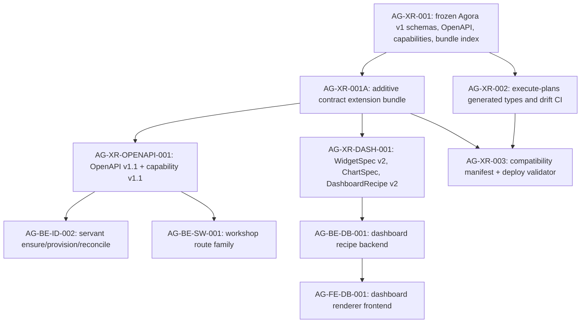

# AG-XR-001A Sidecar Acceptance Packet

- Parent task: `AG-XR-001A` - additive Agora contract extension bundle
- Helper task: `AG-XR-001A-SIDECAR-ACCEPTANCE`
- Helper kind: `acceptance_packet`
- Owner: `Codex`
- Reviewer: `Codex2`
- Prepared: `2026-06-20`
- Mutates canonical truth: `no`

This is a support artifact only. It does not implement the extension bundle,
modify the frozen `AG-XR-001` contract, edit OpenAPI, update capability
manifests, generate TypeScript, or change runtime / registry / governance
behavior.

## Purpose

`AG-XR-001A` exists to preserve the reviewed `AG-XR-001` Agora v1 contract
bundle while publishing an additive v1.1/v2 extension bundle that downstream
tasks can consume. This packet gives the parent owner and reviewer an
acceptance checklist, dependency map, and handoff guardrails for that parent
slice.

The important acceptance distinction is:

- `AG-XR-001` remains immutable and must keep passing its existing digest check.
- `AG-XR-001A` must add new extension artifacts and a separate extension bundle
  index instead of changing v1 hashes in place.
- Downstream tasks remain blocked until the extension artifacts are committed,
  reviewed, hashed, and mirrored/generated where required.

## Sources Read

| Source | Evidence used |
|---|---|
| `AI_COLLABORATION_GUIDE.md` | Sidecar lifecycle, status command, and support-only workflow rules. |
| `ai-status.json` through `AI_NAME=Codex ./scripts/ai-status.sh show AG-XR-001A-SIDECAR-ACCEPTANCE` | Confirms active sidecar ownership, reviewer, artifact path, helper parent, and support-only acceptance. |
| `.orchestrator/task-briefs/ag_xr_001a_sidecar_acceptance.md` | Confirms this helper prepares an acceptance packet and dependency map without canonical edits. |
| `.orchestrator/task-briefs/ag_xr_001.md` | Confirms `AG-XR-001` is done and froze 13 schemas, 61 OpenAPI operations, 7 capabilities, and reproducible bundle hashes. |
| `docs/04/pantheon_agora_cross_repo_2026-06-20/review_ag_xr_001_claude2.md` | Reviewer-approved evidence for the frozen v1 contract bundle. |
| `docs/04/pantheon_agora_cross_repo_2026-06-20/SD_2026-06-20.md` | Canonical v1 contract scope, freeze rule, route list, capability names, and §22.1 bundle definition. |
| `docs/04/pantheon_agora_cross_repo_2026-06-20/contract-closure/INDEX.md` | Contract-closure authority note and decision summary for additive extension work. |
| `contract-closure/02_schema_coexistence_and_migration.md` | Required immutable-base and additive-extension artifact layout. |
| `contract-closure/03_servant_and_workshop_contracts.md` | New servant/workshop routes and capability implications for v1.1. |
| `contract-closure/04_dashboard_crud_and_concurrency.md` | Dashboard v2 CRUD, ETag, idempotency, and capability implications. |
| `contract-closure/05_execute_plans_agora_ui_ia_and_dependencies.md` | Frontend dependency and IA constraints that depend on v2 generated types. |
| `contract-closure/06_compatibility_manifest_and_hash_rules.md` | Cross-repo manifest path, commit semantics, exact-byte hash rules, and deploy gate conditions. |
| `contract-closure/07_dispatch_unblock_matrix_v2.md` | Parent/downstream dependency order and unblock evidence. |
| `contract-closure/ARCHIVE_NOTES.md` | Archival reconciliation: prose docs are authority; seed YAML is incomplete; `bundle_index.v1_1.json` must be generated by `AG-XR-001A`. |
| `services/control-plane/specs/agora/capability_manifest.json` | Frozen v1 capability list and safety notes. |
| `services/control-plane/specs/agora/bundle_index.json` | Frozen v1 per-file digest baseline. |
| `scripts/agora_schema_bundle.py` | Existing v1 digest verification behavior to preserve. |

`current-work.md` and the full `ai-activity-log.jsonl` were not read.

## Current Repository Observation

As of this sidecar packet, the repo still has the frozen v1 Agora bundle:

- `services/control-plane/specs/agora/*.schema.json`
- `services/control-plane/specs/agora/capability_manifest.json`
- `services/control-plane/specs/agora/bundle_index.json`
- `services/control-plane/openapi/agora_v1.openapi.yaml`

The parent extension artifacts are not present yet under
`services/control-plane/specs/agora/v2/`, and
`services/control-plane/openapi/agora_v1_1.openapi.yaml` is not present yet.
That is expected for this support slice; implementation belongs to the parent
or follow-on contract tasks.

## Parent Acceptance Checklist

| Check | Expected parent evidence | Sidecar stance |
|---|---|---|
| Preserve `AG-XR-001` immutable base | No edits to `widget_spec.schema.json`, `dashboard_recipe.schema.json`, `capability_manifest.json`, `agora_v1.openapi.yaml`, or `bundle_index.json`; `python3 scripts/agora_schema_bundle.py --verify` still passes. | Required. |
| Add extension schema directory | New files land under `services/control-plane/specs/agora/v2/`: `widget_spec_v2.schema.json`, `chart_spec_v1.schema.json`, `dashboard_recipe_v2.schema.json`, `compatibility_manifest.schema.json`, and `capability_manifest_v1_1.json`. | Parent implementation. |
| Add OpenAPI extension without replacing v1 | `services/control-plane/openapi/agora_v1_1.openapi.yaml` exists and covers the full prose route set, not only the seed YAML subset. | Parent implementation. |
| Generate extension bundle index | `services/control-plane/specs/agora/bundle_index.v1_1.json` exists with `bundle_version: "1.1"`, an `extends` object referencing v1 `bundle_index.json`, the raw-byte sha256 of that base index, and per-file digests for the extension files. | Parent implementation. |
| Keep v1/v2 names explicit | Generated and documented contracts distinguish `WidgetSpecV1` from `WidgetSpecV2`, `DashboardRecipeV1` from `DashboardRecipeV2`, and do not silently coerce v1 custom widgets into v2. | Required. |
| Carry v1.1 capability semantics | `capability_manifest_v1_1.json` extends the frozen v1 manifest and includes `agora.servant.v1`, `agora.workshop.v1` at version `1.1`, and `agora.dashboard.v2` without widening broker, capital, or RuntimeBinding authority. | Parent implementation. |
| Encode compatibility manifest schema | `compatibility_manifest.schema.json` uses `contract_family: "agora.v1.1"`, exact 40-char commit pins, exact-byte `base_bundle_index_sha256`, `extension_bundle_index_sha256`, `openapi_sha256`, generated types hash, required capabilities, and fail-closed compatibility status. | Parent implementation. |
| Define generated manifest path | Both repos use `docs/contracts/agora/dev-compatibility-manifest.json`; generated manifests marked `generated=true` are not hand-edited. | Required by contract closure. |
| Preserve safe Agora authority | Extension artifacts do not introduce live-order routing, broker execution, capital binding, RuntimeBinding writes, or Management-plane authority. | Reviewer should reject violations. |
| Verify seed/prose completeness | Parent treats `contract-closure/*.md` prose as authority and resolves archive-note gaps in the seed OpenAPI: servant session, workshop research/consult/conclude, and dashboard/widget feedback/plugin routes. | Required before unblock. |

## Dependency Map



Durable interpretation:

- `AG-XR-001` is a prerequisite but not an edit target for `AG-XR-001A`.
- `AG-XR-001A` should unblock only contract coexistence and extension-bundle
  mechanics; it is not the runtime implementation of servant, workshop, or
  dashboard behavior.
- `AG-XR-OPENAPI-001` and `AG-XR-DASH-001` consume the extension mechanics to
  publish complete route/schema contracts.
- `AG-XR-003` depends on both cross-repo type alignment and the v1.1 manifest
  hash semantics before it can implement a meaningful deployment gate.

## Reviewer Questions For Codex2

| Question | Expected reviewer stance |
|---|---|
| Does this packet preserve the support-only boundary? | Approve only if no canonical specs, OpenAPI, capability files, runtime code, or registry/governance implementation were edited by this sidecar. |
| Does the parent checklist keep `AG-XR-001` immutable? | Reject any parent plan that updates v1 files in place instead of adding extension artifacts. |
| Does the dependency map match `07_dispatch_unblock_matrix_v2.md`? | Approve if AG-XR-001A is treated as predecessor for OpenAPI v1.1, dashboard v2, and compatibility manifest work. |
| Are the seed-artifact limitations represented? | Approve only if parent review knows the seed OpenAPI is incomplete and prose docs are authority. |
| Are broker/capital/runtime write boundaries explicit? | Approve only if no new live-order, capital-binding, or RuntimeBinding authority is implied. |

## Suggested Handoff

If this packet is acceptable, reviewer `Codex2` can treat it as the support
acceptance and dependency map for `AG-XR-001A-SIDECAR-ACCEPTANCE`.

Recommended status handoff message:

```text
Support packet ready for AG-XR-001A: acceptance checklist and dependency map are
in support/sidecars/AG-XR-001A/AG-XR-001A-SIDECAR-ACCEPTANCE.md. The packet
preserves the support-only boundary, keeps AG-XR-001 immutable, and identifies
the extension bundle, compatibility manifest, OpenAPI v1.1, dashboard v2, and
downstream unblock checks for parent review.
```

## Verification

Commands run while preparing this packet:

```bash
git status -sb
git branch --show-current
git remote -v
AI_NAME=Codex ./scripts/ai-status.sh show AG-XR-001A-SIDECAR-ACCEPTANCE
python3 scripts/agora_schema_bundle.py --verify
GIT_INDEX_FILE=/tmp/git-index-check-AG-XR-001A-SIDECAR-ACCEPTANCE git read-tree HEAD
GIT_INDEX_FILE=/tmp/git-index-check-AG-XR-001A-SIDECAR-ACCEPTANCE git add -N support/sidecars/AG-XR-001A/AG-XR-001A-SIDECAR-ACCEPTANCE.md
GIT_INDEX_FILE=/tmp/git-index-check-AG-XR-001A-SIDECAR-ACCEPTANCE git diff --check -- support/sidecars/AG-XR-001A/AG-XR-001A-SIDECAR-ACCEPTANCE.md
rg -n "^(TBD|TODO|PLACEHOLDER|FIXME)$" support/sidecars/AG-XR-001A/AG-XR-001A-SIDECAR-ACCEPTANCE.md
```

Results:

- `python3 scripts/agora_schema_bundle.py --verify`: pass; all 15 indexed v1
  Agora files reported `OK`.
- private-index `git diff --check -- support/sidecars/AG-XR-001A/AG-XR-001A-SIDECAR-ACCEPTANCE.md`:
  pass.
- `rg -n "^(TBD|TODO|PLACEHOLDER|FIXME)$" ...`: pass; no matches.

## Sidecar Completion Criteria

This sidecar is ready for review when:

- this support packet exists at the declared artifact path;
- it maps parent acceptance to concrete artifacts and verification evidence;
- it records the dependency/unblock relationship without broadening scope;
- it preserves the "no canonical truth changes" sidecar boundary;
- it is handed off to `Codex2` for review and possible absorption by the parent
  owner.
