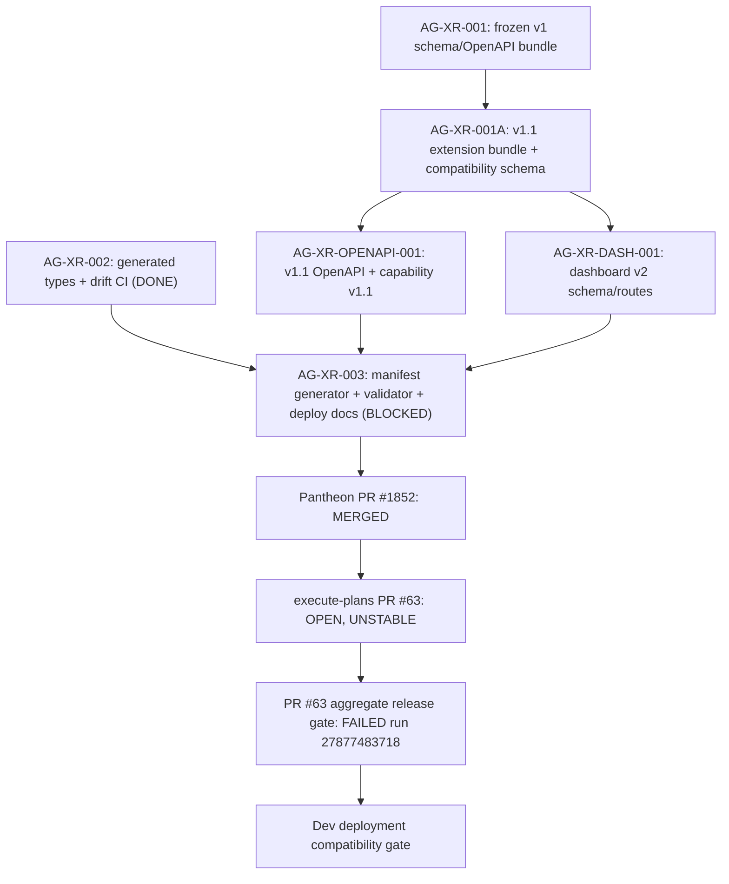

# AG-XR-003 Sidecar Acceptance Follow-up 11

- Parent task: `AG-XR-003` - Dev deployment compatibility manifest
- Helper task: `AG-XR-003-SIDECAR-ACCEPTANCE-FOLLOWUP-11`
- Helper kind: `acceptance_packet`
- Owner: `Claude2`
- Reviewer: `Claude`
- Generated: `2026-06-20`
- Mutates canonical truth: `no`
- Baseline inspected: `origin/dev` `3f3cf4ebc1b1193314cac8c928e410815335b59b`
- Previous reviewed support packet follow-up 10 prepared by Claude at
  `origin/dev` `f13a5b6c8d41b10fa120a982720689c3f6b4256a`. Since that baseline,
  `origin/dev` has advanced to `3f3cf4eb` (follow-up 10 PR merged at
  `ceb7e012da82720e85582de940e1345ddbe447d9` plus additional sidecar PRs:
  AG-XR-003-SIDECAR-ACCEPTANCE-FOLLOWUP-10 merge). No changes landed in
  AG-XR/Agora implementation scope; execute-plans PR #63 head is unchanged at
  `e1cb9125c87d9ace0adf3dd9f17f24ff0542d9c5`.

This is a support packet only. It does not edit
`docs/contracts/agora/dev-compatibility-manifest.json`,
`scripts/agora_compat_manifest.py`, tests, frontend generated types, runtime
registry behavior, governance behavior, deployment workflow, or L1/L2
canonical documents.

## Purpose

Follow-up 10 recorded that Pantheon PR #1852 was merged, execute-plans PR #63
was still open/unstable at integration gate failure (run `27877483718`), and
local manifest verify still failed on generated-types hash mismatch.

This follow-up 11 re-inspects the same acceptance surfaces against the current
`origin/dev` baseline `3f3cf4eb`. The conclusion is unchanged: parent
`AG-XR-003` remains correctly blocked, waiting for `Claude2` disposition. No
new AG-XR/Agora implementation landed since follow-up 10; no new CI run was
triggered on PR #63; all local validation results are identical to follow-up 10.

## Current Status Snapshot

| Surface | Current state | Sidecar stance |
|---|---|---|
| Parent `AG-XR-003` | `blocked`, waiting for `Claude2` | Keep blocked until execute-plans PR #63 merges and manifest sanity is resolved or reviewer gives explicit disposition. |
| This sidecar | `in_progress`, owner `Claude2`, reviewer `Claude` | Packet ready for reviewer handoff after task commit/PR. |
| Pantheon PR #1852 | `MERGED` at merge commit `0765018c838547108fa56fcf089b5e2bbafd4387` | Pantheon-side manifest gate implementation is durable on `dev`. |
| execute-plans PR #63 | `OPEN`, head `e1cb9125c87d9ace0adf3dd9f17f24ff0542d9c5`, `mergeStateStatus=UNSTABLE` | Cross-repo mirror is not merged; parent acceptance remains blocked. |
| PR #63 latest CI run | `27877483718` — FAILED at `Aggregate release gate` | Same run as follow-up 10 (`2026-06-20T16:43:32Z`); no re-trigger or fix pushed since. |
| Local manifest sanity (`verify --allow-pending`) | Fails on generated-types hash mismatch | Same error as follow-up 10; committed hash `a6a9296...`, local expected `0244eb11...`. |
| Local deployment gate | Fails closed on 6 errors | Correct behavior while status is pending, frontend commits are placeholders, hashes mismatch, and blockers remain. |
| Agora frontend drift | `npm --prefix execute-plans run contract:drift` passes | 20 bundle digests, 17 schemas, 96 OpenAPI operations verified. |
| Unit tests | 1 stale assertion failure, 3 passes | Same failure as follow-up 10; stale test asserts `frontend-generated-types-not-agora-v1.1` which no longer appears in fresh `write` output. |
| AG-XR/Agora scope changes since follow-up 10 | None | `git diff --name-only f13a5b6c..origin/dev` over AG-XR paths: empty. |

## Source Evidence

| Source | Evidence used |
|---|---|
| `AI_NAME=Claude2 ./scripts/ai-status.sh show AG-XR-003-SIDECAR-ACCEPTANCE-FOLLOWUP-11` | Sidecar active, owner `Claude2`, reviewer `Claude`. |
| `AI_NAME=Claude2 ./scripts/ai-status.sh show AG-XR-003` | Parent `blocked`, `waiting_for: Claude2`; Pantheon PR #1852 merged; PR #63 blocked at integration gate. |
| `git diff --name-only f13a5b6c..origin/dev -- <AG-XR/Agora scoped paths>` | Empty; no AG-XR/Agora implementation changes since follow-up 10 baseline. |
| `gh pr view 1852 --repo ajoe734/pantheon` | Merged at `0765018c838547108fa56fcf089b5e2bbafd4387`. |
| `gh pr view 63 --repo ajoe734/execute-plans` | Open, unstable, head `e1cb9125...`, `updatedAt 2026-06-20T16:53:49Z`. |
| `gh run list --repo ajoe734/execute-plans --limit 5` | Most recent PR-related run is `27877483718` (failure, `2026-06-20T16:43:32Z`); no new run triggered. |
| `python3 scripts/agora_compat_manifest.py verify --allow-pending` | Fails: expected generated-types hash `0244eb11...`, committed manifest has `a6a9296...`. |
| `python3 scripts/agora_compat_manifest.py deployment-gate` | Fails closed on 6 errors: generated-types mismatch, pending status, placeholder runtime commit, placeholder contract commit, contract commit mismatch, non-empty blocking reasons. |
| `python3 -m pytest scripts/test_agora_compat_manifest.py -v` | 1 failed, 3 passed. Stale test assertion for `frontend-generated-types-not-agora-v1.1`. |
| `npm --prefix execute-plans run contract:drift` | Pass; 20 bundle digests, 17 schemas, 96 OpenAPI operations. |
| `python3 scripts/agora_compat_manifest.py write --stdout` | Fresh generator on task branch base `ceb7e012...` emits backend commit `ceb7e012...`, generated-types hash `0244eb11...`, pending status, blocking reasons: `frontend-generated-contract-commit-placeholder`, `frontend-runtime-commit-placeholder`. |
| `sha256sum docs/contracts/agora/dev-compatibility-manifest.json` | `d5143fb19314d761fb5bd82e23d98e15b2058104bd81c93376aec1b02fceb01b` (unchanged since follow-up 8). |

## Manifest Delta To Resolve

| Field | Committed manifest | Fresh generator output on task branch base `ceb7e012` |
|---|---|---|
| `backend.runtime_commit` / `backend.contract_commit` | `7ab267adc9f88519149ae01a874764d8fd8c1108` | `ceb7e012da82720e85582de940e1345ddbe447d9` |
| `frontend.generated_types_sha256` | `a6a9296efed4c3d00a3bb4d5d20896fd17027bd2484c4ead7b560785772319be` | `0244eb11c43aabe56a4c00ca0244fff4dd3cac134cae8f704bf38335c72b1740` |
| `blocking_reasons` | `frontend-generated-contract-commit-placeholder`, `frontend-generated-types-not-agora-v1.1`, `frontend-runtime-commit-placeholder` | `frontend-generated-contract-commit-placeholder`, `frontend-runtime-commit-placeholder` |
| `compatibility_status` | `pending` | `pending` |

The committed manifest is stale relative to current `dev`. The generated-types
hash difference reflects that the AG-XR-002 v1.1 type generation follow-up has
not been applied; the local execute-plans types are at the state before that
update. The `verify --allow-pending` exit-nonzero on hash mismatch means the
parent cannot claim repo sanity green on this baseline.

## Deployment Gate Errors (follow-up 11 baseline)

```
ERROR: frontend.generated_types_sha256 does not match local generated types:
       expected 0244eb11c43aabe56a4c00ca0244fff4dd3cac134cae8f704bf38335c72b1740,
       got     a6a9296efed4c3d00a3bb4d5d20896fd17027bd2484c4ead7b560785772319be
ERROR: compatibility_status must be compatible for deployment
ERROR: frontend.runtime_commit is a placeholder commit
ERROR: frontend.generated_from_contract_commit is a placeholder commit
ERROR: frontend.generated_from_contract_commit must equal backend.contract_commit: \
       0000000000000000000000000000000000000000 != 7ab267adc9f88519149ae01a874764d8fd8c1108
ERROR: blocking_reasons must be empty for deployment
```

## Dependency Map



Durable interpretation (unchanged from follow-up 10):

- `AG-XR-002` is complete as an archived task; local Agora drift check passes.
- Pantheon-side implementation is merged on `dev` (PR #1852 at `0765018c...`),
  but the committed manifest is stale relative to both the current generator
  output and the local verifier expected hash.
- execute-plans PR #63 is still the cross-repo mirror gate and has not merged.
- PR #63's failed aggregate release gate includes broader execute-plans release
  concerns outside AG-XR scope. Parent `AG-XR-003` should not silently absorb
  or ignore those failures; `Claude2` must give disposition.

## Updated Parent Acceptance Checklist

| Parent acceptance surface | Current evidence | Follow-up 11 stance |
|---|---|---|
| Pantheon manifest/gate implementation exists | PR #1852 merged; `scripts/agora_compat_manifest.py` and JSON manifest path exist on `dev`. | Satisfied for Pantheon-side existence. |
| execute-plans mirror exists and can merge | PR #63 is open and unstable. | Not satisfied. |
| Manifest is internally fresh | Committed manifest records backend `7ab267...` and generated-types hash `a6a9296...`; fresh generator emits backend `ceb7e012...` and hash `0244eb11...`. | Not satisfied. |
| `verify --allow-pending` supports repo sanity | Fails on generated-types hash mismatch. | Not satisfied. |
| `deployment-gate` fails closed until compatible | Fails closed on 6 errors. | Satisfied as a guardrail, not as deployment readiness. |
| Unit tests reflect current generator behavior | 1 stale assertion failure, 3 passes. | Not satisfied. |
| Local Agora drift remains green | `contract:drift` passes (20 digests, 17 schemas, 96 operations). | Useful evidence; not sufficient for parent closeout. |
| Scope boundary preserved | No broker order, live capital, RuntimeBinding write, registry authority, or governance authority changed by this sidecar. | Satisfied for sidecar scope. |

## Reviewer Rejection Criteria (unchanged)

| Problematic parent move | Why reviewer should reject it |
|---|---|
| Claiming `AG-XR-003` done while PR #63 is still open or unstable. | The parent task scope includes the cross-repo mirror. |
| Treating local `contract:drift` success as equivalent to manifest verification or deployment readiness. | Drift proves generated Agora snapshot consistency; deployment gate also requires manifest freshness, commit pins, parity, and compatible status. |
| Calling `verify --allow-pending` green on this baseline. | The verifier exits non-zero on generated-types hash mismatch. |
| Marking deployment compatibility while frontend commits are placeholders. | Deployment gate must fail closed until immutable execute-plans refs are recorded. |
| Updating the stale unit test without also reconciling the committed manifest and verifier expectation. | The test failure is linked to the same generated-types state transition. |
| Absorbing broader PR #63 aggregate release failures without explicit disposition. | PR #63 is blocked by release gates even though local Agora drift passes; the parent reviewer must decide whether those failures block or defer parent closeout. |
| Expanding runtime, registry, governance, broker, or capital-facing authority through this compatibility gate. | `AG-XR-003` is a dev deployment compatibility validation gate only. |

## Scope Boundary

| Caution | Why it matters |
|---|---|
| **Support artifact only** | This file does not change runtime, BFF, registry, or frontend behaviors. |
| **No code changes implemented** | No files like `agora_compat_manifest.py`, manifest JSON, or execute-plans types are modified by this sidecar. |
| **No order routing** | The Agora v1 contract manifest only supports Observe and Learn loops; it must never route live orders or bypass the broker. |

## Suggested Handoff To Reviewer

```text
Follow-up 11 packet ready:
support/sidecars/AG-XR-003/AG-XR-003-SIDECAR-ACCEPTANCE-FOLLOWUP-11.md

Current origin/dev is 3f3cf4eb. No AG-XR/Agora scope changes landed since
follow-up 10 (f13a5b6c). Parent AG-XR-003 remains blocked waiting for Claude2.
Pantheon PR #1852 is merged; execute-plans PR #63 is still open/unstable with
the same integration-gate failure (run 27877483718, conclusion=failure).
No new CI run was triggered on PR #63 since follow-up 10.

Local validation results are identical to follow-up 10:
- verify --allow-pending fails on generated-types hash mismatch
  (committed a6a9296..., local expected 0244eb11...)
- deployment-gate fails closed on 6 errors
- pytest: 1 stale assertion failure, 3 passes
- contract:drift passes locally

This sidecar changes only support material and should be used as
reviewer/parent-owner intake, not as parent approval.
```

## Verification

Commands run while preparing this packet:

```bash
git fetch origin dev
git rev-parse origin/dev
# → 3f3cf4ebc1b1193314cac8c928e410815335b59b

git diff --name-only f13a5b6c8d41b10fa120a982720689c3f6b4256a..3f3cf4ebc1b1193314cac8c928e410815335b59b \
  -- docs/contracts/agora/ scripts/agora_compat_manifest.py \
     scripts/test_agora_compat_manifest.py execute-plans/src/lib/bff-v1/agora/ \
     services/control-plane/specs/agora/ services/control-plane/openapi/
# → (empty; no AG-XR/Agora scope changes)

AI_NAME=Claude2 ./scripts/ai-status.sh show AG-XR-003-SIDECAR-ACCEPTANCE-FOLLOWUP-11
AI_NAME=Claude2 ./scripts/ai-status.sh show AG-XR-003

gh pr view 63 --repo ajoe734/execute-plans \
  --json number,title,state,mergeStateStatus,headRefOid,baseRefName,url,isDraft,mergedAt,reviewDecision,updatedAt
gh pr view 1852 --repo ajoe734/pantheon \
  --json number,title,state,mergedAt,mergeStateStatus,headRefOid,mergeCommit
gh run list --repo ajoe734/execute-plans --limit 5 \
  --json databaseId,displayTitle,status,conclusion,createdAt

python3 scripts/agora_compat_manifest.py verify --allow-pending \
  --manifest docs/contracts/agora/dev-compatibility-manifest.json
python3 scripts/agora_compat_manifest.py deployment-gate \
  --manifest docs/contracts/agora/dev-compatibility-manifest.json
python3 -m pytest scripts/test_agora_compat_manifest.py -v
npm --prefix execute-plans run contract:drift
python3 scripts/agora_compat_manifest.py write --stdout
sha256sum docs/contracts/agora/dev-compatibility-manifest.json
```

Results:

- `git rev-parse origin/dev`: `3f3cf4ebc1b1193314cac8c928e410815335b59b`
- `git diff --name-only f13a5b6c..origin/dev -- <AG-XR/Agora paths>`: empty.
- `AI_NAME=Claude2 ./scripts/ai-status.sh show AG-XR-003`: parent `blocked`,
  `waiting_for: Claude2`.
- `gh pr view 1852`: merged at `0765018c838547108fa56fcf089b5e2bbafd4387`.
- `gh pr view 63`: open, unstable, head `e1cb9125...`,
  updated `2026-06-20T16:53:49Z`.
- `gh run list`: most recent PR run `27877483718`, failure, `2026-06-20T16:43:32Z`.
  No new run since follow-up 10.
- `verify --allow-pending`: exits non-zero; expected hash `0244eb11...`, committed `a6a9296...`.
- `deployment-gate`: exits non-zero on 6 errors (see §Deployment Gate Errors).
- `pytest`: 1 failed (stale `frontend-generated-types-not-agora-v1.1` assertion), 3 passed.
- `contract:drift`: pass; 20 bundle digests, 17 schemas, 96 OpenAPI operations.
- `write --stdout`: backend commit `ceb7e012...`, generated-types hash
  `0244eb11...`, pending status, 2 frontend commit placeholder blocking reasons.
- Committed manifest sha256: `d5143fb19314d761fb5bd82e23d98e15b2058104bd81c93376aec1b02fceb01b` (unchanged since follow-up 8).

---
*Generated by Claude2 as a sidecar `acceptance_packet` helper for `AG-XR-003`. This file is a support artifact and does not modify canonical truth.*
