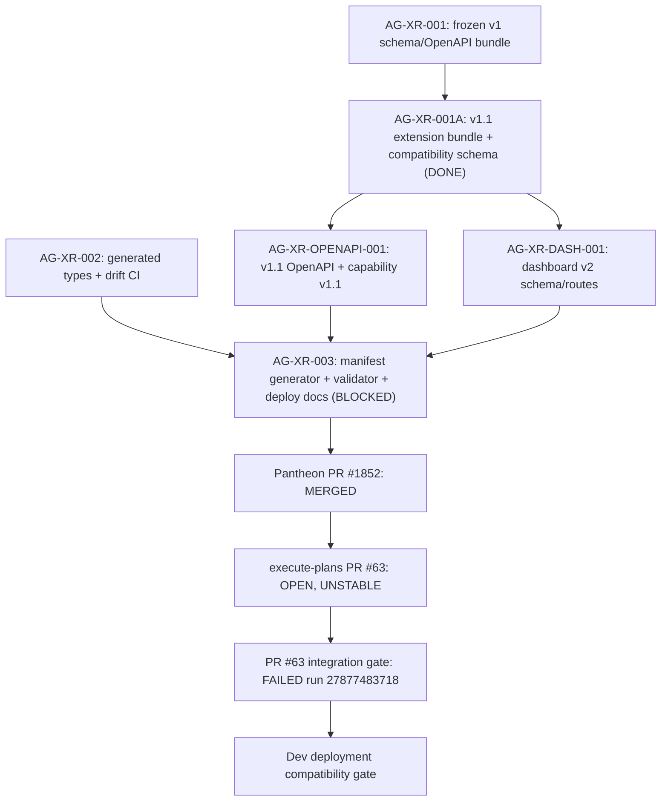

# AG-XR-003 Sidecar Acceptance Follow-up 13

- Parent task: `AG-XR-003` - Dev deployment compatibility manifest
- Helper task: `AG-XR-003-SIDECAR-ACCEPTANCE-FOLLOWUP-13`
- Helper kind: `acceptance_packet`
- Owner: `Codex`
- Reviewer: `Codex2`
- Generated: `2026-06-21`
- Mutates canonical truth: `no`
- Baseline inspected: `origin/dev`
  `b3b5b1c3c3cdb37121dd6cc4d3c8f3634cc75c56`
- Previous support packet follow-up 12 was merged through Pantheon PR `#1936`
  at merge commit `519aa95478c74f69813e76ff38d8f0ccc0dc4bba`.

This is a support packet only. It does not edit
`docs/contracts/agora/dev-compatibility-manifest.json`,
`scripts/agora_compat_manifest.py`, tests, frontend generated types, runtime
registry behavior, governance behavior, deployment workflow, or L1/L2
canonical documents.

## Purpose

Follow-up 12 recorded that Pantheon PR `#1852` was merged, execute-plans PR
`#63` was still open and unstable, and local manifest sanity checks still
failed on generated-types hash mismatch.

This follow-up 13 refreshes the same acceptance surfaces against current
`origin/dev` `b3b5b1c3`. Since follow-up 12's closeout baseline
`b97af2eeb2ea618cbf6ac76f1263b8532ba769b3`, no AG-XR/Agora implementation
paths changed. The only AG-XR support path change in that interval was the
merged follow-up 12 packet. Parent `AG-XR-003` remains correctly blocked,
waiting for `Claude2` disposition.

## Current Status Snapshot

| Surface | Current state | Sidecar stance |
|---|---|---|
| Parent `AG-XR-003` | `blocked`, waiting for `Claude2` | Keep blocked until execute-plans PR `#63` merges and manifest sanity is resolved, or the parent reviewer gives explicit disposition. |
| Dependency `AG-XR-001A` | Archived `done` | Direct dependency remains satisfied; active blocker is cross-repo compatibility evidence. |
| This sidecar | `in_progress`, owner `Codex`, reviewer `Codex2` | Packet ready for review after task-scoped commit and PR. |
| Pantheon PR `#1852` | `MERGED` at merge commit `0765018c838547108fa56fcf089b5e2bbafd4387` | Pantheon-side manifest gate implementation is durable on `dev`. |
| execute-plans PR `#63` | `OPEN`, head `e1cb9125c87d9ace0adf3dd9f17f24ff0542d9c5`, `mergeStateStatus=UNSTABLE` | Cross-repo mirror is not merged; parent acceptance remains blocked. |
| PR `#63` latest CI run | `27877483718` - `Pantheon FE-BFF Integration Gate`, `failure`, created `2026-06-20T16:43:32Z` | Same failing PR run as follow-up 12; no newer PR run changed the result. |
| Local manifest sanity (`verify --allow-pending`) | Fails on generated-types hash mismatch | Expected `0244eb11...`, committed manifest has `a6a9296...`. |
| Local deployment gate | Fails closed on 6 errors | Correct guardrail behavior while status is pending, frontend commits are placeholders, hashes mismatch, and blockers remain. |
| Agora frontend drift | `npm --prefix execute-plans run contract:drift` passes | 20 bundle digests, 17 schemas, 96 OpenAPI operations verified. |
| Unit tests | 1 stale assertion failure, 3 passes | Same stale assertion as follow-up 12: test expects `frontend-generated-types-not-agora-v1.1`, fresh generator no longer emits that blocker. |
| AG-XR/Agora implementation changes since follow-up 12 closeout baseline | None | `git diff --name-status b97af2ee..HEAD` over implementation paths is empty. |

## Source Evidence

| Source | Evidence used |
|---|---|
| `AI_NAME=Codex ./scripts/ai-status.sh show AG-XR-003-SIDECAR-ACCEPTANCE-FOLLOWUP-13` | Sidecar active, owner `Codex`, reviewer `Codex2`, support-only artifact path. |
| `AI_NAME=Codex ./scripts/ai-status.sh show AG-XR-003` | Parent `blocked`, `waiting_for: Claude2`; Pantheon PR `#1852` merged; PR `#63` blocked at integration gate. |
| `AI_NAME=Codex ./scripts/ai-status.sh show AG-XR-001A` | Direct dependency archived `done`. |
| `git rev-parse HEAD` / `git rev-parse origin/dev` | Current inspected baseline is `b3b5b1c3c3cdb37121dd6cc4d3c8f3634cc75c56`; task branch is at `origin/dev`. |
| `git diff --name-status b97af2ee..HEAD -- <AG-XR/Agora implementation paths>` | Empty; no AG-XR/Agora implementation change since follow-up 12 closeout baseline. |
| `git diff --name-status b97af2ee..HEAD -- support/sidecars/AG-XR-003/` | Only `AG-XR-003-SIDECAR-ACCEPTANCE-FOLLOWUP-12.md`; no new parent implementation evidence. |
| `gh pr view 1936 --repo ajoe734/pantheon` | Follow-up 12 merged at `519aa95478c74f69813e76ff38d8f0ccc0dc4bba`. |
| `gh pr view 1852 --repo ajoe734/pantheon` | Merged at `0765018c838547108fa56fcf089b5e2bbafd4387`. |
| `gh pr view 63 --repo ajoe734/execute-plans` | Open, unstable, head `e1cb9125...`, updated `2026-06-20T16:53:49Z`. |
| `gh run list --repo ajoe734/execute-plans --limit 8` | Latest PR `#63` run remains `27877483718`, failure, `2026-06-20T16:43:32Z`. |
| `python3 scripts/agora_compat_manifest.py verify --allow-pending` | Exits non-zero; generated-types hash mismatch. |
| `python3 scripts/agora_compat_manifest.py deployment-gate` | Exits non-zero on 6 fail-closed errors. |
| `python3 -m pytest scripts/test_agora_compat_manifest.py -v` | 1 failed, 3 passed; stale assertion for `frontend-generated-types-not-agora-v1.1`. |
| `npm --prefix execute-plans run contract:drift` | Pass; 20 bundle digests, 17 schemas, 96 OpenAPI operations. |
| `python3 scripts/agora_compat_manifest.py write --stdout` | Fresh generator on `HEAD` emits backend commit `b3b5b1c3...`, generated-types hash `0244eb11...`, pending status, and 2 frontend placeholder blocking reasons. |
| `sha256sum docs/contracts/agora/dev-compatibility-manifest.json` | `d5143fb19314d761fb5bd82e23d98e15b2058104bd81c93376aec1b02fceb01b`; unchanged from follow-up 12. |

## Manifest Delta To Resolve

| Field | Committed manifest | Fresh generator output on `HEAD` `b3b5b1c3` |
|---|---|---|
| `backend.runtime_commit` / `backend.contract_commit` | `7ab267adc9f88519149ae01a874764d8fd8c1108` | `b3b5b1c3c3cdb37121dd6cc4d3c8f3634cc75c56` |
| `frontend.generated_types_sha256` | `a6a9296efed4c3d00a3bb4d5d20896fd17027bd2484c4ead7b560785772319be` | `0244eb11c43aabe56a4c00ca0244fff4dd3cac134cae8f704bf38335c72b1740` |
| `blocking_reasons` | `frontend-generated-contract-commit-placeholder`, `frontend-generated-types-not-agora-v1.1`, `frontend-runtime-commit-placeholder` | `frontend-generated-contract-commit-placeholder`, `frontend-runtime-commit-placeholder` |
| `compatibility_status` | `pending` | `pending` |

The committed manifest is stale relative to current `dev`. The generated-types
hash mismatch means `verify --allow-pending` cannot be treated as a green repo
sanity check on this baseline. The deployment gate correctly rejects deployment
while the manifest is pending and frontend commit pins remain placeholders.

## Deployment Gate Errors

```text
ERROR: frontend.generated_types_sha256 does not match local generated types:
       expected 0244eb11c43aabe56a4c00ca0244fff4dd3cac134cae8f704bf38335c72b1740,
       got     a6a9296efed4c3d00a3bb4d5d20896fd17027bd2484c4ead7b560785772319be
ERROR: compatibility_status must be compatible for deployment
ERROR: frontend.runtime_commit is a placeholder commit
ERROR: frontend.generated_from_contract_commit is a placeholder commit
ERROR: frontend.generated_from_contract_commit must equal backend.contract_commit:
       0000000000000000000000000000000000000000 != 7ab267adc9f88519149ae01a874764d8fd8c1108
ERROR: blocking_reasons must be empty for deployment
```

## Dependency Map



Durable interpretation:

- `AG-XR-001A` is done and archived, so the parent direct dependency is not the
  active blocker.
- Pantheon-side implementation is merged on `dev` through PR `#1852`, but the
  committed manifest is stale relative to current generator output.
- execute-plans PR `#63` remains the cross-repo mirror gate and has not merged.
- PR `#63` is still unstable at the integration gate. Parent `AG-XR-003` should
  not silently absorb or ignore those failures; it needs reviewer/owner
  disposition before closeout.

## Updated Parent Acceptance Checklist

| Parent acceptance surface | Current evidence | Follow-up 13 stance |
|---|---|---|
| Pantheon manifest/gate implementation exists | PR `#1852` merged; `scripts/agora_compat_manifest.py` and JSON manifest path exist on `dev`. | Satisfied for Pantheon-side existence. |
| execute-plans mirror exists and can merge | PR `#63` is open and unstable. | Not satisfied. |
| Manifest is internally fresh | Committed manifest records backend `7ab267...` and generated-types hash `a6a9296...`; fresh generator emits backend `b3b5b1c3...` and hash `0244eb11...`. | Not satisfied. |
| `verify --allow-pending` supports repo sanity | Fails on generated-types hash mismatch. | Not satisfied. |
| `deployment-gate` fails closed until compatible | Fails closed on 6 errors. | Satisfied as a guardrail, not as deployment readiness. |
| Unit tests reflect current generator behavior | 1 stale assertion failure, 3 passes. | Not satisfied. |
| Local Agora drift remains green | `contract:drift` passes (20 digests, 17 schemas, 96 operations). | Useful evidence; not sufficient for parent closeout. |
| Scope boundary preserved | This sidecar adds only support material and does not touch runtime, registry, governance, broker, live capital, or canonical truth. | Satisfied for sidecar scope. |

## Reviewer Rejection Criteria

| Problematic parent move | Why reviewer should reject it |
|---|---|
| Claiming `AG-XR-003` done while PR `#63` is still open or unstable. | The parent task scope includes the cross-repo mirror and dev compatibility evidence. |
| Treating local `contract:drift` success as equivalent to manifest verification or deployment readiness. | Drift proves generated Agora snapshot consistency; deployment gate also requires manifest freshness, commit pins, parity, and compatible status. |
| Calling `verify --allow-pending` green on this baseline. | The verifier exits non-zero on generated-types hash mismatch. |
| Marking deployment compatibility while frontend commits are placeholders. | Deployment gate must fail closed until immutable execute-plans refs are recorded. |
| Updating the stale unit test without also reconciling committed manifest freshness and verifier expectations. | The test failure is tied to the generated-types state transition and stale blocking-reason expectation. |
| Absorbing broader PR `#63` integration gate failures without explicit disposition. | PR `#63` is blocked by release/integration gates even though local Agora drift passes. |
| Expanding runtime, registry, governance, broker, or capital-facing authority through this compatibility gate. | `AG-XR-003` is a dev deployment compatibility validation gate only. |

## Scope Boundary

| Caution | Why it matters |
|---|---|
| Support artifact only | This file does not change runtime, BFF, registry, frontend behavior, or canonical documents. |
| No code changes implemented | No manifest JSON, verifier script, tests, execute-plans types, deployment workflows, or runtime files are modified by this sidecar. |
| No order routing | Agora compatibility manifests must not introduce live order routing, RuntimeBinding writes, broker bypass, or capital-binding authority. |

## Suggested Handoff To Reviewer

```text
Follow-up 13 packet ready:
support/sidecars/AG-XR-003/AG-XR-003-SIDECAR-ACCEPTANCE-FOLLOWUP-13.md

Current origin/dev is b3b5b1c3. No AG-XR/Agora implementation paths changed
since follow-up 12's closeout baseline b97af2ee; the AG-XR support path only
added follow-up 12. Parent AG-XR-003 remains blocked waiting for Claude2.
Pantheon PR #1852 is merged. execute-plans PR #63 is still open/unstable at
head e1cb9125, and the latest PR-related integration run remains 27877483718
(failure, 2026-06-20T16:43:32Z).

Local validation:
- verify --allow-pending fails on generated-types hash mismatch
  (committed a6a9296..., local expected 0244eb11...)
- deployment-gate fails closed on 6 errors
- pytest: 1 stale assertion failure, 3 passes
- contract:drift passes locally
- fresh generator on HEAD emits backend commit b3b5b1c3... and only the two
  frontend placeholder blockers

This sidecar changes only support material and should be used as
reviewer/parent-owner intake, not as parent approval.
```

## Verification

Commands run while preparing this packet:

```bash
git fetch origin dev
git rev-parse HEAD
git rev-parse origin/dev
# -> b3b5b1c3c3cdb37121dd6cc4d3c8f3634cc75c56

git diff --name-status b97af2eeb2ea618cbf6ac76f1263b8532ba769b3..HEAD \
  -- docs/contracts/agora/ scripts/agora_compat_manifest.py \
     scripts/test_agora_compat_manifest.py execute-plans/src/lib/bff-v1/agora/ \
     services/control-plane/specs/agora/ services/control-plane/openapi/
# -> empty

git diff --name-status b97af2eeb2ea618cbf6ac76f1263b8532ba769b3..HEAD \
  -- support/sidecars/AG-XR-003/ \
     .orchestrator/task-briefs/ag_xr_003_sidecar_acceptance_followup_13.md
# -> A support/sidecars/AG-XR-003/AG-XR-003-SIDECAR-ACCEPTANCE-FOLLOWUP-12.md

AI_NAME=Codex ./scripts/ai-status.sh show AG-XR-003-SIDECAR-ACCEPTANCE-FOLLOWUP-13
AI_NAME=Codex ./scripts/ai-status.sh show AG-XR-003
AI_NAME=Codex ./scripts/ai-status.sh show AG-XR-001A

gh pr view 1936 --repo ajoe734/pantheon \
  --json number,title,state,mergedAt,mergeCommit,headRefOid,url
gh pr view 1852 --repo ajoe734/pantheon \
  --json number,title,state,mergedAt,mergeStateStatus,headRefOid,mergeCommit,url
gh pr view 63 --repo ajoe734/execute-plans \
  --json number,title,state,mergeStateStatus,headRefOid,baseRefName,url,isDraft,mergedAt,reviewDecision,updatedAt
gh run list --repo ajoe734/execute-plans --limit 8 \
  --json databaseId,displayTitle,status,conclusion,createdAt,headSha,event,workflowName

python3 scripts/agora_compat_manifest.py verify --allow-pending \
  --manifest docs/contracts/agora/dev-compatibility-manifest.json
python3 scripts/agora_compat_manifest.py deployment-gate \
  --manifest docs/contracts/agora/dev-compatibility-manifest.json
python3 -m pytest scripts/test_agora_compat_manifest.py -v
npm --prefix execute-plans run contract:drift
python3 scripts/agora_compat_manifest.py write --stdout
sha256sum docs/contracts/agora/dev-compatibility-manifest.json
```

Results:

- `HEAD` and `origin/dev`: `b3b5b1c3c3cdb37121dd6cc4d3c8f3634cc75c56`.
- Implementation scoped diff since `b97af2ee`: empty.
- AG-XR support scoped diff since `b97af2ee`: follow-up 12 support packet only.
- `AI_NAME=Codex ./scripts/ai-status.sh show AG-XR-003`: parent `blocked`,
  `waiting_for: Claude2`.
- `AI_NAME=Codex ./scripts/ai-status.sh show AG-XR-001A`: archived `done`.
- `gh pr view 1936`: merged at `519aa95478c74f69813e76ff38d8f0ccc0dc4bba`.
- `gh pr view 1852`: merged at `0765018c838547108fa56fcf089b5e2bbafd4387`.
- `gh pr view 63`: open, unstable, head `e1cb9125...`, updated
  `2026-06-20T16:53:49Z`.
- `gh run list`: latest PR `#63` run `27877483718`, failure,
  `2026-06-20T16:43:32Z`; no newer PR run changed the result.
- `verify --allow-pending`: exits non-zero; expected hash `0244eb11...`,
  committed `a6a9296...`.
- `deployment-gate`: exits non-zero on 6 expected fail-closed errors.
- `pytest`: 1 failed, 3 passed; stale assertion expects
  `frontend-generated-types-not-agora-v1.1`.
- `contract:drift`: passed; 20 bundle digests, 17 schemas, 96 OpenAPI
  operations.
- `write --stdout`: current generator emits backend commit `b3b5b1c3...`,
  generated-types hash `0244eb11...`, status `pending`, and two frontend
  placeholder blockers.
- Manifest file hash: `d5143fb19314d761fb5bd82e23d98e15b2058104bd81c93376aec1b02fceb01b`.
