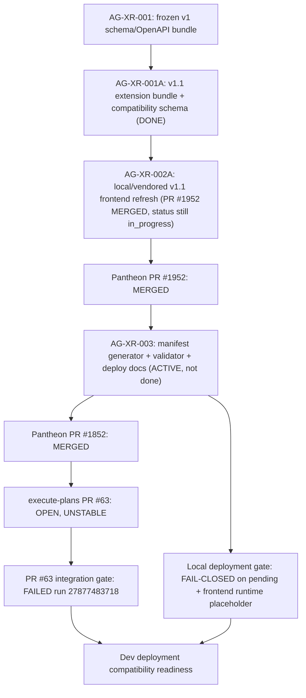

# AG-XR-003 Sidecar Acceptance Follow-up 14

- Parent task: `AG-XR-003` - Dev deployment compatibility manifest
- Helper task: `AG-XR-003-SIDECAR-ACCEPTANCE-FOLLOWUP-14`
- Helper kind: `acceptance_packet`
- Owner: `Codex2`
- Reviewer: `Claude`
- Generated: `2026-06-21`
- Mutates canonical truth: `no`
- Inspected baseline: `origin/dev`
  `e5f20720bc5c0fa7eb1e03972db838eb8098b241`
- PR-prep refresh baseline: `origin/dev`
  `60e3e18c466a0b3b4d28d8a128f28156e42743cd`
- GitHub behind refresh baseline: `origin/dev`
  `285a6d6002da982f029d0b8b7447f95f10efc09b`
- Previous support packet follow-up 13 was merged through Pantheon PR `#1946`
  at merge commit `13f864d5946b4fd2ccdff328a4e0fd359c100cfc`.

This is a support packet only. It does not edit
`docs/contracts/agora/dev-compatibility-manifest.json`,
`scripts/agora_compat_manifest.py`, tests, frontend generated types, runtime
registry behavior, governance behavior, deployment workflow, or L1/L2
canonical documents.

## Purpose

Follow-up 13 recorded that the Pantheon-side manifest implementation was
merged, execute-plans PR `#63` was still open and unstable, and local manifest
sanity still failed on a generated-types hash mismatch.

Follow-up 14 refreshes the same acceptance surfaces after `origin/dev` advanced
through AG-XR-002A PR `#1952`. That merge changes the AG-XR acceptance state:
the local Pantheon/vendored frontend snapshot now verifies against Agora v1.1,
the stale manifest pytest failure is resolved, and local `contract:drift` plus
`build:agora` pass. At packet review time, the parent still had unresolved
cross-repo/runtime-pin acceptance risk because the real execute-plans PR `#63`
remained open/unstable and the deployment gate still failed closed while the
frontend runtime commit remained a placeholder.

During PR preparation, `origin/dev` advanced from `e5f20720` to `60e3e18c`.
The scoped AG-XR/Agora diff across that interval was empty; the only observed
dev delta was an unrelated AG-FE-DB-002 sidecar review artifact.

After PR `#1956` opened, GitHub reported the branch `BEHIND`. A second refresh
merged `origin/dev` `285a6d60`; the scoped AG-XR/Agora diff from `60e3e18c` to
`285a6d60` was also empty. That dev advancement only added an AG-XR-002A
sidecar handoff support artifact and does not change this packet's acceptance
conclusion.

## Closeout Refresh

Codex2 finalization on `2026-06-21` rechecked the lifecycle state after review
approval:

- This sidecar is active `review_approved`, owner `Codex2`, reviewer `Claude`.
- Review notes are recorded in
  `support/sidecars/AG-XR-003/REVIEW-AG-XR-003-SIDECAR-ACCEPTANCE-FOLLOWUP-14.md`.
- Pantheon PR `#1956` merged this packet into `dev` at merge commit
  `e7d75a1161545aa0c2f696882e45fc13ff4bdf35`.
- `AG-XR-002A` is now archived `done`; its status lifecycle cleanup happened
  after this packet was prepared.
- Parent `AG-XR-003` is now archived `done` by its owning lane. This sidecar
  remains support evidence only and does not modify or define parent canonical
  closeout truth.
- execute-plans PR `#63` remains `OPEN` and `UNSTABLE` at head
  `e1cb9125c87d9ace0adf3dd9f17f24ff0542d9c5`; its PR check
  `27877483718` is still failed.

## Current Status Snapshot

| Surface | Current state | Sidecar stance |
|---|---|---|
| Parent `AG-XR-003` | Archived `done` after this packet was prepared. | Parent closeout is outside this sidecar's authority; use the parent archive for terminal truth. |
| Dependency `AG-XR-001A` | Archived `done`. | Direct contract-extension dependency remains satisfied. |
| Follow-up dependency `AG-XR-002A` | Archived `done`; Pantheon PR `#1952` merged to `dev` at `e5f20720`. | Implementation evidence and status lifecycle are now both closed. |
| Previous support packet | Follow-up 13 merged in Pantheon PR `#1946` at `13f864d5`. | This packet records only the delta after that merge. |
| Pantheon PR `#1852` | `MERGED` at `0765018c838547108fa56fcf089b5e2bbafd4387`. | Pantheon-side manifest gate implementation remains durable. |
| Pantheon PR `#1952` | `MERGED` at `e5f20720bc5c0fa7eb1e03972db838eb8098b241`. | Local/vendored Agora v1.1 frontend contract refresh is now on `dev`. |
| execute-plans PR `#63` | `OPEN`, head `e1cb9125c87d9ace0adf3dd9f17f24ff0542d9c5`, `mergeStateStatus=UNSTABLE`. | Cross-repo mirror remains the open blocker. |
| PR `#63` latest CI run | `27877483718` - `Pantheon FE-BFF Integration Gate`, `failure`, created `2026-06-20T16:43:32Z`. | No newer PR run changed the result during this refresh. |
| Local manifest sanity (`verify --allow-pending`) | Passes on `docs/contracts/agora/dev-compatibility-manifest.json`. | Generated-types hash mismatch from follow-up 13 is resolved locally. |
| Local deployment gate | Fails closed on 3 errors. | Correct guardrail behavior while status is pending and frontend runtime commit is a placeholder. |
| Manifest pytest | 4 passed. | Stale assertion from follow-up 13 is resolved. |
| Agora frontend drift | `npm --prefix execute-plans run contract:drift` passes. | Vendored frontend snapshot aligns with the current Agora contract bundle. |
| Agora frontend build | Passes after `npm --prefix execute-plans ci`. | Build proves local generated types compile; `npm ci` reported existing audit vulnerabilities that are out of this sidecar scope. |

## Delta Since Follow-up 13

Scoped diff from follow-up 13 merge commit `13f864d5` to current `HEAD`
`e5f20720` over AG-XR/Agora implementation paths:

```text
M docs/contracts/agora/dev-compatibility-manifest.json
M execute-plans/scripts/contract-drift-check.mjs
M execute-plans/scripts/generate-agora-types.mjs
M execute-plans/src/lib/bff-v1/agora/types.ts
M scripts/test_agora_compat_manifest.py
```

Interpretation:

- AG-XR-002A landed the local/vendored frontend v1.1 contract refresh.
- `execute-plans/src/lib/bff-v1/agora/types.ts` now contains
  `WidgetSpecV1`, `WidgetSpecV2`, `ChartSpecV1`, and `DashboardRecipeV2`.
- The committed manifest generated-types hash is now
  `f5de14e14a0779614302c3813c61b32448052bea5d78a8c5645d372e2e0c52d1`.
- The old `verify --allow-pending` hash mismatch is gone.
- The old manifest pytest stale assertion is gone.
- The deployment gate still intentionally fails closed because deployment
  compatibility is still pending and the frontend runtime commit is not pinned.

## Source Evidence

| Source | Evidence used |
|---|---|
| `AI_NAME=Codex2 ./scripts/ai-status.sh show AG-XR-003-SIDECAR-ACCEPTANCE-FOLLOWUP-14` | Sidecar is active `review_approved`, owner `Codex2`, reviewer `Claude`, support-only artifact path. |
| `AI_NAME=Codex2 ./scripts/ai-status.sh show AG-XR-003` | Parent is archived `done`; parent terminal truth is outside this support packet. |
| `AI_NAME=Codex2 ./scripts/ai-status.sh show AG-XR-002A` | Dependency is archived `done`; PR `#1952` landed and lifecycle cleanup is complete. |
| `AI_NAME=Codex2 ./scripts/ai-status.sh show AG-XR-001A` | Direct dependency is archived `done`. |
| `gh pr view 1946 --repo ajoe734/pantheon` | Follow-up 13 merged at `13f864d5946b4fd2ccdff328a4e0fd359c100cfc`. |
| `gh pr view 1852 --repo ajoe734/pantheon` | Parent Pantheon implementation PR merged at `0765018c838547108fa56fcf089b5e2bbafd4387`. |
| `gh pr view 1952 --repo ajoe734/pantheon` | AG-XR-002A merged at `e5f20720bc5c0fa7eb1e03972db838eb8098b241`. |
| `gh pr view 63 --repo ajoe734/execute-plans` | Cross-repo PR remains open, unstable, head `e1cb9125...`, updated `2026-06-20T16:53:49Z`. |
| `gh run list --repo ajoe734/execute-plans --limit 5` | Latest PR `#63` run remains `27877483718`, failure. |
| `git diff --name-status e5f20720..60e3e18c -- <AG-XR/Agora paths>` | Empty; PR-prep dev refresh did not alter this packet's acceptance surfaces. |
| `git diff --name-status 60e3e18c..285a6d60 -- <AG-XR/Agora paths>` | Empty; GitHub `BEHIND` refresh did not alter this packet's acceptance surfaces. |
| `python3 scripts/agora_compat_manifest.py verify --allow-pending` | Passes on committed manifest. |
| `python3 scripts/agora_compat_manifest.py deployment-gate` | Exits non-zero on 3 fail-closed errors. |
| `python3 -m pytest scripts/test_agora_compat_manifest.py -v` | 4 passed. |
| `npm --prefix execute-plans run contract:drift` | Passes; 20 bundle digests, 17 schemas, 96 OpenAPI operations. |
| `npm --prefix execute-plans run build:agora` | Passes after installing dependencies with `npm --prefix execute-plans ci`. |
| `sha256sum docs/contracts/agora/dev-compatibility-manifest.json` | `77d8d8958add8a4e5e14778e695f73d14500cde0da54038eef697c7c791c537b`. |

## Manifest State To Review

Committed manifest on `HEAD`:

| Field | Value |
|---|---|
| `contract_family` | `agora.v1.1` |
| `backend.runtime_commit` / `backend.contract_commit` | `7ab267adc9f88519149ae01a874764d8fd8c1108` |
| `frontend.generated_from_contract_commit` | `7ab267adc9f88519149ae01a874764d8fd8c1108` |
| `frontend.runtime_commit` | `0000000000000000000000000000000000000000` |
| `frontend.generated_types_sha256` | `f5de14e14a0779614302c3813c61b32448052bea5d78a8c5645d372e2e0c52d1` |
| `compatibility_status` | `pending` |
| `blocking_reasons` | `frontend-runtime-commit-placeholder` |

Fresh `write --stdout` on `HEAD` emits backend commit `e5f20720...` and two
frontend placeholder blockers:

- `frontend-generated-contract-commit-placeholder`
- `frontend-runtime-commit-placeholder`

That generator preview should not be mistaken for deployment readiness. The
parent owner still needs an explicit cross-repo pin/update path for the real
execute-plans runtime commit before the deployment gate can become compatible.

## Deployment Gate Errors

```text
ERROR: compatibility_status must be compatible for deployment
ERROR: frontend.runtime_commit is a placeholder commit
ERROR: blocking_reasons must be empty for deployment
```

## Dependency Map



Durable interpretation:

- `AG-XR-001A` is done and archived.
- `AG-XR-002A` evidence is merged on Pantheon `dev`, but its active task status
  has not been closed in `ai-status.json`.
- Pantheon-side AG-XR-003 implementation exists and local manifest sanity is now
  green.
- The real execute-plans mirror PR `#63` has not merged and still has a failed
  integration gate.
- Parent `AG-XR-003` has since been archived `done` by its owner/reviewer. This
  packet remains a support artifact recording the acceptance evidence and
  cross-repo/runtime-pin risk observed during sidecar review.

## Updated Parent Acceptance Checklist

| Parent acceptance surface | Current evidence | Follow-up 14 stance |
|---|---|---|
| Pantheon manifest/gate implementation exists | PR `#1852` merged; script and JSON manifest path exist on `dev`. | Satisfied for Pantheon-side existence. |
| Local/vendored frontend Agora v1.1 types exist | PR `#1952` merged; `types.ts` includes v1/v2 names and `contract:drift` passes. | Satisfied locally in Pantheon repo. |
| Manifest generated-types hash is sane | `verify --allow-pending` passes; hash is `f5de14e1...`. | Satisfied for pending-state sanity. |
| Manifest pytest reflects current generator behavior | 4 tests passed. | Satisfied. |
| Agora frontend build compiles | `build:agora` passes after `npm ci`. | Satisfied locally. |
| execute-plans mirror exists and can merge | PR `#63` is open and unstable. | Not satisfied. |
| Frontend runtime commit is pinned | Committed manifest still uses all-zero `frontend.runtime_commit`. | Not satisfied. |
| Deployment gate can pass | Fails closed on pending status, frontend runtime placeholder, and non-empty blockers. | Not satisfied. |
| Status lifecycle is coherent | AG-XR-002A and AG-XR-003 are both now archived `done`; this sidecar remains active `review_approved` pending owner closeout. | Satisfied after finalization commit and `done` status closeout. |
| Scope boundary preserved | This sidecar adds only support material and does not touch runtime, registry, governance, broker, live capital, or canonical truth. | Satisfied for sidecar scope. |

## Reviewer Rejection Criteria

| Problematic parent move | Why reviewer should reject it |
|---|---|
| Claiming `AG-XR-003` done while execute-plans PR `#63` is still open/unstable. | The parent task is explicitly cross-repo and deployment-gate oriented. |
| Treating local `verify --allow-pending`, `contract:drift`, or `build:agora` as deployment readiness. | These prove local pending-state sanity, not a compatible deployment manifest. |
| Ignoring the all-zero `frontend.runtime_commit`. | Deployment compatibility requires an immutable frontend runtime pin. |
| Treating AG-XR-002A's merged PR as a completed lifecycle while `ai-status.json` still records it `in_progress`. | Closeout state must match durable repo evidence. |
| Marking the deployment gate compatible while `compatibility_status` is `pending`. | The gate correctly rejects pending manifests. |
| Expanding runtime, registry, governance, broker, or capital-facing authority through this compatibility gate. | AG-XR-003 is a dev deployment compatibility validation gate only. |

## Scope Boundary

| Caution | Why it matters |
|---|---|
| Support artifact only | This file does not change runtime, BFF, registry, frontend behavior, or canonical documents. |
| No code changes implemented | No manifest JSON, verifier script, tests, execute-plans types, deployment workflows, or runtime files are modified by this sidecar. |
| No order routing | Agora compatibility manifests must not introduce live order routing, RuntimeBinding writes, broker bypass, or capital-binding authority. |

## Suggested Handoff To Reviewer

```text
Follow-up 14 packet ready:
support/sidecars/AG-XR-003/AG-XR-003-SIDECAR-ACCEPTANCE-FOLLOWUP-14.md

Current origin/dev is 285a6d60. Since follow-up 13 merged in PR #1946,
AG-XR-002A PR #1952 landed local/vendored Agora v1.1 frontend contract updates
at e5f20720; the later dev refreshes to 60e3e18c and 285a6d60 did not change
AG-XR/Agora surfaces. Local manifest sanity now passes, manifest pytest is 4/4,
contract:drift passes, and build:agora passes after npm ci. The previous
generated-types mismatch and stale pytest assertion should be considered
resolved locally.

At review time, do not treat this packet by itself as parent closeout approval:
execute-plans PR #63 remains OPEN/UNSTABLE at head e1cb9125 with failed
integration-gate run 27877483718. The committed manifest remains pending and
still has an all-zero frontend.runtime_commit, so deployment-gate correctly
fails closed on 3 errors.

This sidecar changes only support material and should be used as
reviewer/parent-owner intake, not as parent approval.
```

## Verification

Commands run while preparing this packet:

```bash
git fetch origin dev
git merge --ff-only origin/dev
git rev-parse HEAD
# -> e5f20720bc5c0fa7eb1e03972db838eb8098b241

git merge --no-edit origin/dev
git rev-parse origin/dev
# -> 60e3e18c466a0b3b4d28d8a128f28156e42743cd

git merge --no-edit origin/dev
git rev-parse origin/dev
# -> 285a6d6002da982f029d0b8b7447f95f10efc09b

AI_NAME=Codex2 ./scripts/ai-status.sh show AG-XR-003-SIDECAR-ACCEPTANCE-FOLLOWUP-14
AI_NAME=Codex2 ./scripts/ai-status.sh show AG-XR-003
AI_NAME=Codex2 ./scripts/ai-status.sh show AG-XR-002A
AI_NAME=Codex2 ./scripts/ai-status.sh show AG-XR-001A

gh pr view 1946 --repo ajoe734/pantheon \
  --json number,title,state,mergedAt,mergeCommit,headRefOid,url
gh pr view 1852 --repo ajoe734/pantheon \
  --json number,title,state,mergedAt,mergeStateStatus,headRefOid,mergeCommit,url
gh pr view 1952 --repo ajoe734/pantheon \
  --json number,title,state,mergedAt,mergeCommit,headRefOid,url
gh pr view 63 --repo ajoe734/execute-plans \
  --json number,title,state,mergeStateStatus,headRefOid,baseRefName,url,isDraft,mergedAt,reviewDecision,updatedAt,statusCheckRollup
gh run list --repo ajoe734/execute-plans --limit 5 \
  --json databaseId,displayTitle,status,conclusion,createdAt,headSha,event,workflowName

git diff --name-status 13f864d5946b4fd2ccdff328a4e0fd359c100cfc..HEAD \
  -- docs/contracts/agora/ scripts/agora_compat_manifest.py \
     scripts/test_agora_compat_manifest.py execute-plans/src/lib/bff-v1/agora/ \
     execute-plans/scripts/ services/control-plane/specs/agora/ \
     services/control-plane/openapi/ support/sidecars/AG-XR-003/

git diff --name-status e5f20720bc5c0fa7eb1e03972db838eb8098b241..60e3e18c466a0b3b4d28d8a128f28156e42743cd \
  -- docs/contracts/agora/ scripts/agora_compat_manifest.py \
     scripts/test_agora_compat_manifest.py execute-plans/src/lib/bff-v1/agora/ \
     execute-plans/scripts/ services/control-plane/specs/agora/ \
     services/control-plane/openapi/ support/sidecars/AG-XR-003/

git diff --name-status 60e3e18c466a0b3b4d28d8a128f28156e42743cd..285a6d6002da982f029d0b8b7447f95f10efc09b \
  -- docs/contracts/agora/ scripts/agora_compat_manifest.py \
     scripts/test_agora_compat_manifest.py execute-plans/src/lib/bff-v1/agora/ \
     execute-plans/scripts/ services/control-plane/specs/agora/ \
     services/control-plane/openapi/ support/sidecars/AG-XR-003/

python3 scripts/agora_compat_manifest.py verify --allow-pending \
  --manifest docs/contracts/agora/dev-compatibility-manifest.json
python3 scripts/agora_compat_manifest.py deployment-gate \
  --manifest docs/contracts/agora/dev-compatibility-manifest.json
python3 scripts/agora_compat_manifest.py write --stdout
python3 -m pytest scripts/test_agora_compat_manifest.py -v
python3 scripts/agora_schema_bundle.py --verify
npm --prefix execute-plans run contract:drift
npm --prefix execute-plans ci
npm --prefix execute-plans run build:agora
sha256sum docs/contracts/agora/dev-compatibility-manifest.json
```

Results:

- Initial AG-XR evidence baseline: `e5f20720bc5c0fa7eb1e03972db838eb8098b241`.
- PR-prep `origin/dev`: `60e3e18c466a0b3b4d28d8a128f28156e42743cd`.
- GitHub behind-refresh `origin/dev`: `285a6d6002da982f029d0b8b7447f95f10efc09b`.
- Follow-up 13 PR `#1946`: merged at
  `13f864d5946b4fd2ccdff328a4e0fd359c100cfc`.
- Pantheon PR `#1852`: merged at
  `0765018c838547108fa56fcf089b5e2bbafd4387`.
- Pantheon PR `#1952`: merged at
  `e5f20720bc5c0fa7eb1e03972db838eb8098b241`.
- execute-plans PR `#63`: open, unstable, head `e1cb9125...`; latest listed
  integration run `27877483718` failed.
- Scoped AG-XR/Agora implementation diff since follow-up 13 consists of the
  five AG-XR-002A files listed in "Delta Since Follow-up 13".
- Scoped AG-XR/Agora diff from `e5f20720` to `60e3e18c`: empty.
- Scoped AG-XR/Agora diff from `60e3e18c` to `285a6d60`: empty.
- `verify --allow-pending`: passed.
- `deployment-gate`: exited non-zero on 3 expected fail-closed errors.
- `write --stdout`: emitted backend commit `e5f20720...`, status `pending`,
  and two frontend placeholder blockers.
- `pytest`: 4 passed.
- `agora_schema_bundle.py --verify`: passed for the frozen v1 bundle.
- `contract:drift`: passed; 20 bundle digests, 17 schemas, 96 OpenAPI
  operations.
- `npm ci`: installed dependencies; reported 4 existing audit vulnerabilities
  (2 moderate, 1 high, 1 critical), not changed in this sidecar.
- `build:agora`: passed, 34 modules transformed.
- Manifest file hash:
  `77d8d8958add8a4e5e14778e695f73d14500cde0da54038eef697c7c791c537b`.

---
*Generated by Codex2 as a sidecar `acceptance_packet` helper for `AG-XR-003`.
This file is a support artifact and does not modify canonical truth.*
