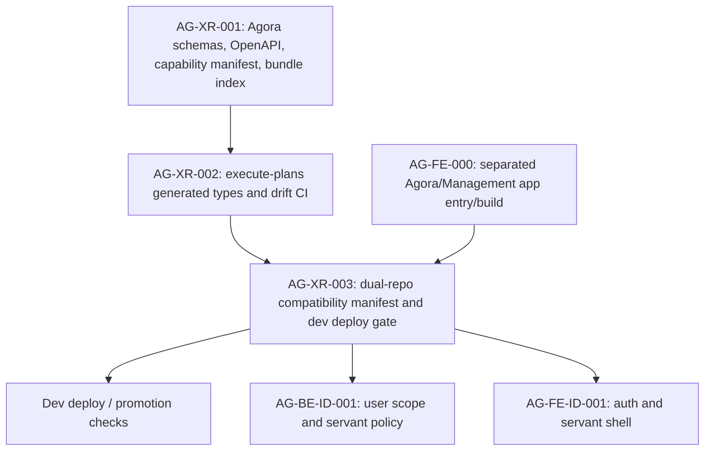

# AG-XR-003 Sidecar Acceptance Follow-up 2

- Parent task: `AG-XR-003` - Dev deployment compatibility manifest
- Helper task: `AG-XR-003-SIDECAR-ACCEPTANCE-FOLLOWUP-2`
- Helper kind: `acceptance_packet`
- Owner: `Codex2`
- Reviewer: `Codex`
- Generated: `2026-06-20`
- Mutates canonical truth: `no`

This is a support packet only. It does not implement
`compatibility-manifest.yaml`, `scripts/agora_compat_manifest.py`, cross-repo
deployment gates, L1 policy, runtime registry behavior, governance behavior, or
frontend code.

## Purpose

The prior packet,
`support/sidecars/AG-XR-003/AG-XR-003-SIDECAR-ACCEPTANCE.md`, captured the
support-only boundary and broad blocker questions. This follow-up narrows the
reviewer handoff into concrete acceptance checks for the parent owner and
reviewer, while keeping unresolved contract choices explicitly out of this
sidecar.

## Source Evidence

| Source | Evidence used here |
|---|---|
| `scripts/dispatch_agora_cross_repo_2026-06-20.py` | Defines `AG-XR-003`, its owner/reviewer, dependency on `AG-XR-002`, required manifest fields, checksum script, and deploy-doc gate. |
| `docs/04/pantheon_agora_cross_repo_2026-06-20/SD_2026-06-20.md` | Defines Agora v1 naming in section 2, capability manifest in section 4, and contract bundle in section `22.1`. |
| `services/control-plane/specs/agora/capability_manifest.json` | Lists the 7 frozen `agora.*.v1` BFF capabilities and the OpenAPI reference. |
| `services/control-plane/specs/agora/bundle_index.json` | Records per-file sha256 values for the 13 schemas, capability manifest, and OpenAPI file. |
| Existing AG-XR-003 sidecar packet | Preserves prior blocker context and support-only scope declaration. |

## Contract Inputs Already Observable In This Repo

| Input | Observable value | Source |
|---|---|---|
| `contract_family` | `agora.v1` | Dispatch definition and Agora SD scope. |
| `required_bff_capabilities` | `agora.identity.v1`, `agora.session.v1`, `agora.workshop.v1`, `agora.research.v1`, `agora.trading.v1`, `agora.dashboard.v1`, `agora.personalization.v1` | `capability_manifest.json` |
| `openapi_sha256` | `4da5ea91923e40c13a9118ee4f784a5d6627e6cb91e4d4712d8fac244912118f` | `bundle_index.json`; confirmed by local `sha256sum` |
| `schema_bundle_sha256` | unresolved by parent task text | See "Parent Decisions Still Required" below. |

`sha256sum services/control-plane/specs/agora/bundle_index.json` currently
returns `286891c6bb900d6b5e9f9037d357c2016f8ecac33927056556a848f95fb4bd0b`.
This follow-up does not assert that value as canonical for
`schema_bundle_sha256`; it is only a candidate implementation convention unless
the parent owner/reviewer accepts it.

## Parent Acceptance Checklist

| Check | Expected parent evidence | Sidecar stance |
|---|---|---|
| Pantheon manifest exists | `docs/contracts/agora/compatibility-manifest.yaml` is added in the `pantheon` parent task PR. | Not implemented by this sidecar. |
| Frontend manifest exists | Equivalent `compatibility-manifest.yaml` is added in `execute-plans`; exact path must be selected by the parent owner/reviewer. | Not implemented by this sidecar. |
| Required fields present | Both manifests include `contract_family`, `frontend_commit`, `backend_commit`, `required_bff_capabilities`, `openapi_sha256`, and `schema_bundle_sha256`. | Checklist only. |
| Capability list is frozen | Both manifests include exactly the 7 `agora.*.v1` capabilities from `capability_manifest.json`; comparison should be order-insensitive or normalized before hashing. | Checklist only. |
| OpenAPI checksum is tied to AG-XR-001 output | Manifest `openapi_sha256` matches `bundle_index.json` and local file hash for `services/control-plane/openapi/agora_v1.openapi.yaml`. | Checklist only. |
| Schema bundle checksum rule is explicit | Parent implementation documents whether `schema_bundle_sha256` is the sha256 of `bundle_index.json` or another deterministic aggregate over the indexed files. | Parent decision required. |
| Commit pins are usable at deploy time | `frontend_commit` and `backend_commit` are full git SHAs or deployment-resolved immutable refs; placeholders must fail the deploy gate. | Parent decision required for PR timing. |
| Comparison script fails closed | `scripts/agora_compat_manifest.py` exits non-zero when contract family, capabilities, openapi hash, schema bundle hash, or required commit pins mismatch or are missing. | Parent implementation work. |
| Dev deployment docs mention the gate | Dev deploy documentation names the script and states that mismatch blocks dev deployment. | Parent implementation work. |
| No runtime authority expands | No live-order, broker, registry, or governance authority is added by the manifest gate. | Reviewer should reject any such expansion. |

## Dependency Map



Durable interpretation:

- `AG-XR-001` is the source for schemas, OpenAPI, capability names, and
  `bundle_index.json`.
- `AG-XR-002` must align `execute-plans` generated types and drift checks before
  the compatibility manifest can be meaningful across repos.
- `AG-FE-000` matters because the manifest is intended to protect the Agora
  frontend bundle, not the legacy Management surface.
- `AG-XR-003` should not unblock deployment unless both repos carry matching
  manifest facts and the comparison script passes.

## Parent Decisions Still Required

1. Resolve the dispatch reference to `SD section 2.3`. The current SD has
   section 2 and section `22.1`, but no section `2.3`.
2. Choose the `execute-plans` manifest path. The most reviewable convention is
   matching the Pantheon path, `docs/contracts/agora/compatibility-manifest.yaml`,
   unless the frontend repo has a stronger established contract directory.
3. Define `schema_bundle_sha256`. Candidate conventions are:
   - sha256 of `services/control-plane/specs/agora/bundle_index.json`
   - deterministic aggregate over all files listed in `bundle_index.json`
4. Define commit pin timing. The deploy gate should fail on placeholders; if PRs
   cannot know both final SHAs at author time, deployment or release tooling must
   stamp or verify immutable refs before the gate passes.
5. Decide which dev deployment doc names the gate.

## Reviewer Checklist For This Follow-up

| Check | Expected result |
|---|---|
| Support-only scope | This file and the generated task brief are the only intended task artifacts. |
| No canonical truth edited | No L1 policy, SD, OpenAPI, schema, runtime, registry, governance, or frontend files are changed. |
| Existing blocker context preserved | Prior sidecar blocker questions are referenced, not overwritten. |
| Acceptance checks are actionable | Parent owner can implement the manifest/script/docs without using this file as canonical truth. |
| Handoff target is clear | Reviewer is `Codex`; parent owner/reviewer decide whether to absorb this into `AG-XR-003`. |

## Suggested Handoff

If this packet is acceptable, reviewer `Codex` can treat it as the follow-up
acceptance/dependency map for `AG-XR-003-SIDECAR-ACCEPTANCE-FOLLOWUP-2` and pass
the parent decisions above back to the `AG-XR-003` owner/reviewer lane.

Recommended status handoff message:

```text
Follow-up packet ready: support-only acceptance checklist and dependency map
for AG-XR-003 are in
support/sidecars/AG-XR-003/AG-XR-003-SIDECAR-ACCEPTANCE-FOLLOWUP-2.md.
No canonical or runtime files changed; parent owner/reviewer still need to
choose schema_bundle_sha256 semantics, execute-plans manifest path, commit pin
timing, and the dev deploy doc target.
```

## Verification

Commands run for this sidecar:

```bash
git status -sb
AI_NAME=Codex2 ./scripts/ai-status.sh show AG-XR-003-SIDECAR-ACCEPTANCE-FOLLOWUP-2
sed -n '1,260p' support/sidecars/AG-XR-003/AG-XR-003-SIDECAR-ACCEPTANCE.md
sed -n '70,115p' scripts/dispatch_agora_cross_repo_2026-06-20.py
sed -n '1,80p' docs/04/pantheon_agora_cross_repo_2026-06-20/SD_2026-06-20.md
sed -n '210,285p' docs/04/pantheon_agora_cross_repo_2026-06-20/SD_2026-06-20.md
sed -n '1,220p' services/control-plane/specs/agora/capability_manifest.json
sed -n '1,260p' services/control-plane/specs/agora/bundle_index.json
sha256sum services/control-plane/openapi/agora_v1.openapi.yaml services/control-plane/specs/agora/bundle_index.json services/control-plane/specs/agora/capability_manifest.json
find . -path '*compatibility-manifest.yaml' -o -path '*agora_compat_manifest.py'
```

Focused validation after writing this file:

```bash
git diff --check
python3 scripts/agora_schema_bundle.py --verify
git status --short
rg -n "^(TBD|TODO|PLACEHOLDER|FIXME)$" support/sidecars/AG-XR-003/AG-XR-003-SIDECAR-ACCEPTANCE-FOLLOWUP-2.md .orchestrator/task-briefs/ag_xr_003_sidecar_acceptance_followup_2.md
```

Results:

- `git diff --check`: pass.
- `python3 scripts/agora_schema_bundle.py --verify`: pass; all 15 indexed
  Agora schema/OpenAPI/capability files verified.
- `git status --short`: only the generated task brief and this support packet
  are dirty.
- `rg -n "^(TBD|TODO|PLACEHOLDER|FIXME)$" ...`: pass after this verification
  section was finalized.
