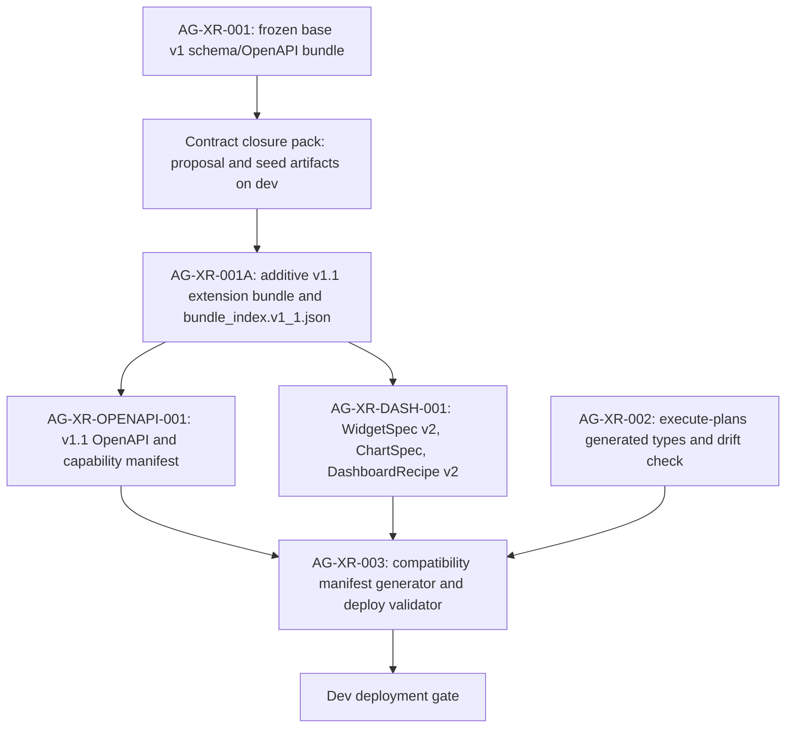

# AG-XR-003 Sidecar Acceptance Follow-up 3

- Parent task: `AG-XR-003` - Dev deployment compatibility manifest
- Helper task: `AG-XR-003-SIDECAR-ACCEPTANCE-FOLLOWUP-3`
- Helper kind: `acceptance_packet`
- Owner: `Codex2`
- Reviewer: `Codex`
- Generated: `2026-06-20`
- Mutates canonical truth: `no`
- Baseline inspected: `pantheon@dev` `3efec287`

This is a support packet only. It does not implement
`docs/contracts/agora/dev-compatibility-manifest.json`,
`scripts/agora_compat_manifest.py`, cross-repo deployment automation, L1 policy,
runtime registry behavior, governance behavior, or frontend code.

## Purpose

The first two AG-XR-003 sidecar packets captured the original blockers around
manifest path, schema, checksum semantics, commit pin timing, and dependency
order. Since then, the Agora contract-layer closure pack was merged onto
`dev`. This follow-up maps the new closure-pack evidence into a reviewer-facing
acceptance packet for the parent owner.

The important distinction is that the closure pack is now available as design
input, but it still says the implementing `AG-XR-*` tasks must promote,
hash-verify, and mirror the actual canonical artifacts. This sidecar records
that boundary instead of treating the archive pack as runtime implementation.

## Source Evidence

| Source | Evidence used here |
|---|---|
| `scripts/dispatch_agora_cross_repo_2026-06-20.py` | The original parent task still asks for flat YAML fields, `contract_family=agora.v1`, `schema_bundle_sha256`, and `scripts/agora_compat_manifest.py`. |
| `support/sidecars/AG-XR-003/AG-XR-003-SIDECAR-ACCEPTANCE.md` | Original sidecar blocker packet for missing schema/path/hash/commit pin decisions. |
| `support/sidecars/AG-XR-003/AG-XR-003-SIDECAR-ACCEPTANCE-FOLLOWUP-2.md` | Prior narrowed checklist and dependency map, before the closure pack landed. |
| `docs/04/pantheon_agora_cross_repo_2026-06-20/contract-closure/INDEX.md` | States the pack is a design decision proposal until canonical artifacts are merged and mirrored. |
| `docs/04/pantheon_agora_cross_repo_2026-06-20/contract-closure/ARCHIVE_NOTES.md` | Says the prose docs are authority, seed artifacts are not complete, and AG-XR-003 remains blocked until predecessor contract tasks are implemented. |
| `docs/04/pantheon_agora_cross_repo_2026-06-20/contract-closure/06_compatibility_manifest_and_hash_rules.md` | Defines the proposed manifest path, commit semantics, byte-level hash rules, generated types hash algorithm, deploy check, and generated-manifest ownership. |
| `docs/04/pantheon_agora_cross_repo_2026-06-20/contract-closure/compatibility_manifest.schema.json` | Provides the proposed JSON schema shape for `agora.v1.1` compatibility manifests. |
| `docs/04/pantheon_agora_cross_repo_2026-06-20/contract-closure/07_dispatch_unblock_matrix_v2.md` | Names AG-XR-003's current blocker and the predecessor evidence required before implementation is unblocked. |

## Delta From Follow-up 2

| Earlier open question | New closure-pack input | Acceptance stance for parent review |
|---|---|---|
| `SD section 2.3` is missing. | The closure pack gives a replacement compatibility-manifest design in `06_*` and `07_*`. | Parent implementation should cite the closure-pack rules instead of relying on the stale `SD section 2.3` dispatch reference. |
| Manifest path was unclear. | Both repos should store `docs/contracts/agora/dev-compatibility-manifest.json`. | Reviewer should reject a new old-shape `compatibility-manifest.yaml` unless the parent owner intentionally rejects the closure-pack path. |
| Manifest schema was unclear. | Proposed schema is `services/control-plane/specs/agora/v2/compatibility_manifest.schema.json`; archive seed currently lives under the closure pack. | Parent must either land the schema at the proposed canonical path through the authorized contract task or depend on the predecessor that lands it. |
| `schema_bundle_sha256` was undefined. | The closure pack splits this into `base_bundle_index_sha256` and `extension_bundle_index_sha256`, both raw-byte SHA-256 of exact bundle index files. | Reviewer should reject an ad hoc single `schema_bundle_sha256` unless parent explicitly documents a compatibility shim. |
| Commit pins during PR timing were unclear. | Runtime and contract commits are exact 40-character SHAs. Frontend `generated_from_contract_commit` must equal backend `contract_commit`. | Placeholders may exist only with `compatibility_status=pending` or `incompatible`; they must fail deployment when marked compatible. |
| Required capabilities were flat strings. | Proposed schema uses capability objects with `name`, `version`, and `required`. | Parent validator should normalize and verify names plus compatible versions, not only string presence. |

## Updated Parent Acceptance Checklist

| Check | Expected parent evidence | Sidecar stance |
|---|---|---|
| Manifest path follows the closure rule | `docs/contracts/agora/dev-compatibility-manifest.json` exists in both repos or the parent PR records an approved deviation. | Parent implementation work. |
| Manifest uses generated JSON schema | Manifest validates against `compatibility_manifest.schema.json` with `manifest_version=1.0`, `contract_family=agora.v1.1`, and `generated=true`. | Parent implementation work after schema authority is landed. |
| Backend half is immutable and explicit | `backend.repo`, `backend.runtime_commit`, `backend.contract_commit`, `backend.base_bundle_index_sha256`, `backend.extension_bundle_index_sha256`, and `backend.openapi_sha256` are populated with full hashes. | Checklist only. |
| Frontend half proves contract derivation | `frontend.generated_from_contract_commit == backend.contract_commit`; frontend bundle hashes equal backend bundle hashes; generated type hash uses the recorded algorithm. | Checklist only. |
| Hash policy is deterministic | `hash_policy.file_hash == sha256-exact-git-bytes-v1`; `hash_policy.generated_types_hash == sha256-path-tab-filehash-lf-v1`. | Checklist only. |
| Dev deployment gate fails closed | Validator exits non-zero when any required commit, hash, capability, or compatibility status is missing, placeholder, mismatched, or incompatible. | Parent implementation work. |
| Generated manifest is not hand-edited | Manifest marked `generated=true` is emitted by CI/tooling; hand edits are rejected or regenerated. | Parent implementation work. |
| Frozen v1 bundle remains intact | `python3 scripts/agora_schema_bundle.py --verify` remains green and no AG-XR-001 frozen file is replaced in place. | Parent and reviewer guardrail. |
| Extension bundle is explicit | `bundle_index.v1_1.json`, v2 schemas, v1.1 capability manifest, and `agora_v1_1.openapi.yaml` are landed by the authorized predecessor path before a compatible manifest is claimed. | Dependency gate. |
| Dev deployment docs cite the gate | The chosen deployment runbook names the validator command and states mismatch blocks deploy. | Parent implementation work. |

## Current Observable Repo Facts

| Fact | Current value |
|---|---|
| Base bundle index hash | `286891c6bb900d6b5e9f9037d357c2016f8ecac33927056556a848f95fb4bd0b` for `services/control-plane/specs/agora/bundle_index.json`. |
| Base OpenAPI hash | `4da5ea91923e40c13a9118ee4f784a5d6627e6cb91e4d4712d8fac244912118f` for `services/control-plane/openapi/agora_v1.openapi.yaml`. |
| Compatibility schema seed hash | `84c3607195484d09710708c08e7c29821b75d83199376cd5374a2ce0c3ca7827` for the closure-pack schema seed. |
| Compatibility example seed hash | `479bb05be19fbef93124a5e85e65dbe60e02025444f9bba751c1295cd151ebb6` for the closure-pack example seed. |
| Manifest implementation files | No `docs/contracts/agora/dev-compatibility-manifest.json`, `compatibility-manifest.yaml`, or `scripts/agora_compat_manifest.py` currently exists in this repo. |

These values are evidence for reviewer orientation. This sidecar does not
promote the closure-pack seed files into canonical service paths.

## Dependency Map



Durable interpretation:

- `AG-XR-001` remains the frozen v1 baseline. AG-XR-003 must not replace its
  files to get new hashes.
- The closure pack narrows the parent implementation choices but does not
  complete the implementation.
- `AG-XR-001A` must produce the canonical extension bundle and
  `bundle_index.v1_1.json` before AG-XR-003 can honestly mark a manifest
  `compatible`.
- `AG-XR-OPENAPI-001` and `AG-XR-DASH-001` feed the capability/OpenAPI and
  dashboard-schema facts that the manifest must compare.
- `AG-XR-002` remains the generated-types predecessor. The manifest should not
  pass when `execute-plans` generated types were built from a different backend
  contract commit.

## Reviewer Rejection Criteria

| Problematic parent move | Why reviewer should reject it |
|---|---|
| Implements only the stale flat YAML shape from the dispatch script without acknowledging the closure pack. | Latest `dev` now has a more precise JSON manifest proposal and hash policy. |
| Treats closure-pack seed files as complete canonical service artifacts. | `ARCHIVE_NOTES.md` says prose is authority and several seed artifacts are incomplete. |
| Marks a manifest `compatible` with zero hashes, placeholder SHAs, missing v1.1 extension index, or stale generated types. | Deployment gate must fail closed. |
| Edits AG-XR-001 frozen schemas/OpenAPI in place to make hashes line up. | The closure pack requires additive coexistence and no v1 hash invalidation. |
| Lets the frontend provide user-controlled commit, hash, or capability facts. | Manifest halves must come from CI/tooling and deployed immutable refs. |
| Adds broker order, capital binding, live trading authority, or registry/governance authority as part of compatibility validation. | AG-XR-003 is a cross-repo deployment compatibility gate only. |

## Handoff To Reviewer

This follow-up packet is ready for `Codex` review as support material for
`AG-XR-003-SIDECAR-ACCEPTANCE-FOLLOWUP-3`.

Recommended reviewer stance:

1. Accept this sidecar if it accurately maps the closure-pack evidence without
   changing canonical/runtime files.
2. Feed the updated checklist to the parent `AG-XR-003` owner.
3. Keep the parent task blocked or partially blocked until the authorized
   predecessor tasks land the v1.1 extension bundle, canonical manifest schema,
   and generated type evidence.
4. When parent implementation starts, prefer the closure-pack JSON manifest
   path and hash policy over the older dispatch text unless the parent
   owner/reviewer explicitly records a different decision.

## Suggested Status Handoff

```text
Follow-up packet ready: support-only AG-XR-003 acceptance/dependency map is in
support/sidecars/AG-XR-003/AG-XR-003-SIDECAR-ACCEPTANCE-FOLLOWUP-3.md.
It maps the new contract-closure compatibility manifest rules to parent
acceptance checks, without editing canonical schema/OpenAPI/runtime files.
Parent AG-XR-003 should now treat the closure-pack JSON manifest path, v1.1
hash semantics, exact commit pins, and fail-closed deployment gate as the
review input, while waiting for authorized v1.1 contract artifacts to be
landed before claiming compatibility.
```

## Verification

Commands run while preparing this packet:

```bash
git status -sb
AI_NAME=Codex2 ./scripts/ai-status.sh show AG-XR-003-SIDECAR-ACCEPTANCE-FOLLOWUP-3
sed -n '1,260p' support/sidecars/AG-XR-003/AG-XR-003-SIDECAR-ACCEPTANCE.md
sed -n '1,260p' support/sidecars/AG-XR-003/AG-XR-003-SIDECAR-ACCEPTANCE-FOLLOWUP-2.md
sed -n '80,108p' scripts/dispatch_agora_cross_repo_2026-06-20.py
sed -n '1,220p' docs/04/pantheon_agora_cross_repo_2026-06-20/contract-closure/INDEX.md
sed -n '1,100p' docs/04/pantheon_agora_cross_repo_2026-06-20/contract-closure/ARCHIVE_NOTES.md
sed -n '1,260p' docs/04/pantheon_agora_cross_repo_2026-06-20/contract-closure/06_compatibility_manifest_and_hash_rules.md
sed -n '1,240p' docs/04/pantheon_agora_cross_repo_2026-06-20/contract-closure/compatibility_manifest.schema.json
sed -n '1,220p' docs/04/pantheon_agora_cross_repo_2026-06-20/contract-closure/compatibility_manifest.example.json
sed -n '1,220p' docs/04/pantheon_agora_cross_repo_2026-06-20/contract-closure/07_dispatch_unblock_matrix_v2.md
sha256sum services/control-plane/specs/agora/bundle_index.json services/control-plane/openapi/agora_v1.openapi.yaml docs/04/pantheon_agora_cross_repo_2026-06-20/contract-closure/compatibility_manifest.schema.json docs/04/pantheon_agora_cross_repo_2026-06-20/contract-closure/compatibility_manifest.example.json docs/04/pantheon_agora_cross_repo_2026-06-20/contract-closure/06_compatibility_manifest_and_hash_rules.md
find . -path '*dev-compatibility-manifest.json' -o -path '*compatibility-manifest.yaml' -o -path '*agora_compat_manifest.py'
```

Focused validation after writing this file:

```bash
git diff --check
python3 scripts/agora_schema_bundle.py --verify
git status --short
rg -n "^(TBD|TODO|PLACEHOLDER|FIXME)$" support/sidecars/AG-XR-003/AG-XR-003-SIDECAR-ACCEPTANCE-FOLLOWUP-3.md .orchestrator/task-briefs/ag_xr_003_sidecar_acceptance_followup_3.md
```

Results:

- `git diff --check`: pass.
- `python3 scripts/agora_schema_bundle.py --verify`: pass; all 15 frozen
  Agora v1 schema/OpenAPI/capability files verified.
- `git status --short`: only
  `.orchestrator/task-briefs/ag_xr_003_sidecar_acceptance_followup_3.md` and
  this support packet are dirty.
- `rg -n "^(TBD|TODO|PLACEHOLDER|FIXME)$" ...`: pass; no matches.
