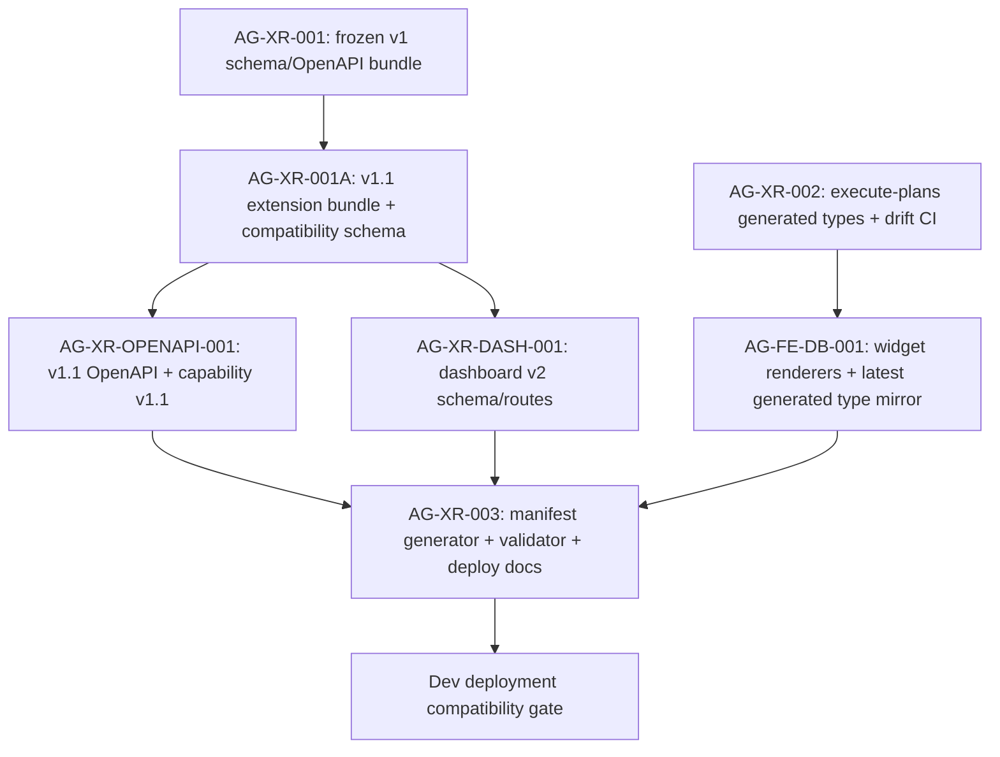

# AG-XR-003 Sidecar Acceptance Follow-up 4

- Parent task: `AG-XR-003` - Dev deployment compatibility manifest
- Helper task: `AG-XR-003-SIDECAR-ACCEPTANCE-FOLLOWUP-4`
- Helper kind: `acceptance_packet`
- Owner: `Codex`
- Reviewer: `Codex2`
- Generated: `2026-06-20`
- Mutates canonical truth: `no`
- Baseline inspected: `origin/dev` `0fafe7f87cb913d4592c936a9449a89d090840b5`

This is a support packet only. It does not edit
`docs/contracts/agora/dev-compatibility-manifest.json`,
`scripts/agora_compat_manifest.py`, tests, frontend generated types, runtime
registry behavior, governance behavior, or L1/L2 canonical documents.

## Purpose

Follow-up 3 recorded that AG-XR-003 still needed the compatibility manifest
generator, validator, deployment gate, and frontend generated-type evidence.
The current `dev` baseline now contains the parent manifest gate implementation
and a later execute-plans generated-type/widget refresh. This packet maps that
new state into reviewer-facing acceptance guidance for the parent owner.

The key current finding is that the gate exists and fails closed, but the
committed manifest and one validator test are stale relative to the latest
execute-plans generated type mirror on `dev`. This sidecar records that as a
parent acceptance gap, not as a sidecar-owned implementation fix.

## Source Evidence

| Source | Evidence used here |
|---|---|
| `AI_NAME=Codex ./scripts/ai-status.sh show AG-XR-003` | Parent status is `in_progress`; status note says PR `#1852` merged and Codex is preparing review handoff. |
| `docs/contracts/agora/dev-compatibility-manifest.json` | Generated manifest is present at the closure-pack JSON path with `contract_family=agora.v1.1`, but records stale frontend generated-type hash and placeholder frontend commits. |
| `scripts/agora_compat_manifest.py` | Provides `write`, `verify`, and `deployment-gate` commands; validates shape, local contract hashes, local frontend generated-type hash, capabilities, and deployment fail-closed rules. |
| `scripts/test_agora_compat_manifest.py` | Unit coverage exists, but one assertion is stale after the execute-plans v1.1 generated-type refresh. |
| `docs/frontend/execute-plans-dev-hosting.md` | Dev deployment docs now include the Agora compatibility gate and distinguish pending repo sanity checks from actual deployment gate checks. |
| `execute-plans/src/lib/bff-v1/agora/contract-snapshot.json` | Latest frontend mirror now reports `contract_version=1.1` and `source_bundle=services/control-plane/specs/agora/bundle_index.v1_1.json`. |
| `execute-plans/scripts/generate-agora-types.mjs` | Frontend generated-type generation defaults to the v1.1 bundle when available and verifies base plus extension bundle digests. |
| `support/sidecars/AG-XR-003/AG-XR-003-SIDECAR-ACCEPTANCE-FOLLOWUP-3.md` | Prior acceptance packet said to prefer closure-pack JSON manifest path and fail-closed hash policy over the stale YAML dispatch shape. |

## Current Acceptance State

| Parent acceptance surface | Current observable state | Follow-up 4 stance |
|---|---|---|
| Manifest path | `docs/contracts/agora/dev-compatibility-manifest.json` exists on `dev`. | Path now follows the closure-pack rule. |
| Manifest schema/shape | Manifest uses `manifest_version=1.0`, `contract_family=agora.v1.1`, backend/frontend halves, `hash_policy`, capabilities, and `compatibility_status`. | Shape is directionally aligned with the v2 compatibility schema. |
| Validator script | `scripts/agora_compat_manifest.py` exists with `write`, `verify`, and `deployment-gate`. | Parent implementation surface exists. |
| Dev deployment docs | `docs/frontend/execute-plans-dev-hosting.md` names `verify --allow-pending` for repo sanity and `deployment-gate` for actual deployment. | Deployment-doc acceptance surface exists. |
| Frozen v1 bundle | `python3 scripts/agora_schema_bundle.py --verify` passes for all 15 frozen v1 indexed files. | Guardrail remains intact. |
| Frontend type mirror | `npm --prefix execute-plans run contract:drift` passes: 20 bundle digests, 17 schemas, 96 OpenAPI operations. | Frontend mirror is now v1.1-aware. |
| Committed manifest freshness | `verify --allow-pending` fails because committed `frontend.generated_types_sha256` is `a6a9296efed4c3d00a3bb4d5d20896fd17027bd2484c4ead7b560785772319be`, while local generated types hash to `0244eb11c43aabe56a4c00ca0244fff4dd3cac134cae8f704bf38335c72b1740`. | Parent AG-XR-003 should refresh or regenerate the manifest after the latest execute-plans mirror change. |
| Deployment readiness | `deployment-gate` fails because status is pending, frontend commit pins are zero placeholders, frontend contract commit does not equal backend contract commit, blocking reasons are not empty, and generated types hash is stale. | Correct fail-closed behavior; not ready for deploy compatibility claim. |
| Unit tests | `python3 -m pytest scripts/test_agora_compat_manifest.py` reports 1 failed, 3 passed; the failure expects `frontend-generated-types-not-agora-v1.1`, but the current snapshot is v1.1. | Parent AG-XR-003 should update the stale assertion when refreshing manifest evidence. |

## Current Manifest Delta To Resolve

Running the generator without writing files on `origin/dev` now emits:

| Field | Committed manifest | Fresh generator output at inspected HEAD |
|---|---|---|
| `backend.runtime_commit` / `backend.contract_commit` | `7ab267adc9f88519149ae01a874764d8fd8c1108` | `0fafe7f87cb913d4592c936a9449a89d090840b5` |
| `frontend.generated_types_sha256` | `a6a9296efed4c3d00a3bb4d5d20896fd17027bd2484c4ead7b560785772319be` | `0244eb11c43aabe56a4c00ca0244fff4dd3cac134cae8f704bf38335c72b1740` |
| `blocking_reasons` | `frontend-generated-contract-commit-placeholder`, `frontend-generated-types-not-agora-v1.1`, `frontend-runtime-commit-placeholder` | `frontend-generated-contract-commit-placeholder`, `frontend-runtime-commit-placeholder` |

The `frontend-generated-types-not-agora-v1.1` blocker should no longer be
present once the manifest is regenerated against the current execute-plans
mirror. The zero frontend commit placeholders remain valid blockers until the
frontend runtime commit and generated-from-contract commit are filled with
immutable refs and match the backend contract commit.

## Dependency Map



Durable interpretation:

- `AG-XR-001`, `AG-XR-001A`, `AG-XR-OPENAPI-001`, and `AG-XR-DASH-001` provide
  the contract files and hashes consumed by the manifest.
- `AG-XR-002` provides the generated-type and drift-check lane.
- `AG-FE-DB-001` has updated execute-plans generated artifacts on the inspected
  `dev` baseline while its task state is still `review_approved`; AG-XR-003
  review should account for that updated generated-types hash before claiming
  the manifest is fresh.
- AG-XR-003 should not claim deployment compatibility until the manifest is
  regenerated after the latest frontend mirror, frontend commit pins are
  immutable non-placeholder SHAs, `compatibility_status=compatible`, and the
  deployment gate passes.

## Reviewer Acceptance Checks For Parent AG-XR-003

| Check | Reviewer expectation |
|---|---|
| Manifest freshness | Regenerated manifest matches current backend contract files and current execute-plans generated type hash. |
| Pending sanity mode | `verify --allow-pending` passes only when local hashes and capabilities are internally consistent. |
| Deployment gate | `deployment-gate` continues to fail closed until non-placeholder frontend commits and a compatible status are present. |
| Unit tests | `scripts/test_agora_compat_manifest.py` reflects the current v1.1 frontend snapshot behavior. |
| Frontend mirror | `npm --prefix execute-plans run contract:drift` remains green after any manifest refresh. |
| Dev docs | Deployment docs keep separate repo sanity validation from actual deploy compatibility. |
| Scope boundary | No broker order, live capital, RuntimeBinding write, or governance authority is added through the compatibility gate. |

## Reviewer Rejection Criteria

| Problematic parent move | Why reviewer should reject it |
|---|---|
| Claiming AG-XR-003 is deployment-ready while the manifest still has placeholder frontend commits. | The gate must fail closed until immutable frontend refs are recorded. |
| Leaving the committed manifest generated-types hash stale after execute-plans generated files changed. | `verify --allow-pending` should be an internally consistent repo sanity check. |
| Treating a green frontend drift check as equivalent to a green cross-repo deployment gate. | Drift check proves generated files match contract bundle; deployment gate also requires commit pins, manifest parity, and compatible status. |
| Updating tests to ignore the generated-types mismatch instead of refreshing manifest/test expectations. | The mismatch is useful acceptance evidence and should stay visible until resolved. |
| Reverting to `compatibility-manifest.yaml` without an explicit parent owner/reviewer deviation. | Current closure-pack and implementation path use JSON manifest `docs/contracts/agora/dev-compatibility-manifest.json`. |
| Expanding route/capability authority through this gate. | AG-XR-003 is a compatibility validation gate only. |

## Suggested Handoff To Reviewer

```text
Follow-up packet ready: support-only AG-XR-003 acceptance/dependency map is in
support/sidecars/AG-XR-003/AG-XR-003-SIDECAR-ACCEPTANCE-FOLLOWUP-4.md.
Current dev has the manifest gate implementation and dev deploy docs, but the
committed manifest is stale after the latest execute-plans generated-type
refresh. `verify --allow-pending` fails on generated_types_sha256 mismatch, and
`deployment-gate` correctly fails closed on pending status plus placeholder
frontend commits. Parent AG-XR-003 should refresh manifest/test evidence before
review approval or deployment compatibility claims.
```

## Verification

Commands run while preparing this packet:

```bash
git status -sb
git fetch origin dev
git merge --ff-only origin/dev
AI_NAME=Codex ./scripts/ai-status.sh show AG-XR-003-SIDECAR-ACCEPTANCE-FOLLOWUP-4
AI_NAME=Codex ./scripts/ai-status.sh show AG-XR-003
AI_NAME=Codex ./scripts/ai-status.sh show AG-XR-002
AI_NAME=Codex ./scripts/ai-status.sh show AG-XR-OPENAPI-001
AI_NAME=Codex ./scripts/ai-status.sh show AG-XR-DASH-001
AI_NAME=Codex ./scripts/ai-status.sh show AG-FE-DB-001
sed -n '1,260p' scripts/agora_compat_manifest.py
sed -n '1,240p' scripts/test_agora_compat_manifest.py
sed -n '1,260p' docs/contracts/agora/dev-compatibility-manifest.json
sed -n '1,220p' execute-plans/src/lib/bff-v1/agora/contract-snapshot.json
sed -n '1,260p' docs/frontend/execute-plans-dev-hosting.md
python3 scripts/agora_schema_bundle.py --verify
python3 scripts/agora_compat_manifest.py verify --allow-pending --manifest docs/contracts/agora/dev-compatibility-manifest.json
python3 scripts/agora_compat_manifest.py deployment-gate --manifest docs/contracts/agora/dev-compatibility-manifest.json
python3 -m pytest scripts/test_agora_compat_manifest.py
npm --prefix execute-plans run contract:drift
python3 scripts/agora_compat_manifest.py write --stdout
sha256sum docs/contracts/agora/dev-compatibility-manifest.json services/control-plane/specs/agora/bundle_index.json services/control-plane/specs/agora/bundle_index.v1_1.json services/control-plane/openapi/agora_v1_1.openapi.yaml execute-plans/src/lib/bff-v1/agora/contract-snapshot.json execute-plans/src/lib/bff-v1/agora/types.ts
```

Results:

- `git merge --ff-only origin/dev`: pass; task branch moved to
  `0fafe7f87cb913d4592c936a9449a89d090840b5`.
- `python3 scripts/agora_schema_bundle.py --verify`: pass for the 15 frozen v1
  indexed files.
- `npm --prefix execute-plans run contract:drift`: pass; 20 bundle digests, 17
  schemas, and 96 OpenAPI operations verified.
- `python3 scripts/agora_compat_manifest.py verify --allow-pending --manifest
  docs/contracts/agora/dev-compatibility-manifest.json`: expected fail; local
  generated types hash is `0244eb11c43aabe56a4c00ca0244fff4dd3cac134cae8f704bf38335c72b1740`
  but the manifest records
  `a6a9296efed4c3d00a3bb4d5d20896fd17027bd2484c4ead7b560785772319be`.
- `python3 scripts/agora_compat_manifest.py deployment-gate --manifest
  docs/contracts/agora/dev-compatibility-manifest.json`: expected fail-closed;
  generated-types hash mismatch, pending status, zero frontend commits,
  frontend/backend contract commit mismatch, and non-empty blocking reasons.
- `python3 -m pytest scripts/test_agora_compat_manifest.py`: expected partial
  fail; 1 failed and 3 passed because the first test still expects
  `frontend-generated-types-not-agora-v1.1` even though the current frontend
  snapshot is v1.1.
- `python3 scripts/agora_compat_manifest.py write --stdout`: pass; fresh output
  would record backend commit `0fafe7f87cb913d4592c936a9449a89d090840b5`,
  generated types hash `0244eb11c43aabe56a4c00ca0244fff4dd3cac134cae8f704bf38335c72b1740`,
  and only the two frontend commit placeholder blocking reasons.
