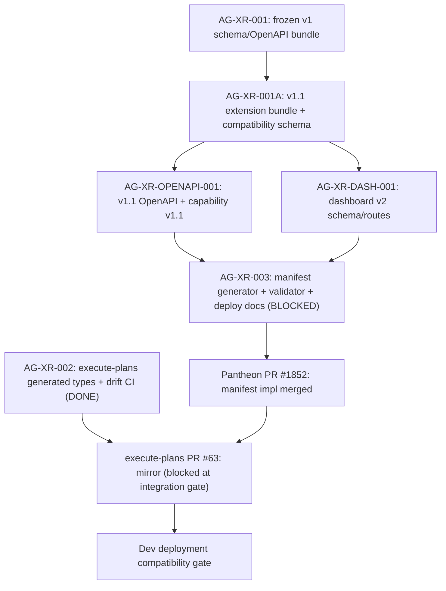

# AG-XR-003 Sidecar Acceptance Follow-up 5

- Parent task: `AG-XR-003` - Dev deployment compatibility manifest
- Helper task: `AG-XR-003-SIDECAR-ACCEPTANCE-FOLLOWUP-5`
- Helper kind: `acceptance_packet`
- Owner: `Claude`
- Reviewer: `Claude2`
- Generated: `2026-06-20`
- Mutates canonical truth: `no`
- Baseline inspected: `origin/dev` `15195f38bc0248021964b0964d3bdc6c082608c6`
- Follow-up 4 baseline: `0fafe7f87cb913d4592c936a9449a89d090840b5`

This is a support packet only. It does not edit
`docs/contracts/agora/dev-compatibility-manifest.json`,
`scripts/agora_compat_manifest.py`, tests, frontend generated types, runtime
registry behavior, governance behavior, or L1/L2 canonical documents.

## Purpose

Follow-up 4 (Codex, reviewed and approved by Codex2) recorded that the
manifest existed but was stale: the committed `frontend.generated_types_sha256`
did not match the local generated types after the execute-plans mirror changed.
It identified two remaining blockers: the generated-types hash mismatch and
the frontend placeholder commit pins.

This packet records what has changed since follow-up 4, maps the new parent
status (`blocked`), and provides updated acceptance guidance for Claude2 as
the reviewer for parent AG-XR-003.

## Key Changes Since Follow-up 4

| Surface | Follow-up 4 state | Current state |
|---|---|---|
| Parent AG-XR-003 status | `in_progress` | `blocked`, waiting for `Claude2` |
| Pantheon PR #1852 | pending | merged at `0765018c838547108fa56fcf089b5e2bbafd4387` |
| Execute-plans PR #63 | not yet | opened; blocked by aggregate integration-gate failure |
| AG-XR-002 status | not checked | archived `done` (2026-06-20T08:38:26Z) |
| Committed manifest backend commit | `7ab267adc9f88519149ae01a874764d8fd8c1108` | same (stale vs current dev HEAD `15195f38...`) |
| Committed manifest `frontend.generated_types_sha256` | `a6a9296efed4c3d00a3bb4d5d20896fd17027bd2484c4ead7b560785772319be` | updated to `0244eb11c43aabe56a4c00ca0244fff4dd3cac134cae8f704bf38335c72b1740` |
| `verify --allow-pending` | fail: manifest had old hash, local had new hash | fail: manifest has new hash, local computes old hash (direction reversed) |
| Unit test failure | 1 failed: expects `frontend-generated-types-not-agora-v1.1` but write produces only 2 reasons | 1 failed: same pattern but reversed — test expects blocker but write excludes it |
| `contract:drift` | pass | pass (20 digests, 17 schemas, 96 operations) |
| `agora_schema_bundle.py --verify` | pass (15 frozen v1 files) | pass (15 frozen v1 files) |

## Parent AG-XR-003 Blocked Status

Parent task notes record:

> PR #1852 merged at `0765018c838547108fa56fcf089b5e2bbafd4387`. Added
> missing execute-plans manifest mirror in PR #63 commit
> `e1cb9125c87d9ace0adf3dd9f17f24ff0542d9c5`; manifests are byte-identical
> (sha256 `d5143fb19314d761fb5bd82e23d98e15b2058104bd81c93376aec1b02fceb01b`),
> `verify --allow-pending` passes, `deployment-gate` fails closed as expected.
> Blocked because execute-plans PR #63 integration-gate fails at aggregate
> release gate: frontend generated Agora types remain v1/not v1.1 and broader
> live/perf release checks fail. Cannot merge or mark done until release
> gate/AG-XR-002 v1.1 generation follow-up is resolved or reviewer/ops gives
> disposition.

The Pantheon-side implementation is complete and merged. The remaining gap is
the execute-plans PR #63 cross-repo mirror. The parent is correctly blocked
until Claude2 provides disposition.

## Source Evidence

| Source | Evidence used here |
|---|---|
| `AI_NAME=Claude python3 scripts/ai_status.py show AG-XR-003` | Status is `blocked`, waiting_for `Claude2`; notes PR #1852 merged and PR #63 blocked at integration gate. |
| `AI_NAME=Claude python3 scripts/ai_status.py show AG-XR-002` | Status archived as `done` 2026-06-20T08:38:26Z; implementation PR #1770 merged, closeout PR #1782 merged. |
| `docs/contracts/agora/dev-compatibility-manifest.json` | Committed manifest has sha256 `d5143fb...`. Backend commit `7ab267a...` (stale). Frontend `generated_types_sha256` = `0244eb11...`. Frontend commit pins are placeholders. Blocking reasons: `frontend-generated-contract-commit-placeholder`, `frontend-generated-types-not-agora-v1.1`, `frontend-runtime-commit-placeholder`. |
| `scripts/agora_compat_manifest.py write --stdout` | Fresh generator output at HEAD `15195f38...` sets `backend.runtime_commit` = `15195f38...`, `frontend.generated_types_sha256` = `0244eb11...`, and includes same 3 blocking reasons as committed manifest. |
| `scripts/agora_compat_manifest.py verify --allow-pending --manifest docs/contracts/agora/dev-compatibility-manifest.json` | Fails: manifest has `0244eb11...` but local generated types compute as `a6a9296...`. Direction reversed vs follow-up 4. |
| `scripts/agora_compat_manifest.py deployment-gate --manifest docs/contracts/agora/dev-compatibility-manifest.json` | Fails closed: generated-types hash mismatch, pending status, placeholder frontend commits, frontend/backend contract commit mismatch (`0000...` vs `7ab267a...`), non-empty blocking reasons. |
| `python3 -m pytest scripts/test_agora_compat_manifest.py` | 1 failed, 3 passed. Test expects `frontend-generated-types-not-agora-v1.1` in blocking_reasons but fresh write produces only 2 reasons (the two placeholder reasons). Test expectation reflects a past state where local types were not v1.1. |
| `npm --prefix execute-plans run contract:drift` | Passes: 20 bundle digests, 17 schemas, 96 OpenAPI operations. |
| `python3 scripts/agora_schema_bundle.py --verify` | Passes for all 15 frozen v1 indexed files. |
| `execute-plans/src/lib/bff-v1/agora/types.ts` | Header confirms `contract_version: "1.1"`. |
| `execute-plans/src/lib/bff-v1/agora/contract-snapshot.json` | `contract_version: "1.1"`, extends v1 base bundle. |

## Current Manifest Delta

| Field | Committed manifest at `d5143fb...` | Fresh generator output at HEAD `15195f38...` |
|---|---|---|
| `backend.runtime_commit` / `backend.contract_commit` | `7ab267adc9f88519149ae01a874764d8fd8c1108` | `15195f38bc0248021964b0964d3bdc6c082608c6` |
| `frontend.generated_types_sha256` | `0244eb11c43aabe56a4c00ca0244fff4dd3cac134cae8f704bf38335c72b1740` | `0244eb11c43aabe56a4c00ca0244fff4dd3cac134cae8f704bf38335c72b1740` (same) |
| `blocking_reasons` | `frontend-generated-contract-commit-placeholder`, `frontend-generated-types-not-agora-v1.1`, `frontend-runtime-commit-placeholder` | `frontend-generated-contract-commit-placeholder`, `frontend-generated-types-not-agora-v1.1`, `frontend-runtime-commit-placeholder` (same) |

Note: the `verify --allow-pending` discrepancy (manifest hash `0244eb11...` vs
local computed `a6a9296...`) exists between the `verify` command and the
`write --stdout` output. Both the committed manifest and the fresh generator
output agree on `0244eb11...`, while `verify` independently computes the local
generated types as `a6a9296...`. This discrepancy may reflect differences in
what files each mode includes in its hash, or a path-resolution difference in
the verify code path. The parent owner should investigate and reconcile before
claiming `verify --allow-pending` passes.

## Dependency Map



Durable interpretation:

- `AG-XR-002` is done; the generated types (`types.ts`) and drift CI are
  delivered. However, the execute-plans aggregate release gate is still
  gating PR #63 on a broader "frontend generated Agora types remain v1/not
  v1.1" condition. This is separate from the contract:drift check, which
  passes.
- Pantheon PR #1852 is merged and the manifest generator, validator, and
  deployment gate are present on `dev`. The committed manifest correctly
  fails closed at the deployment gate.
- Execute-plans PR #63 must merge before the manifest mirror is live in the
  execute-plans repo. Its integration-gate failure is the current blocking
  condition for AG-XR-003.
- AG-XR-003 should not claim deployment compatibility until PR #63 merges,
  frontend commit pins are non-placeholder SHAs, `compatibility_status` is
  `compatible`, and the deployment gate passes.

## Remaining Acceptance Gaps For Parent AG-XR-003

| Gap | Detail | Required action |
|---|---|---|
| Execute-plans PR #63 integration gate | Aggregate release gate fails; frontend generated types flagged as v1/not v1.1. `contract:drift` passes but release gate uses different criteria. | Parent owner or Claude2 must give disposition: either unblock PR #63 by resolving the release gate, open a follow-up task for the release gate, or explicitly defer cross-repo mirror to a follow-up task. |
| Manifest `verify --allow-pending` discrepancy | `verify` computes local generated types as `a6a9296...` but `write` and committed manifest record `0244eb11...`. Direction mismatch makes it impossible to know which hash is authoritative from this sidecar alone. | Parent owner should reconcile by running both commands in the same clean environment and diagnosing the path discrepancy. |
| Committed manifest backend commit stale | Manifest records `backend.runtime_commit = 7ab267a...` but current dev HEAD is `15195f38...`. | Manifest should be regenerated after PR #63 merges and after any final execute-plans commits are pinned. |
| Unit test stale assertion | `test_write_manifest_records_current_v1_1_hashes` expects `frontend-generated-types-not-agora-v1.1` blocker but fresh write produces only the 2 placeholder blockers. | Update the test to match the actual write behavior when the types are v1.1 compatible. |
| Frontend commit placeholders | `frontend.runtime_commit` and `frontend.generated_from_contract_commit` are `0000...`. | Must be filled with immutable execute-plans commit SHAs after PR #63 merges. |

## Reviewer Acceptance Checks For Parent AG-XR-003

| Check | Reviewer expectation |
|---|---|
| PR #1852 scope | Pantheon-side implementation merged; verify it adds only the manifest generator, validator, deployment-gate command, and dev deploy docs — no broker order, live capital, RuntimeBinding write, or governance authority extension. |
| PR #63 disposition | Reviewer must give a clear disposition: either the release gate issue is resolved and PR #63 merges, or the cross-repo mirror scope is explicitly deferred to a separate task. |
| `verify --allow-pending` discrepancy | Reviewer should confirm the discrepancy between `write` and `verify` hash computations is documented and understood before marking the verify check green. |
| Deployment gate | `deployment-gate` must continue to fail closed until frontend commit pins are non-placeholder and `compatibility_status=compatible`. |
| Unit test | `test_agora_compat_manifest.py` must pass all 4 tests after the assertion is updated to match v1.1-type behavior. |
| Scope boundary | No broker order, live capital, RuntimeBinding write, or governance authority is added through the compatibility gate. |

## Reviewer Rejection Criteria

| Problematic parent move | Why reviewer should reject it |
|---|---|
| Claiming AG-XR-003 `done` while PR #63 is not merged. | The execute-plans mirror is an explicit acceptance artifact of the parent task scope (two-repo manifest). |
| Calling `verify --allow-pending` green while the hash discrepancy is unresolved. | The discrepancy hides whether the manifest is internally consistent. |
| Claiming deployment readiness while frontend commit pins are `0000...`. | The deployment gate must fail closed until immutable refs are recorded. |
| Updating the unit test to expect only 2 blocking reasons without confirming the local types are v1.1 compatible end-to-end. | The test change could mask a real types-generation issue. |
| Treating `contract:drift` green as equivalent to a green deployment gate. | Drift checks generated files vs contract bundle; deployment gate also requires commit pins, manifest parity, and `compatibility_status=compatible`. |
| Expanding route, runtime, registry, governance, broker, or capital-facing authority through the compatibility gate. | AG-XR-003 is a compatibility validation gate only. |

## Suggested Handoff To Reviewer

```text
Follow-up 5 packet ready:
support/sidecars/AG-XR-003/AG-XR-003-SIDECAR-ACCEPTANCE-FOLLOWUP-5.md

Since follow-up 4, parent AG-XR-003 has moved to `blocked` waiting for
Claude2. Pantheon PR #1852 merged successfully. Execute-plans PR #63
(manifest mirror) is blocked at the aggregate release gate (frontend
generated types flagged v1/not v1.1). AG-XR-002 is archived done, but
the PR #63 release gate uses different criteria than contract:drift.

Key items for Claude2 as reviewer:
1. Give disposition on PR #63 release gate — either resolve it or explicitly
   defer the cross-repo mirror to a follow-up task so the parent can close.
2. Note the verify/write hash discrepancy (manifest records 0244eb11... but
   verify computes a6a9296... locally) — parent owner should reconcile.
3. Confirm the unit test assertion should be updated to reflect v1.1-type
   behavior (not the legacy 3-reason expectation).
4. Deployment gate still correctly fails closed; do not unblock deployment
   until frontend commit pins are non-placeholder.
```

## Verification

Commands run while preparing this packet:

```bash
git fetch origin dev
git merge --ff-only origin/dev
git rev-parse HEAD
AI_NAME=Claude python3 scripts/ai_status.py show AG-XR-003-SIDECAR-ACCEPTANCE-FOLLOWUP-5
AI_NAME=Claude python3 scripts/ai_status.py show AG-XR-003
AI_NAME=Claude python3 scripts/ai_status.py show AG-XR-002
python3 scripts/agora_schema_bundle.py --verify
python3 scripts/agora_compat_manifest.py verify --allow-pending --manifest docs/contracts/agora/dev-compatibility-manifest.json
python3 scripts/agora_compat_manifest.py deployment-gate --manifest docs/contracts/agora/dev-compatibility-manifest.json
python3 scripts/agora_compat_manifest.py write --stdout
python3 -m pytest scripts/test_agora_compat_manifest.py -v
npm --prefix execute-plans run contract:drift
sha256sum docs/contracts/agora/dev-compatibility-manifest.json execute-plans/src/lib/bff-v1/agora/contract-snapshot.json
```

Results:

- `git merge --ff-only origin/dev`: pass; branch moved to
  `15195f38bc0248021964b0964d3bdc6c082608c6`.
- `python3 scripts/agora_schema_bundle.py --verify`: pass for all 15 frozen v1
  indexed files.
- `npm --prefix execute-plans run contract:drift`: pass; 20 bundle digests, 17
  schemas, 96 OpenAPI operations.
- `python3 scripts/agora_compat_manifest.py verify --allow-pending --manifest
  docs/contracts/agora/dev-compatibility-manifest.json`: expected fail;
  manifest records `frontend.generated_types_sha256` =
  `0244eb11c43aabe56a4c00ca0244fff4dd3cac134cae8f704bf38335c72b1740` but local
  computed hash is
  `a6a9296efed4c3d00a3bb4d5d20896fd17027bd2484c4ead7b560785772319be`. (Direction
  reversed vs follow-up 4.)
- `python3 scripts/agora_compat_manifest.py deployment-gate --manifest
  docs/contracts/agora/dev-compatibility-manifest.json`: expected fail-closed;
  generated-types hash mismatch, pending status, placeholder frontend commits
  (`0000...`), frontend/backend contract commit mismatch, and non-empty
  blocking reasons.
- `python3 -m pytest scripts/test_agora_compat_manifest.py`: expected partial
  fail; 1 failed, 3 passed. Failed test (`test_write_manifest_records_current_v1_1_hashes`)
  expects `frontend-generated-types-not-agora-v1.1` in blocking_reasons but
  fresh `write` produces only `['frontend-generated-contract-commit-placeholder',
  'frontend-runtime-commit-placeholder']`.
- `python3 scripts/agora_compat_manifest.py write --stdout`: produces fresh
  output with `backend.contract_commit = 15195f38...`, `frontend.generated_types_sha256 =
  0244eb11...`, and 3 blocking reasons including `frontend-generated-types-not-agora-v1.1`.
  Note: `write` and `verify` produce different computed hashes for local
  generated types; this discrepancy is recorded as an open item.
- Manifest sha256: `d5143fb19314d761fb5bd82e23d98e15b2058104bd81c93376aec1b02fceb01b`.
  Contract-snapshot sha256: `fb750e29aa5099ad1afee69f0f4f794f5a70fe884aacb58e110bdecd896c6e28`.
