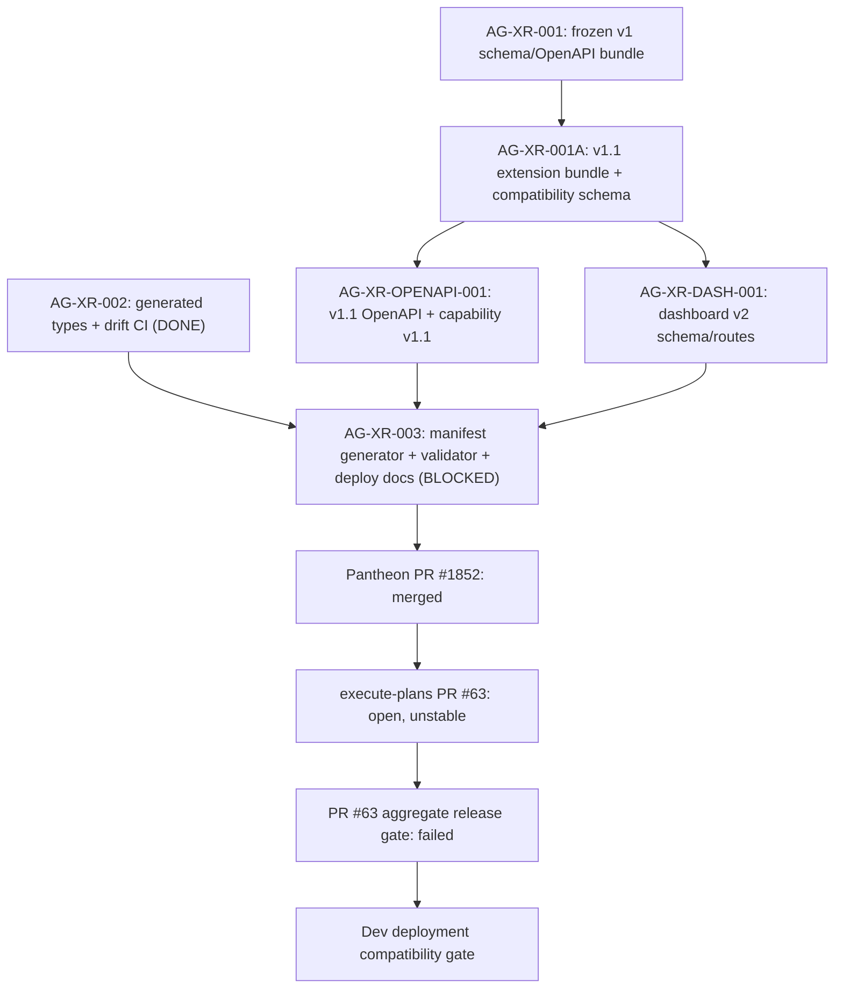

# AG-XR-003 Sidecar Acceptance Follow-up 7

- Parent task: `AG-XR-003` - Dev deployment compatibility manifest
- Helper task: `AG-XR-003-SIDECAR-ACCEPTANCE-FOLLOWUP-7`
- Helper kind: `acceptance_packet`
- Owner: `Codex2`
- Reviewer: `Codex`
- Generated: `2026-06-20`
- Mutates canonical truth: `no`
- Baseline inspected: `origin/dev` `e51bc8fdcdce119bd66596367c468364d18bf835`
- Closeout refresh: AG-XR/Agora scoped paths unchanged through `origin/dev`
  `7e9937342d33405d1f5bc872c684e7c705327245`

This is a support packet only. It does not edit
`docs/contracts/agora/dev-compatibility-manifest.json`,
`scripts/agora_compat_manifest.py`, tests, frontend generated types, runtime
registry behavior, governance behavior, deployment workflow, or L1/L2
canonical documents.

## Purpose

Follow-up 6 recorded that Pantheon PR #1852 had merged, execute-plans PR #63
was still open/unstable, and the local manifest sanity checks still disagreed
on the generated-types hash. This follow-up rechecked the `origin/dev`
baseline, confirmed the GitHub PR state, and repackaged the acceptance and
dependency map for reviewer `Codex`.

The current conclusion is unchanged: parent `AG-XR-003` remains correctly
blocked waiting for `Claude2`. Pantheon-side implementation is durable on
`dev`, but the cross-repo mirror PR is still unmerged and the local manifest
sanity path is not green.

## Current Status Snapshot

| Surface | Current state | Sidecar stance |
|---|---|---|
| Parent `AG-XR-003` | `blocked`, waiting for `Claude2` | Correct to keep blocked until PR #63 disposition and manifest sanity issues are resolved or explicitly deferred. |
| This sidecar | `review_approved`, owner `Codex2`, reviewer `Codex` | Reviewer accepted the support-only packet; owner should close it through task PR and `done` after merge. |
| Pantheon PR #1852 | `MERGED` at merge commit `0765018c838547108fa56fcf089b5e2bbafd4387` | Pantheon-side manifest gate implementation is durable on `dev`. |
| execute-plans PR #63 | `OPEN`, head `e1cb9125c87d9ace0adf3dd9f17f24ff0542d9c5`, `mergeStateStatus=UNSTABLE` | Cross-repo mirror is not merged; parent acceptance remains blocked. |
| PR #63 integration gate | Failed at `Aggregate release gate` in run `27877483718` | The pipeline reached the aggregate decision; release gates remain red even though F13 Agora passes. |
| Local manifest sanity | `verify --allow-pending` fails on generated-types hash mismatch | Parent cannot claim repo sanity green on this baseline. |
| Local deployment gate | Fails closed | Correct behavior while status is pending, frontend commits are placeholders, hashes mismatch, and blockers remain. |
| Agora frontend drift | `npm --prefix execute-plans run contract:drift` passes locally | Useful Agora evidence, but not equivalent to a green deployment gate or a merged mirror PR. |

## Closeout Refresh

Reviewer `Codex` approved this support-only packet. The closeout update is
limited to this packet's review-approved/finalization note and the task brief
status sync. After fetching `origin/dev`
`7e9937342d33405d1f5bc872c684e7c705327245`, the AG-XR/Agora scoped diff from
the packet baseline `e51bc8fdcdce119bd66596367c468364d18bf835` through current
`origin/dev` was empty, so the reviewed packet still composes with the current
dev branch.

This sidecar does not approve or unblock parent `AG-XR-003`. The parent remains
blocked on `Claude2` and execute-plans PR #63 disposition.

## Source Evidence

| Source | Evidence used here |
|---|---|
| `AI_NAME=Codex2 ./scripts/ai-status.sh show AG-XR-003-SIDECAR-ACCEPTANCE-FOLLOWUP-7` | Sidecar is `review_approved`, owner `Codex2`, reviewer `Codex`, artifact path is this packet, and reviewer notes accept the support-only scope. |
| `AI_NAME=Codex2 ./scripts/ai-status.sh show AG-XR-003` | Parent is `blocked`, waiting for `Claude2`; note records PR #1852 merged and PR #63 blocked at integration gate. |
| `gh pr view 1852 --repo ajoe734/pantheon ...` | PR #1852 is merged at `0765018...`; Branch CI and orchestrator sync checks succeeded. |
| `gh pr view 63 --repo ajoe734/execute-plans ...` | PR #63 is still open, unstable, with `integration-gate` failure. |
| `gh run view 27877483718 --repo ajoe734/execute-plans ...` | Job failed only at step 22, `Aggregate release gate`; earlier job steps completed successfully. |
| `gh run view 27877483718 --repo ajoe734/execute-plans --log-failed` | Aggregate summary reports failing Gates 1, 2, 3, 5, 6, and 7; Gate 4 and F13 Agora pass. |
| `docs/contracts/agora/dev-compatibility-manifest.json` | Committed manifest sha256 is `d5143fb...`; backend commit is still `7ab267...`; frontend commits are placeholders; committed generated-types hash is `a6a9296...`; blocking reasons include generated-types-not-v1.1 plus the two placeholder frontend commit blockers. |
| `scripts/agora_compat_manifest.py write --stdout` | Fresh generator at inspected `origin/dev` baseline `e51bc8fd` emits backend commit `e51bc8fd`, frontend generated-types hash `0244eb11...`, and only the two placeholder frontend commit blockers. |
| `execute-plans/src/lib/bff-v1/agora/types.ts` and `contract-snapshot.json` | Headers record `contract_version: "1.1"`, explaining why fresh `write` no longer emits the generated-types-not-v1.1 blocker. |

## Manifest Delta To Resolve

| Field | Committed manifest | Fresh generator output at inspected `origin/dev` `e51bc8fd` |
|---|---|---|
| `backend.runtime_commit` / `backend.contract_commit` | `7ab267adc9f88519149ae01a874764d8fd8c1108` | `e51bc8fdcdce119bd66596367c468364d18bf835` |
| `frontend.generated_types_sha256` | `a6a9296efed4c3d00a3bb4d5d20896fd17027bd2484c4ead7b560785772319be` | `0244eb11c43aabe56a4c00ca0244fff4dd3cac134cae8f704bf38335c72b1740` |
| `blocking_reasons` | `frontend-generated-contract-commit-placeholder`, `frontend-generated-types-not-agora-v1.1`, `frontend-runtime-commit-placeholder` | `frontend-generated-contract-commit-placeholder`, `frontend-runtime-commit-placeholder` |
| `compatibility_status` | `pending` | `pending` |

Current `verify --allow-pending` fails because the committed manifest's
generated-types hash does not match the local generated-types hash expected by
the verifier. Current `deployment-gate` fails closed on the same hash mismatch,
pending status, placeholder frontend commits, frontend/backend contract commit
mismatch, and non-empty blocking reasons.

Reviewer re-run note: after this support packet is committed on the task
branch, `write --stdout` records the task branch HEAD as the backend commit.
That changes only the commit-id field in generated stdout; the generated-types
hash, pending status, and two placeholder frontend blockers should remain the
same unless another branch change lands first.

## Dependency Map



Durable interpretation:

- `AG-XR-002` is complete as an archived task, and the local Agora drift check
  passes.
- Pantheon-side implementation is merged, but the committed manifest is stale
  relative to the current generator output and local verifier.
- execute-plans PR #63 is still the cross-repo mirror gate and has not merged.
- PR #63's failed aggregate release gate includes broader execute-plans release
  concerns. Parent `AG-XR-003` should not silently absorb or ignore those
  failures; `Claude2` or the parent owner must give disposition.

## Updated Parent Acceptance Checklist

| Parent acceptance surface | Current evidence | Follow-up 7 stance |
|---|---|---|
| Pantheon manifest/gate implementation exists | PR #1852 merged; `scripts/agora_compat_manifest.py` and JSON manifest path exist on `dev`. | Satisfied for Pantheon-side existence. |
| execute-plans mirror exists and can merge | PR #63 is open and unstable. | Not satisfied. |
| Manifest is internally fresh | Committed manifest still records backend `7ab267...` and generated-types hash `a6a9296...`; fresh generator emits inspected baseline `e51bc8fd` and `0244eb11...`. | Not satisfied. |
| `verify --allow-pending` supports repo sanity | Fails on generated-types hash mismatch. | Not satisfied. |
| `deployment-gate` fails closed until compatible | Fails closed on pending status, placeholders, mismatch, and non-empty blockers. | Satisfied as a guardrail, not as deployment readiness. |
| Unit tests reflect current generator behavior | `scripts/test_agora_compat_manifest.py` has 1 stale assertion failure and 3 passes. | Not satisfied. |
| Local Agora drift remains green | `npm --prefix execute-plans run contract:drift` passes. | Useful evidence; not sufficient for parent closeout. |
| Scope boundary preserved | No broker order, live capital, RuntimeBinding write, registry authority, or governance authority changed by this sidecar. | Satisfied for sidecar scope. |

## PR #63 Release Gate Reading

The failed execute-plans gate should be treated as a release-level blocker, not
an Agora-only blocker:

| Gate | Current evidence | Interpretation |
|---|---|---|
| Gate 0 Preconditions | PASS | Release identifiers and target URLs are present. |
| Gate 1 Static / Build / Unit | FAIL | `npm run lint` and `npm run test:contract` are still red in the aggregate summary. |
| Gate 2 Contract Drift | FAIL | Aggregate summary still reports six contract-drift checks red, even though local Agora-only `contract:drift` passes in this worktree. |
| Gate 3 BFF Route Probes | FAIL | Live dry-run write, RBAC, and two-man checks remain red or warning. |
| Gate 4 Browser Frontend E2E | PASS | Browser/BFF probe passed. |
| Gate 5 Playwright User Flows | FAIL | F01 and F05 remain red; F13 Agora passes. |
| Gate 6 A11y / Perf | FAIL | Performance and SSE rerender checks remain red. |
| Gate 7 Release Decision | FAIL | Aggregate decision reports 15 failing or missing checks. |

This supports a narrow acceptance conclusion: Agora mirror content may be
present in PR #63, but the PR is not mergeable and should not be treated as
cross-repo delivery complete.

## Reviewer Rejection Criteria

| Problematic parent move | Why reviewer should reject it |
|---|---|
| Claiming `AG-XR-003` done while PR #63 is still open or unstable. | The parent task scope includes the cross-repo mirror. |
| Treating local `contract:drift` success as equivalent to manifest verification or deployment readiness. | Drift proves generated Agora snapshot consistency; deployment gate also requires manifest freshness, commit pins, parity, and compatible status. |
| Calling `verify --allow-pending` green on this baseline. | The verifier currently exits non-zero on generated-types hash mismatch. |
| Marking deployment compatibility while frontend commits are placeholders. | Deployment gate must fail closed until immutable execute-plans refs are recorded. |
| Updating the stale unit test without also reconciling the committed manifest and verifier expectation. | The test failure is linked to the same generated-types state transition. |
| Absorbing broader PR #63 aggregate release failures without explicit disposition. | PR #63 is blocked by release gates even though F13 Agora passes; the parent reviewer must decide whether those failures block or defer parent closeout. |
| Expanding runtime, registry, governance, broker, or capital-facing authority through this compatibility gate. | `AG-XR-003` is only a dev deployment compatibility validation gate. |

## Suggested Handoff To Reviewer

```text
Follow-up 7 packet review-approved and ready for owner closeout:
support/sidecars/AG-XR-003/AG-XR-003-SIDECAR-ACCEPTANCE-FOLLOWUP-7.md

Reviewed packet baseline was origin/dev e51bc8fd; closeout refresh confirmed
AG-XR/Agora scoped paths are unchanged through origin/dev 7e993734. Parent
AG-XR-003 remains blocked waiting for Claude2. Pantheon PR #1852 is merged at
0765018..., but execute-plans PR #63 is still open/unstable with
integration-gate failing at Aggregate release gate.

Local validation shows the committed manifest is stale relative to the fresh
generator: manifest has backend 7ab267... and generated_types_sha256 a6a9296...,
while write at the inspected baseline emits backend e51bc8fd and hash
0244eb11.... verify --allow-pending fails; deployment-gate fails closed; pytest
has 1 stale assertion failure and 3 passes; Agora contract drift passes locally.
This sidecar changes only support material and should be used as
reviewer/parent-owner intake, not as parent approval.
```

## Verification

Commands run while preparing this packet:

```bash
git status -sb
git fetch origin dev
git merge --ff-only origin/dev
git rev-parse HEAD
AI_NAME=Codex2 ./scripts/ai-status.sh show AG-XR-003-SIDECAR-ACCEPTANCE-FOLLOWUP-7
AI_NAME=Codex2 ./scripts/ai-status.sh show AG-XR-003
gh pr view 63 --repo ajoe734/execute-plans --json number,title,state,mergeStateStatus,statusCheckRollup,headRefOid,headRefName,baseRefName,url,isDraft,mergedAt,reviewDecision
gh pr view 1852 --repo ajoe734/pantheon --json number,title,state,mergeStateStatus,statusCheckRollup,headRefOid,headRefName,baseRefName,url,isDraft,mergedAt,reviewDecision,mergeCommit
gh run view 27877483718 --repo ajoe734/execute-plans --json name,displayTitle,status,conclusion,createdAt,updatedAt,jobs,url
gh run view 27877483718 --repo ajoe734/execute-plans --log-failed
python3 scripts/agora_schema_bundle.py --verify
python3 scripts/agora_compat_manifest.py verify --allow-pending --manifest docs/contracts/agora/dev-compatibility-manifest.json
python3 scripts/agora_compat_manifest.py deployment-gate --manifest docs/contracts/agora/dev-compatibility-manifest.json
python3 -m pytest scripts/test_agora_compat_manifest.py -v
npm --prefix execute-plans run contract:drift
python3 scripts/agora_compat_manifest.py write --stdout
sha256sum docs/contracts/agora/dev-compatibility-manifest.json execute-plans/src/lib/bff-v1/agora/contract-snapshot.json execute-plans/src/lib/bff-v1/agora/types.ts services/control-plane/specs/agora/bundle_index.json services/control-plane/specs/agora/bundle_index.v1_1.json services/control-plane/openapi/agora_v1_1.openapi.yaml

# closeout refresh
git fetch origin dev
git rev-parse origin/dev
git diff --name-status e51bc8fdcdce119bd66596367c468364d18bf835..origin/dev -- docs/contracts/agora scripts/agora_compat_manifest.py scripts/test_agora_compat_manifest.py execute-plans/src/lib/bff-v1/agora services/control-plane/specs/agora services/control-plane/openapi/agora_v1_1.openapi.yaml support/sidecars/AG-XR-003 .orchestrator/task-briefs/ag_xr_003_sidecar_acceptance_followup_7.md
AI_NAME=Codex2 ./scripts/ai-status.sh show AG-XR-003-SIDECAR-ACCEPTANCE-FOLLOWUP-7
AI_NAME=Codex2 ./scripts/ai-status.sh show AG-XR-003
gh pr view 63 --repo ajoe734/execute-plans --json number,title,state,mergeStateStatus,statusCheckRollup,headRefOid,headRefName,baseRefName,url,isDraft,mergedAt,reviewDecision
gh pr view 1852 --repo ajoe734/pantheon --json number,title,state,mergeStateStatus,statusCheckRollup,headRefOid,headRefName,baseRefName,url,isDraft,mergedAt,reviewDecision,mergeCommit
python3 scripts/agora_schema_bundle.py --verify
python3 scripts/agora_compat_manifest.py verify --allow-pending --manifest docs/contracts/agora/dev-compatibility-manifest.json
python3 scripts/agora_compat_manifest.py deployment-gate --manifest docs/contracts/agora/dev-compatibility-manifest.json
python3 -m pytest scripts/test_agora_compat_manifest.py -q
npm --prefix execute-plans run contract:drift
```

Results:

- `git merge --ff-only origin/dev`: pass; branch moved to
  `e51bc8fdcdce119bd66596367c468364d18bf835`.
- `AI_NAME=Codex2 ./scripts/ai-status.sh show AG-XR-003-SIDECAR-ACCEPTANCE-FOLLOWUP-7`:
  sidecar active, owner `Codex2`, reviewer `Codex`.
- `AI_NAME=Codex2 ./scripts/ai-status.sh show AG-XR-003`: parent remains
  `blocked`, waiting for `Claude2`.
- `gh pr view 1852 --repo ajoe734/pantheon`: merged at
  `0765018c838547108fa56fcf089b5e2bbafd4387`.
- `gh pr view 63 --repo ajoe734/execute-plans`: open, unstable, head
  `e1cb9125c87d9ace0adf3dd9f17f24ff0542d9c5`, `integration-gate` failed.
- `gh run view 27877483718 --repo ajoe734/execute-plans`: job failed at
  `Aggregate release gate`; all earlier job steps completed successfully.
- `python3 scripts/agora_schema_bundle.py --verify`: pass for all 15 frozen
  v1 indexed files.
- `python3 scripts/agora_compat_manifest.py verify --allow-pending --manifest
  docs/contracts/agora/dev-compatibility-manifest.json`: expected fail;
  expected local generated-types hash `0244eb11...`, committed manifest value
  `a6a9296...`.
- `python3 scripts/agora_compat_manifest.py deployment-gate --manifest
  docs/contracts/agora/dev-compatibility-manifest.json`: expected fail-closed
  on generated-types mismatch, pending status, placeholder frontend commits,
  frontend/backend contract commit mismatch, and non-empty blocking reasons.
- `python3 -m pytest scripts/test_agora_compat_manifest.py -v`: expected
  partial fail; 1 failed and 3 passed. Failed assertion expects
  `frontend-generated-types-not-agora-v1.1`, while fresh `write` produces only
  the two frontend commit placeholder blockers.
- `npm --prefix execute-plans run contract:drift`: pass; 20 bundle digests, 17
  schemas, and 96 OpenAPI operations verified.
- `python3 scripts/agora_compat_manifest.py write --stdout`: pass during
  packet preparation; fresh output at the inspected `origin/dev` baseline
  records backend commit `e51bc8fd...`, generated-types hash `0244eb11...`,
  and only the two frontend commit placeholder blockers.
- Manifest sha256: `d5143fb19314d761fb5bd82e23d98e15b2058104bd81c93376aec1b02fceb01b`.
- Contract snapshot sha256: `fb750e29aa5099ad1afee69f0f4f794f5a70fe884aacb58e110bdecd896c6e28`.
- Generated types file sha256: `ce03bdc116bd8d5972920a5da9bf952b5314ca1ad564c02a9b5e3953dae59fc4`.
- Base bundle index sha256: `286891c6bb900d6b5e9f9037d357c2016f8ecac33927056556a848f95fb4bd0b`.
- Extension bundle index sha256: `5f875202966d1e373ab325b7107de8355798f1e3f55cdac2548aa74607a821ee`.
- Agora v1.1 OpenAPI sha256:
  `16aa660db15a32aaccd63a7f0594abb4339e9ae95afae18353fbee532c2c0749`.
- Closeout `git rev-parse origin/dev`:
  `7e9937342d33405d1f5bc872c684e7c705327245`.
- Closeout AG-XR/Agora scoped diff from packet baseline through current
  `origin/dev`: no changed paths.
- Closeout sidecar status show: `review_approved`, owner `Codex2`, reviewer
  `Codex`; reviewer notes accepted the support-only packet and kept parent
  `AG-XR-003` blocked pending `Claude2`/PR #63 disposition.
- Closeout parent status show: `blocked`, waiting for `Claude2`.
- Closeout PR recheck: Pantheon PR #1852 remains `MERGED`; execute-plans PR
  #63 remains `OPEN`, `UNSTABLE`, with `integration-gate` failed.
- Closeout `python3 scripts/agora_schema_bundle.py --verify`: pass.
- Closeout `python3 scripts/agora_compat_manifest.py verify --allow-pending
  --manifest docs/contracts/agora/dev-compatibility-manifest.json`: expected
  fail on generated-types sha256 mismatch
  `0244eb11...` expected vs `a6a9296...` committed.
- Closeout `python3 scripts/agora_compat_manifest.py deployment-gate
  --manifest docs/contracts/agora/dev-compatibility-manifest.json`: expected
  fail-closed on generated-types mismatch, pending status, placeholder
  frontend commits, frontend/backend commit mismatch, and non-empty blockers.
- Closeout `python3 -m pytest scripts/test_agora_compat_manifest.py -q`:
  expected partial fail, 1 failed and 3 passed; stale assertion still expects
  `frontend-generated-types-not-agora-v1.1`.
- Closeout `npm --prefix execute-plans run contract:drift`: pass.
