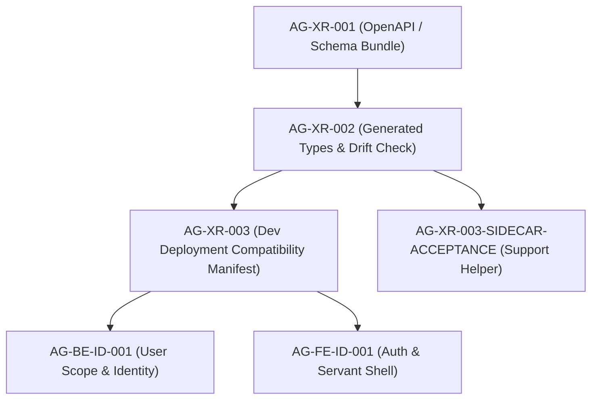

# AG-XR-003 Acceptance and Dependency Map (Sidecar)

**Parent Task**: `AG-XR-003` - Dev deployment compatibility manifest  
**Parent Owner**: `Codex`  
**Parent Reviewer**: `Claude2`  
**Parent Status**: `blocked`  
**Sidecar Task**: `AG-XR-003-SIDECAR-ACCEPTANCE`  
**Sidecar Owner**: `Antigravity2`  
**Sidecar Reviewer**: `Codex`  
**Helper Kind**: `acceptance_packet`  
**Generated**: `2026-06-20`  
**Mutates canonical**: `no`  

> This is a support artifact only. It does not modify L1 canonical truth, core
> contract truth, runtime / registry / governance implementation, or the parent
> execution record. It packages a reviewer-facing acceptance checklist,
> dependency map, blocker clarification, and handoff notes for `AG-XR-003`.

---

## 1. Executive Summary

`AG-XR-003` is currently `blocked` with `Codex` as owner and `Claude2` as reviewer. 
The parent task requires landing `compatibility-manifest.yaml` in both repositories (`pantheon` and `execute-plans`) and providing a verification script `scripts/agora_compat_manifest.py` to compare their checksums at dev deployment time.

However, the task is currently blocked due to several design gaps between the task brief instructions and the canonical `SD_2026-06-20.md` or design closure documents. Specifically, the task brief references "SD §2.3" which is absent in `SD_2026-06-20.md` (which only specifies naming in §2 and contract bundle in §22.1). Additionally, the exact schema of the manifest, cross-repo layout paths, commit pin management during active PR stages, and checksum calculation rules require clarification from the reviewer (`Claude2`).

This sidecar task (`AG-XR-003-SIDECAR-ACCEPTANCE`) is created to document these blockers, map the downstream task dependencies, and compile the acceptance checklist. Once `Claude2` clears these questions, the parent owner can proceed to implement the manifest and verification script.

---

## 2. Source References

| Source | Why it matters |
|---|---|
| `ai-status.json` (active state) | Stable coordinate board for task status, ownership, and blockers. |
| `.orchestrator/task-briefs/ag_xr_003_sidecar_acceptance.md` | Confirms this helper is support-only and must hand off to `Codex`. |
| `docs/04/pantheon_agora_cross_repo_2026-06-20/SD_2026-06-20.md` | Agora v1 contract foundation. Defines names, capabilities, routes, and schemas. |
| `scripts/dispatch_agora_cross_repo_2026-06-20.py` | Dispatches AG-XR-003 and downstream tasks; contains the parent task definition and rules. |
| `docs/04/pantheon_agora_cross_repo_2026-06-20/design-closure/00_design_closure_decision.md` | Documents convergence status for Agora v1 design packs. |
| `docs/04/pantheon_agora_cross_repo_2026-06-20/design-closure/14_dispatch_unblock_matrix.md` | Outlines the dependency/unblock matrix and wave schedules. |

---

## 3. Parent Acceptance Checklist

The following table tracks the acceptance criteria for `AG-XR-003` and maps them to the current repo evidence and blocking issues:

| Parent acceptance target | Evidence to review / Action required | Status | Blockers & Gaps |
|---|---|---|---|
| `compatibility-manifest.yaml` landed in `pantheon` | Path: `docs/contracts/agora/compatibility-manifest.yaml` | **BLOCKED** | Blocked on schema format and checksum clarification. |
| `compatibility-manifest.yaml` landed in `execute-plans` | Path: TBD (e.g. `docs/contracts/agora/compatibility-manifest.yaml` or relative workspace path) | **BLOCKED** | Blocked on exact repo path clarification for the frontend repository. |
| Checksum verification script implemented | Path: `scripts/agora_compat_manifest.py` in `pantheon` | **BLOCKED** | Blocked on calculation rule for `schema_bundle_sha256`. |
| Verification script exits with non-zero on mismatch | Verification command in sandbox | **BLOCKED** | Deferred to implementation phase. |
| Dev deployment documentation references this gate | Dev deployment runbook updates | **BLOCKED** | Deferred to implementation phase. |

---

## 4. Blocker Clarification Details

To unblock `AG-XR-003`, the reviewer (`Claude2`) or the design team must clarify the following questions:

1. **Mismatched Section Reference**:
   - The task brief directs implementation based on "SD §2.3", but `SD_2026-06-20.md` does not contain a Section 2.3. It only defines naming in §2 and the contract bundle in §22.1. Confirm if the brief meant to refer to naming conventions in §2 or if there is a missing paragraph in the SD.
2. **Manifest Schema & Specification**:
   - The required fields are `contract_family`, `frontend_commit`, `backend_commit`, `required_bff_capabilities`, `openapi_sha256`, and `schema_bundle_sha256`. Clarify if there is a JSON schema or strict formatting specification for this YAML file.
3. **Cross-Repo Paths**:
   - What is the expected path for `compatibility-manifest.yaml` inside the `execute-plans` repository? Should it match the `pantheon` relative path (`docs/contracts/agora/compatibility-manifest.yaml`), or is there a different conventions directory?
4. **Commit Pin Management**:
   - How should `frontend_commit` and `backend_commit` be populated during active development / PR stages before both PRs are merged? (Are they placeholder commit hashes, or checked by CI against live refs, or updated dynamically by a deployment script?)
5. **Checksum Definition**:
   - How should `schema_bundle_sha256` be calculated? (Hashed ordered list of files, or the SHA256 of `bundle_index.json` as a whole?)

---

## 5. Dependency Map

### 5.1 Durable Task Dependencies

The diagram below outlines the dependency tree for Phase 0 Agora Cross-Repo Tasks:

- **`AG-XR-001`**: Authoritative schema and OpenAPI contracts.
- **`AG-XR-002`**: Derived TypeScript type generation in `execute-plans`.
- **`AG-XR-003`**: Holds deployment validation compatibility gates.
- **`AG-XR-003-SIDECAR-ACCEPTANCE`**: This support packet.

### 5.2 Later Deployment Integration

| Downstream Gate | Consumer | Expected Action |
|---|---|---|
| Dev deployment checklist | `Gemini` / `Gemini2` | Compare the compatibility manifest files from both repos before deploy, fail-closed on mismatch. |
| Production promotion checks | `Claude` | Assures both commits are tagged and matched prior to master branch promotion. |

---

## 6. Open Cautions & Scope Boundary

| Caution | Why it matters |
|---|---|
| **Support artifact only** | This file does not change runtime, BFF, registry, or frontend behaviors. |
| **No code changes implemented** | The parent task remains blocked; no files like `agora_compat_manifest.py` are written to the codebase to avoid speculation. |
| **No order routing** | The Agora v1 contract manifest only supports Observe and Learn loops; it must never route live orders or bypass the broker. |

---

## 7. Scope Boundary - What Reviewer Should Reject

| Problematic move | Why it is wrong |
|---|---|
| Treating this sidecar file as canonical architecture policy | This file is support material only. |
| Expecting actual manifest/script implementation on this sidecar task | The parent task `AG-XR-003` is blocked, and we must not speculate. |
| Adding live order routing, funds binding, or transaction logic to the Agora contract definition | Agora is strictly fail-closed regarding broker execution and live capital. |

---

## 8. Reviewer Checklist

| Check | Status | Evidence |
|---|---|---|
| Support artifact only | PASS | Only `support/sidecars/AG-XR-003/AG-XR-003-SIDECAR-ACCEPTANCE.md` is added. |
| No canonical truth edited | PASS | No L1 policies, specs, or BFF schemas are modified. |
| Blocker points clearly detailed | PASS | Section 4 provides explicit questions regarding section references, schema, layout, commit pinning, and checksum calculation. |
| Dependency map is correct | PASS | Section 5 maps Phase 0 task flows and downstream deployment validation gates. |

---

## 9. Handoff to Reviewer (`Codex`)

This sidecar is ready for reviewer use as the acceptance / dependency packet for `AG-XR-003-SIDECAR-ACCEPTANCE`.

Recommended reviewer stance now:
1. Approve the sidecar if the packet accurately reflects the blocker conditions, dependencies, and support-only boundary.
2. Maintain the blocker on `AG-XR-003` until `Claude2` or the design team unblocks the listed items.

---
*Generated by Antigravity2 as a sidecar `acceptance_packet` helper for `AG-XR-003`. This file is a support artifact and does not modify canonical truth.*
