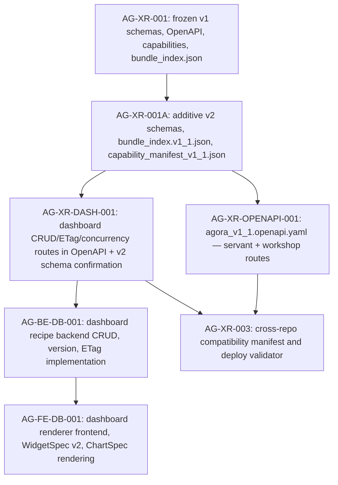

# AG-XR-DASH-001 Sidecar Acceptance Packet

- Parent task: `AG-XR-DASH-001` - WidgetSpec v2, ChartSpec v1, DashboardRecipe v2 and mutation/concurrency contract
- Helper task: `AG-XR-DASH-001-SIDECAR-ACCEPTANCE`
- Helper kind: `acceptance_packet`
- Owner: `Claude2`
- Reviewer: `Claude`
- Prepared: `2026-06-20`
- Mutates canonical truth: `no`

This is a support artifact only. It does not implement WidgetSpec v2, ChartSpec v1,
DashboardRecipe v2, or the dashboard CRUD/ETag/concurrency OpenAPI routes. It does not
edit frozen AG-XR-001 files, modify the extension bundle, update capability manifests,
generate TypeScript, or change runtime / registry / governance behavior.

## Purpose

`AG-XR-DASH-001` must publish the dashboard contract layer that unblocks `AG-BE-DB-001`
(dashboard recipe backend) and `AG-FE-DB-001` (dashboard renderer frontend). The v2
schema files landed with `AG-XR-001A`, but the dashboard CRUD/ETag/concurrency OpenAPI
routes, `agora.dashboard.v2` capability integration, and the three missing dashboard
prose routes are still absent.

This packet gives the parent owner and reviewer an acceptance checklist, observable fact
baseline, and dependency map so the parent task can be reviewed against concrete
pass/fail criteria.

## Sources Read

| Source | Evidence used |
|---|---|
| `AI_COLLABORATION_GUIDE.md` | Sidecar lifecycle, status command, and support-only workflow rules. |
| `.orchestrator/task-briefs/ag_xr_dash_001_sidecar_acceptance.md` | Confirms this helper prepares an acceptance packet and dependency map without canonical edits. |
| `docs/04/pantheon_agora_cross_repo_2026-06-20/contract-closure/ARCHIVE_NOTES.md` | Names AG-XR-DASH-001 as responsible for WidgetSpec v2 / ChartSpec / DashboardRecipe v2 + CRUD/ETag, and lists the 3 missing dashboard routes absent from the seed OpenAPI. |
| `docs/04/pantheon_agora_cross_repo_2026-06-20/contract-closure/02_schema_coexistence_and_migration.md` | Immutable-base rule; additive extension file layout under `v2/`; v1 hash preservation requirement; legacy-adapter mapping semantics. |
| `docs/04/pantheon_agora_cross_repo_2026-06-20/contract-closure/04_dashboard_crud_and_concurrency.md` | Canonical dashboard routes, version/ETag model, mutation semantics (proposal, accept, layout patch, rollback, feedback), and `agora.dashboard.v2` capability requirement. |
| `docs/04/pantheon_agora_cross_repo_2026-06-20/contract-closure/05_execute_plans_agora_ui_ia_and_dependencies.md` | Frontend IA structure, widget rendering dispatch, library additions, and BFF boundary rule. |
| `docs/04/pantheon_agora_cross_repo_2026-06-20/contract-closure/07_dispatch_unblock_matrix_v2.md` | Confirms AG-XR-DASH-001 is the unblock predecessor for AG-BE-DB-001; lists required unblock evidence. |
| `support/sidecars/AG-XR-001A/AG-XR-001A-SIDECAR-ACCEPTANCE.md` | Dependency map showing AG-XR-001A → AG-XR-DASH-001 → AG-BE-DB-001/AG-FE-DB-001 chain. |
| `support/sidecars/AG-XR-003/AG-XR-003-SIDECAR-ACCEPTANCE-FOLLOWUP-3.md` | Current observable hashes for v2 schema files and bundle indices; current repo baseline. |
| `services/control-plane/specs/agora/v2/` (directory listing) | Confirms which v2 schema files exist in the current repo: `widget_spec_v2.schema.json`, `chart_spec_v1.schema.json`, `dashboard_recipe_v2.schema.json`, `compatibility_manifest.schema.json`, `capability_manifest_v1_1.json`. |
| `services/control-plane/openapi/` (directory listing) | Confirms `agora_v1_1.openapi.yaml` is **not present** in the current repo baseline. |
| `python3 scripts/agora_schema_bundle.py --verify` | Confirms the frozen v1 base bundle still passes 15-file integrity check. |

`current-work.md` and the full `ai-activity-log.jsonl` were not read.

## Current Repository Baseline

| Artifact | Status |
|---|---|
| `services/control-plane/specs/agora/v2/widget_spec_v2.schema.json` | Present. SHA-256: `d360a17a9762d69e6a5e2c87921117bb85ee34d972fd8034f8904df6facb993f` |
| `services/control-plane/specs/agora/v2/chart_spec_v1.schema.json` | Present. SHA-256: `0bcd0fa5fc21d7c021d54803780e310cfd9234b3ea15c044fa0b5cdfffed0967` |
| `services/control-plane/specs/agora/v2/dashboard_recipe_v2.schema.json` | Present. SHA-256: `34c7e0fab793ec79776e9ddd5cca98683cacc6b8bba328e02a8c4c5eba45c13a` |
| `services/control-plane/specs/agora/v2/compatibility_manifest.schema.json` | Present (AG-XR-001A). SHA-256: `84c3607195484d09710708c08e7c29821b75d83199376cd5374a2ce0c3ca7827` |
| `services/control-plane/specs/agora/v2/capability_manifest_v1_1.json` | Present (AG-XR-001A). SHA-256: `6a729d1284ca8f88058a4c301dc67a4c17fd76097190bf020310f4f2cab3db41` |
| `services/control-plane/specs/agora/bundle_index.v1_1.json` | Present (AG-XR-001A). SHA-256: `5f875202966d1e373ab325b7107de8355798f1e3f55cdac2548aa74607a821ee` |
| `services/control-plane/openapi/agora_v1_1.openapi.yaml` | **Absent.** Not yet authored. |
| `services/control-plane/openapi/agora_v1.openapi.yaml` | Present (frozen AG-XR-001). Must remain immutable. |
| `python3 scripts/agora_schema_bundle.py --verify` | Pass: all 15 frozen v1 Agora files verified. |

The v2 schema files exist because they were committed by `AG-XR-001A`. The CRUD/ETag
mutation routes and the full `agora_v1_1.openapi.yaml` are still missing; those are the
primary deliverable of `AG-XR-DASH-001`.

## Missing Dashboard Routes (from ARCHIVE_NOTES.md)

The seed OpenAPI (`agora_openapi_extension_v1_1.yaml`) covers only 24 of the 32 prose
routes. The three missing dashboard routes that `AG-XR-DASH-001` must author from
`04_dashboard_crud_and_concurrency.md` are:

```text
POST /bff/agora/dashboard-recipes/{recipe_id}/feedback
POST /bff/agora/widgets/{widget_id}/feedback
POST /bff/agora/widgets/propose-plugin
```

These routes are listed in `04_dashboard_crud_and_concurrency.md` canonical route table
and must appear in the final `agora_v1_1.openapi.yaml` alongside the complete CRUD set.

## Parent Acceptance Checklist

| Check | Expected parent evidence | Sidecar stance |
|---|---|---|
| Preserve AG-XR-001 immutable base | No edits to frozen v1 files; `python3 scripts/agora_schema_bundle.py --verify` still passes all 15 files. | Reviewer must verify. |
| Do not re-hash v2 schema files that AG-XR-001A already committed | `widget_spec_v2.schema.json`, `chart_spec_v1.schema.json`, `dashboard_recipe_v2.schema.json` hashes unchanged from baseline if not semantically changed; any update requires explicit rationale. | Reviewer must flag if hashes change without changelog. |
| Author full dashboard CRUD route set | `agora_v1_1.openapi.yaml` (or a dashboard-specific OpenAPI file) covers all 11 canonical routes from `04_*` including the 3 missing prose routes. | Parent implementation. |
| Encode ETag and optimistic concurrency | Every state-changing route requires `If-Match` header and `Idempotency-Key`; mismatch returns `CONCURRENT_MODIFICATION` with `expected_version` and `current_etag` details. | Parent implementation. |
| Encode `expected_version` in mutation bodies | Proposal, accept, layout-patch, and rollback request bodies carry `expected_version` for explicit auditability alongside `If-Match`. | Parent implementation. |
| Version history is append-only | No route creates a new version whose `previous_version` is null when a prior version exists; rollback creates a new version equal in content to a historical version, not a rewind or deletion. | Parent implementation. |
| ETag format is explicit | `ETag: "recipe:<recipe_id>:v<version>:<content_sha256-prefix>"` exactly as specified in `04_*`. | Parent implementation. |
| Register `agora.dashboard.v2` capability | `capability_manifest_v1_1.json` already present; parent review confirms it includes `agora.dashboard.v2`; if it is missing, the parent task must add it without broadening broker/capital/RuntimeBinding authority. | Reviewer must verify capability list. |
| Layout patch operations are enumerated | OpenAPI schema for PATCH `layout` body enumerates the six allowed operations: `move_widget`, `resize_widget`, `remove_widget`, `add_registered_widget`, `replace_chart_spec`, `update_widget_query`. | Parent implementation. |
| No arbitrary HTML/JS execution in WidgetSpec | `widget_spec_v2.schema.json` must not allow executable or eval-like fields; renderer dispatch is type-based only. | Reviewer must verify. |
| v1/v2 names are explicit | Generated types and contract use explicit `WidgetSpecV1` / `WidgetSpecV2`, `DashboardRecipeV1` / `DashboardRecipeV2` names; no silent v1-to-v2 coercion. | Required by `02_*`. |
| BFF boundary enforced | Dashboard routes are under `/bff/agora/`; no direct page-level fetch; reads and writes through `src/lib/bff-v1/agora/*` in the frontend. | Frontend acceptance dependency. |
| No live-order, broker, capital, or RuntimeBinding authority | Dashboard contract is UI CRUD and proposal only; no new live execution or governance authority. | Reviewer must reject violations. |

## Dependency Map



Durable interpretation:

- `AG-XR-001` is the frozen v1 baseline. `AG-XR-DASH-001` must not edit it.
- `AG-XR-001A` already committed the v2 schema files and the v1.1 extension bundle index.
  `AG-XR-DASH-001` should validate these schema files meet the `04_*` contract, confirm the
  capability manifest includes `agora.dashboard.v2`, and author the missing OpenAPI routes.
- `AG-XR-DASH-001` must author the full dashboard CRUD route contract before
  `AG-BE-DB-001` can implement the backend or `AG-FE-DB-001` can implement the renderer.
- `AG-XR-003` needs both the dashboard contract and the OpenAPI hash before it can produce
  a compatibility manifest that passes deployment validation.
- `AG-FE-DB-001` depends on `AG-BE-DB-001` contract only, not `AG-BE-DB-001`
  implementation — the frontend can begin type generation once the contract is merged.

## Reviewer Questions For Claude

| Question | Expected reviewer stance |
|---|---|
| Does this packet preserve the support-only boundary? | Approve only if no canonical specs, OpenAPI, capability files, runtime code, or registry/governance implementation were edited by this sidecar. |
| Do the v2 schema baselines in the repo match the `04_*` contract intent? | Approve if schema files contain the widget type, chart type, and recipe version fields that `04_*` implies; flag if any required field group is absent or the schema permits arbitrary executable content. |
| Does the checklist cover the 3 missing dashboard routes? | Approve only if the parent checklist explicitly names the three missing routes from `ARCHIVE_NOTES.md`. |
| Is `agora.dashboard.v2` in the v1.1 capability manifest? | Reviewer should confirm `capability_manifest_v1_1.json` lists this capability before the parent task moves to done. |
| Are ETag and `expected_version` both required? | Both are required per `04_*` — `If-Match` for concurrency guard, `expected_version` in the body for auditability. Approve only if both are reflected. |
| Are broker/capital/RuntimeBinding authority boundaries explicit? | Reject any parent plan that introduces live-order routing, broker execution, capital binding, or governance-plane write authority as part of the dashboard contract. |

## Suggested Handoff

If this packet is acceptable, reviewer `Claude` can treat it as the support acceptance and
dependency map for `AG-XR-DASH-001-SIDECAR-ACCEPTANCE`.

Recommended status handoff message:

```text
Support packet ready for AG-XR-DASH-001: acceptance checklist and dependency map are in
support/sidecars/AG-XR-DASH-001/AG-XR-DASH-001-SIDECAR-ACCEPTANCE.md. The packet records
the current v2 schema baseline, lists the 3 missing dashboard routes, maps the CRUD/ETag
concurrency contract to parent acceptance checks, and identifies the dependency chain to
AG-BE-DB-001 and AG-FE-DB-001 without editing canonical truth.
```

## Verification

Commands run while preparing this packet:

```bash
git status -sb
git branch --show-current
ls services/control-plane/specs/agora/v2/
ls services/control-plane/openapi/
python3 scripts/agora_schema_bundle.py --verify
sha256sum services/control-plane/specs/agora/v2/*.json services/control-plane/specs/agora/bundle_index.v1_1.json
grep -r "AG-XR-DASH-001" docs/04/pantheon_agora_cross_repo_2026-06-20/contract-closure/
```

Results:

- Branch: `task/AG-XR-DASH-001-SIDECAR-ACCEPTANCE`. Working tree clean except task brief.
- `ls services/control-plane/specs/agora/v2/`: 5 files present (capability_manifest_v1_1.json,
  chart_spec_v1.schema.json, compatibility_manifest.schema.json, dashboard_recipe_v2.schema.json,
  widget_spec_v2.schema.json).
- `ls services/control-plane/openapi/`: only `agora_v1.openapi.yaml`; `agora_v1_1.openapi.yaml`
  is absent.
- `python3 scripts/agora_schema_bundle.py --verify`: pass; all 15 frozen v1 files verified.
- SHA-256 hashes recorded in the baseline table above.
- `grep AG-XR-DASH-001`: 5 hits confirming AG-XR-DASH-001 is the WidgetSpec v2 / CRUD/ETag
  predecessor to AG-BE-DB-001 per the closure pack.

## Sidecar Completion Criteria

This sidecar is ready for review when:

- this support packet exists at the declared artifact path;
- it maps parent acceptance to concrete artifacts and verification evidence;
- it records the dependency/unblock relationship without broadening scope;
- it preserves the "no canonical truth changes" sidecar boundary;
- it is handed off to `Claude` for review and possible absorption by the parent owner.
