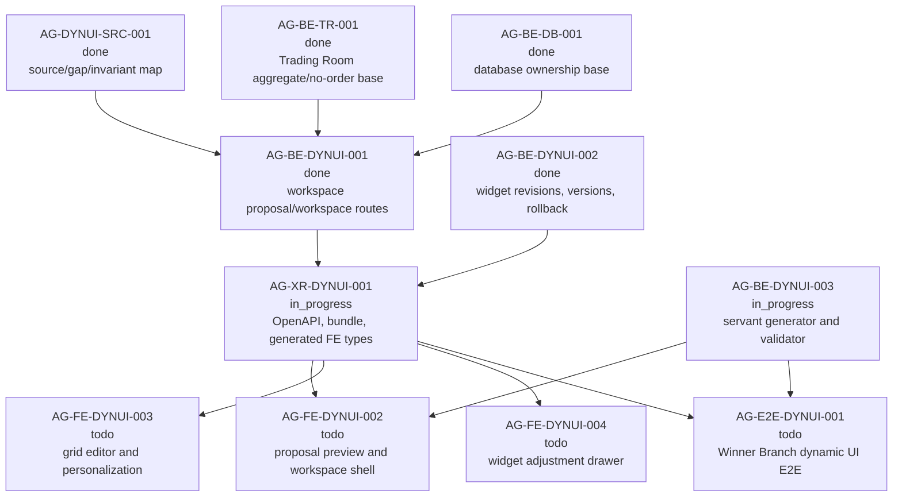

# AG-XR-DYNUI-001 Sidecar Acceptance Packet

**Sidecar task:** `AG-XR-DYNUI-001-SIDECAR-ACCEPTANCE`
**Helper parent:** `AG-XR-DYNUI-001`
**Helper kind:** `acceptance_packet`
**Parent title:** Dynamic Trading Room OpenAPI and generated frontend types
**Parent owner:** `Codex`
**Parent reviewer:** `Claude`
**Parent status at packet preparation:** `in_progress` in central L0 state on
2026-06-29
**Sidecar owner:** `Codex`
**Sidecar reviewer:** `Codex2`
**Date:** `2026-06-29`
**Status:** reviewer handoff pending

> Scope constraint: support artifact only. This packet packages acceptance
> criteria, dependency routing, blocker triggers, and verification guidance for
> `AG-XR-DYNUI-001`. It does not edit canonical truth, schemas, OpenAPI, BFF
> routes, persistence, widget registry code, governance logic, frontend runtime
> code, generated types, or compatibility manifests.

---

## 1. Purpose

`AG-XR-DYNUI-001` owns the cross-repo contract drift closure after the backend
dynamic Trading Room contracts from `AG-BE-DYNUI-001` and `AG-BE-DYNUI-002`
land. The parent must make the dynamic Trading Room route and schema family
visible through the versioned Agora OpenAPI/schema bundle and regenerate the
execute-plans Agora BFF type surface from that bundle.

This acceptance packet gives the parent owner and reviewer a narrow gate for
the XR contract slice:

1. Add the V11 Trading Room workspace, widget revision, workspace version, and
   rollback route family to a versioned OpenAPI/schema bundle.
2. Ensure the bundle includes the backend schema definitions needed for
   `TradingRoomWorkspaceProposal`, `TradingRoomWorkspace`,
   `TradingRoomViewSpec`, `TradingRoomWidgetSpec`,
   `WidgetRevisionProposal`, and workspace version/change-log resources.
3. Regenerate execute-plans Agora generated types and contract snapshot from
   the same bundle, without hand-written type substitutes.
4. Update drift/compatibility checks so backend contract hashes, frontend
   generated type hashes, and selected bundle version agree.
5. Preserve the existing Agora no-order, no-capital, no-RuntimeBinding, no
   Management-plane, and no arbitrary-code-injection boundaries.

The packet does not approve or implement the parent. It is a reviewer checklist
and dependency map for parent absorption.

---

## 2. Sources Used

| Source | Role for this packet |
| --- | --- |
| `.orchestrator/task-briefs/ag_xr_dynui_001_sidecar_acceptance.md` | Sidecar scope: acceptance packet and dependency map only; no canonical truth changes. |
| `AI_COLLABORATION_GUIDE.md` | L0/L1/L2 boundary rules; support packets cannot override canonical architecture truth. |
| `AI_NAME=Codex ./scripts/ai-status.sh show AG-XR-DYNUI-001-SIDECAR-ACCEPTANCE` | Sidecar state: `in_progress`, owner `Codex`, reviewer `Codex2`, artifact path is this file. |
| `AI_NAME=Codex ./scripts/ai-status.sh show AG-XR-DYNUI-001` | Parent state: `in_progress`, owner `Codex`, reviewer `Claude`, depends on `AG-BE-DYNUI-001` and `AG-BE-DYNUI-002`. |
| `AI_NAME=Codex ./scripts/ai-status.sh show AG-BE-DYNUI-001` | Upstream workspace proposal/workspace backend task archived `done`, merged to `dev` at `eac485c90360a93545b5bf023e9324ca50c1b342`. |
| `AI_NAME=Codex ./scripts/ai-status.sh show AG-BE-DYNUI-002` | Upstream widget revision/version/rollback backend task archived `done`, merged to `dev` at `b3c8e654be5502be7c97e69d69f8aabee3a2ab53`. |
| `docs/04/agora_design_pack_dynui_2026-06-28/README.md` | Dynamic UI execution packet and task graph. |
| `docs/04/agora_design_pack_dynui_2026-06-28/source-map-and-gap-map.md` | Frozen V11 source/gap/invariant map. Routes missing OpenAPI/generated frontend types for the dynamic Trading Room contract family to `AG-XR-DYNUI-001`. |
| `support/sidecars/AG-BE-DYNUI-001/AG-BE-DYNUI-001-IMPLEMENTATION-EVIDENCE.md` | Upstream evidence that workspace proposal/workspace schema, store, routes, and focused tests landed; OpenAPI/generated type sync remains XR scope. |
| `support/sidecars/AG-BE-DYNUI-001/AG-BE-DYNUI-001-SIDECAR-REVIEW.md` | Reviewer summary of implemented proposal/workspace backend surfaces and residual OpenAPI/generated type boundary. |
| `support/sidecars/AG-BE-DYNUI-002/AG-BE-DYNUI-002-SIDECAR-ACCEPTANCE.md` | Upstream acceptance boundary for widget revision proposals, versions, rollback, and downstream XR type closure. |
| `services/control-plane/specs/agora/trading_room_workspace.schema.json` | Current backend schema foundation containing workspace proposal, workspace, view/widget, layout operation, widget revision proposal, dashboard version, and change-log definitions. |
| `services/control-plane/bff/agora/trading_room/router.py` and `test_trading_room.py` | Current route/test evidence for proposal/workspace, widget revision, versions, rollback, ETag/idempotency, registry validation, and no-order boundaries. |
| `services/control-plane/openapi/agora_v1_4.openapi.yaml` | Latest inspected OpenAPI extension is candidate-pool focused and does not contain the dynamic Trading Room workspace/revision route family. |
| `services/control-plane/specs/agora/bundle_index*.json` | Current bundle chain reaches v1.4, but v1.4 includes candidate-pool files only; dynamic Trading Room workspace schema is not in the bundle chain. |
| `execute-plans/scripts/generate-agora-types.mjs` | Type generation currently defaults to `bundle_index.v1_1.json` and only composes v1/v1.1 OpenAPI/capability inputs. |
| `execute-plans/src/lib/bff-v1/agora/contract-snapshot.json` and `types.ts` | Generated frontend contract snapshot is v1.1; generated types do not expose V11 Trading Room workspace/revision schemas or operations. |
| `execute-plans/src/lib/bff-v1/agora/tradingRoom.ts` | Current typed client exposes aggregate, strategy detail, decision events, and decision writes only. |
| `scripts/agora_compat_manifest.py` and `scripts/test_agora_compat_manifest.py` | Compatibility manifest and tests currently hardcode Agora v1.1 bundle/openapi paths and generated type snapshot expectations. |
| `support/sidecars/AG-FE-DYNUI-002/AG-FE-DYNUI-002-SIDECAR-BFF-HANDOFF.md` | Downstream FE handoff says FE proposal preview should wait for generated XR types or an explicit temporary adapter decision. |

`current-work.md` and the full `ai-activity-log.jsonl` were not used as sources
for this packet.

---

## 3. Pre-Absorption Gap Snapshot

These observations were captured during sidecar packet preparation. They are
acceptance context for `AG-XR-DYNUI-001`, not canonical truth.

| Surface | Preparation observation | Parent implication |
| --- | --- | --- |
| Backend dynamic schema | `trading_room_workspace.schema.json` now contains `TradingRoomWorkspaceProposal`, `TradingRoomWorkspace`, `TradingRoomViewSpec`, `TradingRoomWidgetSpec`, `WorkspaceLayoutOperation`, `WidgetRevisionProposal`, and `TradingRoomDashboardVersion`. | Parent should use the backend schema as the source for OpenAPI/schema-bundle exposure instead of inventing new frontend-only shapes. |
| Backend route family | `router.py` and focused tests include proposal create/get/accept, workspace read/layout, view/widget mutation, widget revision create/accept, versions, and rollback routes. | Parent OpenAPI must document this full route family with request/response envelopes, headers, and error codes. |
| Latest OpenAPI extension | `agora_v1_4.openapi.yaml` is candidate-pool focused; route search found no `trading-room/proposals`, `trading-room/workspaces`, `revision-proposals`, or workspace rollback routes in it. | Parent cannot claim XR closure until a versioned OpenAPI extension includes the dynamic Trading Room routes. |
| Bundle chain | `bundle_index.v1_4.json` includes v5 candidate-pool schemas and `agora_v1_4.openapi.yaml`, but does not include `trading_room_workspace.schema.json`. | Parent must add an additive bundle version or equivalent repo-approved bundle update that includes the dynamic Trading Room schema/openapi surfaces. |
| Type generator | `generate-agora-types.mjs` defaults to v1.1 and only auto-includes v1/v1.1 OpenAPI and v1.1 capability manifests. | Parent must teach generation/check mode to consume the selected latest bundle chain and all relevant OpenAPI/capability extensions. |
| Generated frontend types | `contract-snapshot.json` reports `contract_version: "1.1"` and `types.ts` lacks V11 workspace/revision types and operations. | Parent must regenerate frontend contract snapshot/types from the dynamic Trading Room bundle and fail drift checks when stale. |
| Frontend Trading Room client | `tradingRoom.ts` exposes aggregate/decision-event methods only. | Parent may add typed client methods or a narrow generated-type-backed helper, but must not hand-write durable duplicate contract types. |
| Compatibility manifest | `agora_compat_manifest.py` and tests hardcode `contract_family: agora.v1.1`, v1.1 bundle/openapi paths, and v1.1 snapshot checks. | Parent must update manifest generation/verification so dynamic bundle and generated type hashes are the deployment-gated contract truth. |
| Downstream frontend | `AG-FE-DYNUI-002` depends on `AG-XR-DYNUI-001`. | FE tasks should consume generated types from this parent, not create local contract guesses. |

---

## 4. Parent Acceptance Checklist

| # | Criterion | Acceptance rule |
| --- | --- | --- |
| 1 | **Design source is cited** | Parent closeout evidence cites the frozen dynamic UI source map and the V11 requirement source. If the source cannot be read, parent opens a blocker instead of inventing fields or routes. |
| 2 | **Backend dependencies are current** | Parent starts from `AG-BE-DYNUI-001` merge `eac485c90360a93545b5bf023e9324ca50c1b342` and `AG-BE-DYNUI-002` merge `b3c8e654be5502be7c97e69d69f8aabee3a2ab53`, or documents a newer `dev` merge that contains both. |
| 3 | **Additive bundle version is explicit** | Parent adds a new versioned Agora bundle or repo-approved equivalent that includes dynamic Trading Room files without mutating frozen earlier bundle semantics. |
| 4 | **Dynamic schema is bundled** | Bundle files include `services/control-plane/specs/agora/trading_room_workspace.schema.json` or an equivalent additive schema file containing workspace proposal, workspace, view, widget, layout operation, widget revision, workspace version, and change-log definitions. |
| 5 | **OpenAPI route family is complete** | OpenAPI includes proposal create/read/accept, workspace read, layout patch, view create/update, widget create/update, widget revision proposal create/accept, workspace versions list, and workspace rollback routes. |
| 6 | **Operation IDs are stable** | Dynamic Trading Room OpenAPI operations have unique, deterministic `operationId` values suitable for generated frontend route maps and drift checks. |
| 7 | **Headers are documented** | Mutating routes document required `If-Match` where concurrency applies, `Idempotency-Key`, and `X-Request-Id`. Read routes document response `ETag` where downstream mutations need it. |
| 8 | **Response envelopes match backend** | OpenAPI response envelopes match the backend route behavior for success, stale writes, forbidden scope, invalid proposal state, validation failure, not found, and capability-not-ready responses. |
| 9 | **Primary schemas are generated** | Generated frontend output exports `TradingRoomWorkspaceProposal`, `TradingRoomWorkspace`, `TradingRoomViewSpec`, `TradingRoomWidgetSpec`, `WidgetRevisionProposal`, and `TradingRoomDashboardVersion` or intentionally named equivalents from the backend bundle. |
| 10 | **Generated route map includes dynamic routes** | `AGORA_V1_OPERATIONS` or the successor route map contains the dynamic Trading Room proposal/workspace/revision/version/rollback operation IDs and paths. |
| 11 | **Frontend snapshot points at the dynamic bundle** | `execute-plans/src/lib/bff-v1/agora/contract-snapshot.json` records the selected dynamic bundle version and source bundle path, not stale v1.1-only inputs. |
| 12 | **No hand-written durable type substitute** | Parent does not add long-lived local frontend interfaces that duplicate backend schemas. Any temporary adapter must be scoped, documented, and removed or proven generated before parent closeout. |
| 13 | **Type generator supports the selected bundle** | `execute-plans/scripts/generate-agora-types.mjs` can generate and `--check` the selected dynamic bundle, including all extension OpenAPI files and capability manifests in the bundle chain. |
| 14 | **Capability manifests are included correctly** | Generated capabilities include the dynamic Trading Room contract capability and do not drop older v1.1/v1.2/v1.3/v1.4 capabilities from the composed chain. |
| 15 | **Compatibility manifest is upgraded** | `scripts/agora_compat_manifest.py`, its tests, and `docs/contracts/agora/dev-compatibility-manifest.json` use the selected dynamic bundle/openapi/version and generated type hashes instead of v1.1-only constants. |
| 16 | **Drift gate fails closed** | A stale OpenAPI hash, stale bundle digest, stale generated type hash, or frontend-generated-from-contract commit mismatch fails the local check/deployment gate. |
| 17 | **Frontend client surface is generated-type-backed** | If parent updates `execute-plans/src/lib/bff-v1/agora/tradingRoom.ts`, new proposal/workspace/revision/version helpers use generated types and documented headers. |
| 18 | **DashboardRecipe is not substituted** | Neither OpenAPI nor generated types present `DashboardRecipeV2` routes as completion for V11 `TradingRoomWorkspaceProposal`, widget revisions, workspace versions, or rollback. |
| 19 | **Generator dependency remains honest** | Parent does not claim real servant workspace generation. `AG-BE-DYNUI-003` remains responsible for generator/validator integration and may still be `in_progress`. |
| 20 | **Frontend runtime remains downstream** | Parent does not implement AG-FE-DYNUI-002/003/004 UI runtime behavior beyond generated contract/client surfaces explicitly in XR scope. |
| 21 | **No order/capital/runtime authority leaks** | New contract output never creates broker orders, binds capital, mutates `RuntimeBinding`, exposes Management-plane actions, or uses broker/runtime backend terms as Agora operator controls. |
| 22 | **No arbitrary executable UI contract** | Schemas and generated types do not permit raw React, JavaScript, HTML, external script URLs, arbitrary renderers, raw prompts, or unsupported data-source URLs. |
| 23 | **Cross-user isolation is represented** | OpenAPI documents `403`/scope-failure behavior for proposal, workspace, revision, version, and rollback resources without implying cross-user discovery. |
| 24 | **Review evidence is attached** | Parent closeout includes exact commands and outputs for bundle verification, generated type check, compatibility manifest tests, route/schema searches, and forbidden-surface searches. |
| 25 | **Downstream handoff is actionable** | Parent closeout names the generated files and client methods that AG-FE-DYNUI-002/003/004 should consume, plus any remaining blocked surfaces. |

---

## 5. Dependency Map



### Dependency notes

| Task | State observed | Relevance |
| --- | --- | --- |
| `AG-DYNUI-SRC-001` | Published frozen dynamic UI source/gap map. | Parent must route from this source map and must not use static screenshots as contract truth. |
| `AG-BE-DYNUI-001` | Archived `done`; merge commit `eac485c90360a93545b5bf023e9324ca50c1b342`. | Supplies workspace proposal/workspace backend contract and route foundation. |
| `AG-BE-DYNUI-002` | Archived `done`; merge commit `b3c8e654be5502be7c97e69d69f8aabee3a2ab53`. | Supplies widget revision proposal, workspace versions, change log, and rollback backend contract foundation. |
| `AG-XR-DYNUI-001` | Active `in_progress`, owner `Codex`, reviewer `Claude`. | Parent task receiving this packet. |
| `AG-BE-DYNUI-003` | Active `in_progress`, owner `Codex2`, reviewer `Codex`. | Owns servant generator/validator integration; not required for OpenAPI/generated type drift closure, but downstream FE may need its readiness for live proposal generation. |
| `AG-FE-DYNUI-002` | Active `todo`, depends on `AG-XR-DYNUI-001`, `AG-BE-DYNUI-003`, `AG-FE-DYNUI-001`, and `AG-FE-TR-001`. | Needs generated proposal/workspace types and client routes from XR before implementing V11 preview shell. |
| `AG-FE-DYNUI-003` | Downstream frontend edit/runtime task. | Needs generated workspace layout/view/widget mutation types and ETag semantics. |
| `AG-FE-DYNUI-004` | Downstream frontend revision drawer task. | Needs generated widget revision proposal, accept action, version, and rollback types. |
| `AG-E2E-DYNUI-001` | Final dynamic UI acceptance. | Needs backend generator, XR generated contracts, and frontend runtime to compose. |

---

## 6. Blocker Triggers For Parent Owner

The parent owner should stop and open a blocker if any of these are true:

1. The V11 design source or frozen source/gap map cannot be read.
2. The checked-out `dev` base does not contain both upstream backend merges for
   `AG-BE-DYNUI-001` and `AG-BE-DYNUI-002`.
3. The backend route/schema surface and tests disagree about route names,
   headers, status codes, or response envelopes.
4. The repo has no approved way to add a new additive Agora bundle version for
   dynamic Trading Room contracts without mutating frozen earlier bundles.
5. Type generation cannot compose v1.2+ extension bundles without dropping
   earlier OpenAPI operations or capabilities.
6. The compatibility manifest cannot represent the selected dynamic bundle
   without weakening deployment-gate hash checks.
7. A frontend task needs the dynamic contract before generated types exist and
   would otherwise create durable hand-written interface copies.
8. Any route or schema would expose order routing, capital binding,
   RuntimeBinding, Management-plane controls, broker backend terms, arbitrary
   executable UI code, or unsupported data-source URLs.
9. Verification cannot be reproduced from checked-in scripts and commands.

---

## 7. Suggested Parent Verification Plan

Exact command names may change if the parent adds a new bundle version or
script option. The review evidence should still cover these categories.

```bash
python3 -m pytest services/control-plane/bff/agora/trading_room/test_trading_room.py -q
```

```bash
node execute-plans/scripts/generate-agora-types.mjs --check \
  --pantheon-root . \
  --bundle-index services/control-plane/specs/agora/<dynamic-bundle-index>.json
```

```bash
python3 -m pytest scripts/test_agora_compat_manifest.py -q
```

```bash
python3 scripts/agora_compat_manifest.py verify \
  --allow-pending \
  --manifest docs/contracts/agora/dev-compatibility-manifest.json
```

```bash
rg -n "TradingRoomWorkspaceProposal|TradingRoomWorkspace|TradingRoomViewSpec|TradingRoomWidgetSpec|WidgetRevisionProposal|TradingRoomDashboardVersion|trading-room/proposals|trading-room/workspaces|revision-proposals|rollback" \
  services/control-plane/openapi \
  services/control-plane/specs/agora \
  execute-plans/src/lib/bff-v1/agora
```

```bash
rg -n "RuntimeBinding|place_order|enable_live|capital_binding|broker_order|dangerouslySetInnerHTML|eval\\(|new Function|<script" \
  services/control-plane/openapi \
  services/control-plane/specs/agora \
  execute-plans/src/lib/bff-v1/agora
```

Recommended assertions:

- Bundle digest verification passes for the selected dynamic bundle chain.
- Generated frontend contract snapshot names the selected dynamic bundle.
- Generated frontend types expose workspace proposal, workspace, view, widget,
  widget revision, workspace version, and change-log shapes.
- Generated route map includes all proposal/workspace/revision/version/rollback
  operations with stable IDs.
- `generate-agora-types.mjs --check` fails before regeneration and passes after
  regeneration when the backend bundle changes.
- Compatibility manifest verification catches stale OpenAPI, stale bundle,
  stale generated types, placeholder frontend commits, and frontend/backend hash
  mismatches.
- Existing v1.1/v1.2/v1.3/v1.4 operations remain present in generated route
  output unless the parent documents an intentional versioning strategy.
- Forbidden-surface search shows no order routing, capital binding,
  RuntimeBinding mutation, Management-plane action, or executable-code injection
  contract in the dynamic Trading Room outputs.

---

## 8. Reviewer Handoff Notes

**Reviewer:** `Codex2`

### What to verify

1. The packet is support-only and does not redefine canonical contract truth.
2. The checklist is specific to `AG-XR-DYNUI-001` and does not assign backend
   generator work, FE runtime work, or E2E proof to the XR parent.
3. The pre-absorption gap snapshot accurately reflects the inspected current
   OpenAPI/bundle/type generator/generated type surfaces.
4. The dependency map reflects archived backend dependencies plus active
   downstream dynamic UI tasks.
5. The safety posture preserves no-order, no-capital, no-Management,
   no-RuntimeBinding, no arbitrary-code, and no DashboardRecipe substitution
   boundaries.

### Suggested reviewer command

```bash
AI_NAME=Codex2 REVIEW_FILE=support/sidecars/AG-XR-DYNUI-001/AG-XR-DYNUI-001-SIDECAR-ACCEPTANCE.md \
  ./scripts/ai-status.sh approve AG-XR-DYNUI-001-SIDECAR-ACCEPTANCE \
  "Acceptance packet approved; support artifact gives AG-XR-DYNUI-001 concrete OpenAPI, bundle, generated type, compatibility manifest, dependency routing, blocker trigger, and verification guidance without changing canonical truth."
```

If changes are required:

```bash
AI_NAME=Codex2 ./scripts/ai-status.sh reopen AG-XR-DYNUI-001-SIDECAR-ACCEPTANCE \
  "Describe the exact packet corrections needed."
```

---

## 9. Support-Only Boundary Confirmation

- No L1/L2 canonical policy or architecture document was edited.
- No schema, OpenAPI, BFF route, persistence layer, widget registry,
  governance logic, frontend runtime, generated type file, compatibility
  manifest, or drift script was changed.
- The only intended deliverable is this support packet.
- This sidecar does not approve or implement `AG-XR-DYNUI-001`. It gives the
  parent owner and reviewer a concrete acceptance surface.

*Prepared by Codex for the `AG-XR-DYNUI-001-SIDECAR-ACCEPTANCE` sidecar slice.*
