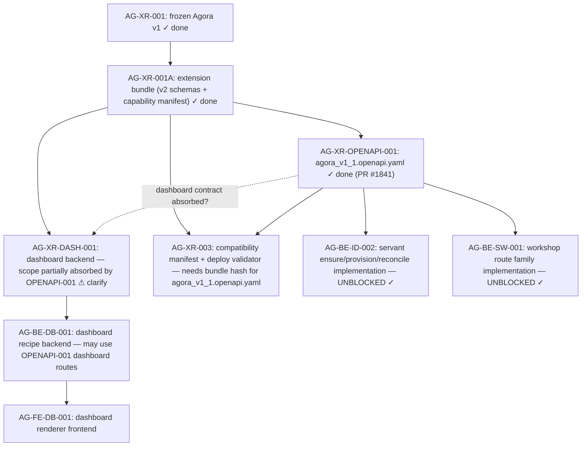

# AG-XR-OPENAPI-001 Sidecar Acceptance Followup-2 — Post-Delivery Verification

- Parent task: `AG-XR-OPENAPI-001` — Publish Agora OpenAPI v1.1 and capability manifest v1.1
- Helper task: `AG-XR-OPENAPI-001-SIDECAR-ACCEPTANCE-FOLLOWUP-2`
- Helper kind: `acceptance_packet`
- Owner: `Claude`
- Reviewer: `Claude2`
- Prepared: `2026-06-20`
- Mutates canonical truth: `no`

This is a support artifact only. It does not implement the OpenAPI contract,
modify frozen AG-XR-001 specs, edit capability manifests, generate TypeScript,
or change runtime / registry / governance behavior.

## Purpose

`AG-XR-OPENAPI-001` has been merged (commit `02fc5bf0`, PR #1841). The deliverable
`services/control-plane/openapi/agora_v1_1.openapi.yaml` is now committed.

This followup-2 packet:

1. Verifies the delivered file against the acceptance checklist from the original
   sidecar packet (`AG-XR-OPENAPI-001-SIDECAR-ACCEPTANCE.md`).
2. Documents the one scope deviation: the parent included 11 dashboard routes
   (`agora.dashboard.v2`) in the same file, which the original acceptance packet
   marked as AG-XR-DASH-001's responsibility. The deviation is recorded here for
   the reviewer and for the parent task owner's formal close-out decision.
3. Records operationId naming differences between the original suggestions and the
   delivered names — all minor and non-breaking.
4. Updates the dependency map to reflect the delivered state.

The original sidecar packet
(`support/sidecars/AG-XR-OPENAPI-001/AG-XR-OPENAPI-001-SIDECAR-ACCEPTANCE.md`)
remains the authoritative record of the pre-delivery analysis and was produced
before the OpenAPI file existed.

## Sources Read

| Source | Evidence used |
|---|---|
| `services/control-plane/openapi/agora_v1_1.openapi.yaml` | Delivered artifact; full route inventory verified. |
| `services/control-plane/specs/agora/bundle_index.v1_1.json` | Extension bundle index; does not yet include hash for `agora_v1_1.openapi.yaml`. |
| `python3 scripts/agora_schema_bundle.py --verify` | 15 v1 schema files all pass digest check; base bundle intact. |
| `support/sidecars/AG-XR-OPENAPI-001/AG-XR-OPENAPI-001-SIDECAR-ACCEPTANCE.md` | Original acceptance packet; baseline for comparison. |
| `git log --oneline -15` | Confirms PR #1841 (`task/AG-XR-OPENAPI-001`) merged into `dev` at `02fc5bf0`. |

`current-work.md` and the full `ai-activity-log.jsonl` were not read.

## Delivery Confirmation

| Item | Expected | Observed |
|---|---|---|
| File present | `services/control-plane/openapi/agora_v1_1.openapi.yaml` | ✓ Committed |
| `openapi:` version | `3.1.0` | ✓ `3.1.0` |
| `info.version` | `1.1.0` | ✓ `1.1.0` |
| `x-extends-contract` | points to `agora_v1.openapi.yaml` | ✓ |
| `x-capability-manifest` | points to `capability_manifest_v1_1.json` | ✓ |
| `x-base-frozen-by` | `AG-XR-001` | ✓ |
| `security:` top-level | `BearerAuth` present | ✓ |
| v1 base bundle integrity | `--verify` passes all 15 files | ✓ |

## Route Inventory Verification

### Servant Routes (8 BFF routes) — All present ✓

| # | Method | Path | Delivered operationId | Expected operationId | Match? |
|---|---|---|---|---|---|
| 1 | GET | `/bff/agora/servant` | `getAgoraServant` | `getAgoraServant` | ✓ exact |
| 2 | POST | `/bff/agora/servant/ensure` | `ensureAgoraServant` | `ensureAgoraServant` | ✓ exact |
| 3 | POST | `/bff/agora/servant/reconcile` | `reconcileAgoraServant` | `reconcileAgoraServant` | ✓ exact |
| 4 | POST | `/bff/agora/servant/sessions` | `createServantSession` | `createAgoraServantSession` | ≈ minor variant |
| 5 | GET | `/bff/agora/servant/sessions/{session_id}` | `getServantSession` | `getAgoraServantSession` | ≈ minor variant |
| 6 | POST | `/bff/agora/servant/sessions/{session_id}/messages` | `postServantSessionMessage` | `postAgoraServantSessionMessage` | ≈ minor variant |
| 7 | POST | `/bff/agora/servant/sessions/{session_id}/terminate` | `terminateServantSession` | `terminateAgoraServantSession` | ≈ minor variant |
| 8 | GET | `/bff/agora/servant/sessions/{session_id}/stream` | `streamServantSession` | `streamAgoraServantSession` | ≈ minor variant |

Paths for routes 4–8 are correct. The operationId variants drop the intermediate
`Agora` prefix in the session sub-routes. This is a non-breaking naming choice;
the path contract and parameter contract are identical. Downstream tasks
(`AG-BE-ID-002`) should use the path, not the operationId, as their contract reference.

Concurrency headers on mutating servant routes:
- `POST /ensure` → `Idempotency-Key` + `X-Request-Id` ✓
- `POST /reconcile` → `Idempotency-Key` + `X-Request-Id` ✓
- `POST /sessions` → `Idempotency-Key` + `X-Request-Id` ✓
- `POST /sessions/{id}/messages` → `Idempotency-Key` + `X-Request-Id` ✓
- `POST /sessions/{id}/terminate` → `Idempotency-Key` ✓

### Workshop Routes (13 BFF routes) — All present ✓

| # | Method | Path | Delivered operationId | Notes |
|---|---|---|---|---|
| 1 | GET | `/bff/agora/workshops` | `listAgoraWorkshops` | ✓ |
| 2 | POST | `/bff/agora/workshops` | `createAgoraWorkshop` | ✓ Idempotency-Key |
| 3 | GET | `/bff/agora/workshops/{workshop_id}` | `getAgoraWorkshop` | ✓ ETag in response |
| 4 | POST | `/bff/agora/workshops/{workshop_id}/messages` | `postAgoraWorkshopMessage` | ✓ If-Match + Idempotency-Key |
| 5 | GET | `/bff/agora/workshops/{workshop_id}/events` | `listAgoraWorkshopEvents` | ✓ |
| 6 | GET | `/bff/agora/workshops/{workshop_id}/completeness` | `getAgoraWorkshopCompleteness` | ✓ |
| 7 | GET | `/bff/agora/workshops/{workshop_id}/versions` | `listAgoraWorkshopVersions` | ✓ |
| 8 | POST | `/bff/agora/workshops/{workshop_id}/versions` | `createAgoraWorkshopVersion` | ✓ If-Match + Idempotency-Key |
| 9 | POST | `/bff/agora/workshops/{workshop_id}/versions/{version_id}/select` | `selectAgoraWorkshopVersion` | ✓ If-Match + Idempotency-Key |
| 10 | POST | `/bff/agora/workshops/{workshop_id}/research-runs` | `dispatchAgoraWorkshopResearchRun` | ≈ suggested `createAgoraWorkshopResearchRun`; If-Match + Idempotency-Key ✓ |
| 11 | POST | `/bff/agora/workshops/{workshop_id}/consultations` | `openAgoraWorkshopConsultation` | ≈ suggested `createAgoraWorkshopConsultation`; If-Match + Idempotency-Key ✓ |
| 12 | POST | `/bff/agora/workshops/{workshop_id}/conclude` | `concludeAgoraWorkshop` | ✓ If-Match + Idempotency-Key |
| 13 | GET | `/bff/agora/workshops/{workshop_id}/stream` | `streamAgoraWorkshop` | ✓ |

All 13 workshop routes are present. Routes 10–12 (previously missing from seed)
are now authored from prose. Minor operationId variants on routes 10–11 are
non-breaking; paths and verb contracts match. `AG-BE-SW-001` is now unblocked.

Concurrency model correctly implemented:
- `GET /workshops/{id}` returns `ETag` header ✓
- All mutating workshop routes carry `If-Match` + `Idempotency-Key` ✓
- `409 CONCURRENT_MODIFICATION` with `details` block on all mutating paths ✓

### Internal OpenClaw Adapter Routes (3 routes) — All present ✓

| # | Method | Path | Delivered operationId |
|---|---|---|---|
| 1 | POST | `/api/openclaw-adapter/agents/ensure` | `openclawAdapterEnsureAgent` |
| 2 | GET | `/api/openclaw-adapter/agents/{persona_id}` | `openclawAdapterGetAgent` |
| 3 | POST | `/api/openclaw-adapter/agents/{persona_id}/reconcile` | `openclawAdapterReconcileAgent` |

All three routes are tagged `openclaw-adapter` with `x-internal: true`. The
`OpenClawAdapterEnsureRequest` schema explicitly forbids
`runtime_binding`, `broker_order`, and `capital_binding` in
`allowed_capabilities` with a `const: agora_servant` persona class guard ✓.

### Scope Deviation: Dashboard Routes Included (11 routes)

The delivered file includes an `agora.dashboard.v2` capability block with 11
routes. The original acceptance packet marked dashboard routes as out of scope
for `AG-XR-OPENAPI-001` and assigned them to `AG-XR-DASH-001`.

The parent task owner decided to bundle the dashboard contract into the same
`agora_v1_1.openapi.yaml` delivery. The file's `info.description` explicitly
names this as one of three new capability families (`agora.dashboard.v2`).

**Dashboard routes included (11 routes):**

| # | Method | Path | operationId |
|---|---|---|---|
| 1 | GET | `/bff/agora/strategies/{strategy_id}/dashboard-recipes` | `listDashboardRecipes` |
| 2 | POST | `/bff/agora/strategies/{strategy_id}/dashboard-recipes/proposals` | `proposeDashboardRecipe` |
| 3 | GET | `/bff/agora/dashboard-recipes/{recipe_id}` | `getDashboardRecipe` |
| 4 | POST | `/bff/agora/dashboard-recipes/{recipe_id}/accept` | `acceptDashboardRecipe` |
| 5 | PATCH | `/bff/agora/dashboard-recipes/{recipe_id}/layout` | `patchDashboardRecipeLayout` |
| 6 | POST | `/bff/agora/dashboard-recipes/{recipe_id}/rollback` | `rollbackDashboardRecipe` |
| 7 | POST | `/bff/agora/dashboard-recipes/{recipe_id}/feedback` | `submitDashboardRecipeFeedback` |
| 8 | GET | `/bff/agora/dashboard-recipes/{recipe_id}/versions` | `listDashboardRecipeVersions` |
| 9 | POST | `/bff/agora/widgets/validate` | `validateAgoraWidget` |
| 10 | POST | `/bff/agora/widgets/{widget_id}/feedback` | `submitWidgetFeedback` |
| 11 | POST | `/bff/agora/widgets/propose-plugin` | `proposeWidgetPlugin` |

**Concurrency model for dashboard routes:**
- `GET /dashboard-recipes/{id}` returns `ETag` header ✓
- Mutating routes (`/accept`, `/layout`, `/rollback`) carry `If-Match` + `Idempotency-Key` ✓
- Append-only feedback routes (`/feedback`, `/propose-plugin`) do not require `If-Match` ✓
- Dashboard versions are append-only; no version is ever deleted ✓

**Reviewer guidance for Claude2 on this deviation:**

The acceptance checklist in the original sidecar packet included the requirement:
> "No dashboard routes in OPENAPI-001 output — agora_v1_1.openapi.yaml does not include
> dashboard-recipes, widgets, or strategies paths."

This check was NOT met in the delivered file. However, the deviation may be an
intentional scope expansion by the parent task owner (bundling AG-XR-DASH-001 contract
into the same YAML to simplify the v1.1 extension surface). Possible implications:

1. **If intentional:** AG-XR-DASH-001 scope is partially or fully absorbed by
   AG-XR-OPENAPI-001's delivery. The reviewer should confirm with the parent owner
   whether AG-XR-DASH-001 now only needs the backend implementation (not a new YAML).

2. **If unintentional:** The dashboard routes should be extracted into a separate
   YAML owned by AG-XR-DASH-001. A follow-on AG-XR-OPENAPI-001 fix commit would
   be required before AG-BE-DB-001 starts implementation.

3. **Either way:** The dashboard routes in the file are internally consistent (correct
   schema refs, correct concurrency headers, correct append-only semantics). The
   contract quality is acceptable regardless of which task ID owns them.

This sidecar does not make a scope ruling. The parent owner and reviewer must decide.

## Route Count Summary

| Capability | Routes | Status |
|---|---|---|
| `agora.servant.v1` BFF routes | 8 | ✓ Delivered |
| `agora.workshop.v1` (v1.1) BFF routes | 13 | ✓ Delivered |
| `openclaw-adapter` internal routes | 3 | ✓ Delivered |
| `agora.dashboard.v2` BFF routes | 11 | ✓ Delivered (scope deviation) |
| **Total routes in file** | **35** | |

The original packet anticipated 21+3 = 24 routes. The delivered file contains 35 routes
due to the inclusion of the 11 dashboard routes.

## Checklist Verification Against Original Packet

| Check | Required | Verdict | Notes |
|---|---|---|---|
| Preserve AG-XR-001 immutable base | Required | ✓ PASS | `--verify` passes all 15 v1 files |
| Preserve AG-XR-001A delivered artifacts | Required | ✓ PASS | `bundle_index.v1_1.json` hashes unchanged; v2 schema files unmodified |
| Deliver `agora_v1_1.openapi.yaml` | Parent impl | ✓ PASS | File committed; `openapi: 3.1.0`; `info.version: 1.1.0` |
| Servant route completeness (8 routes) | Required | ✓ PASS | All 8 routes present |
| Workshop route completeness (13 routes) | Required | ✓ PASS | All 13 routes present including 3 previously missing |
| Internal adapter routes (3 routes) | Required | ✓ PASS | All 3 present under `openclaw-adapter` tag |
| Capability manifest accuracy | Verify | ✓ PASS | Manifest already committed by AG-XR-001A; unchanged |
| Concurrency headers on mutating servant routes | Required | ✓ PASS | Idempotency-Key + X-Request-Id on all relevant routes |
| Concurrency headers on mutating workshop routes | Required | ✓ PASS | If-Match + Idempotency-Key on all mutating routes; ETag on GET |
| No dashboard routes in OPENAPI-001 output | Required | ⚠ DEVIATION | 11 dashboard routes included; see scope deviation section |
| No broker / capital / RuntimeBinding authority | Required | ✓ PASS | Adapter schema explicitly forbids runtime-binding, broker-order, capital-binding |
| `Authorization` header requirement | Required | ✓ PASS | Top-level `security: [{BearerAuth: []}]` present |
| Schema references resolve | Required | ✓ PASS | `$ref` to `widget_spec_v2.schema.json` uses committed path |
| Seed-prose gap resolution | Required | ✓ PASS | 8 missing routes authored from prose (routes 4–8 servant + 10–12 workshop) |

**Result: 13 of 14 checks pass; 1 scope deviation (dashboard routes).**

## Bundle Index Update Needed

The current `bundle_index.v1_1.json` does not include a hash for
`agora_v1_1.openapi.yaml`. This hash pinning is a prerequisite for
`AG-XR-003` (cross-repo compatibility manifest + deploy validator).

Whoever owns that hash pinning (AG-XR-003 or a separate ops task) must
compute and add:

```json
"openapi/agora_v1_1.openapi.yaml": "<sha256-of-delivered-file>"
```

to `bundle_index.v1_1.json` before `AG-XR-003` can finalize its deploy validator.

This is not a blocker on AG-BE-ID-002 or AG-BE-SW-001, which need the route
contract only.

## Updated Dependency Map



**Changes from original dependency map:**
- `AG-XR-OPENAPI-001` is now complete (`done`).
- `AG-BE-ID-002` and `AG-BE-SW-001` are formally unblocked.
- `AG-XR-003` now depends on the OpenAPI file hash being added to `bundle_index.v1_1.json`.
- `AG-XR-DASH-001` has an ambiguous scope boundary (dashed arrow) until the parent
  owner clarifies whether the dashboard contract bundling was intentional.

## Verification Commands Run

```bash
git branch --show-current
# task/AG-XR-OPENAPI-001-SIDECAR-ACCEPTANCE-FOLLOWUP-2

git status --short
# ?? .orchestrator/task-briefs/ag_xr_openapi_001_sidecar_acceptance_followup_2.md

git log --oneline -15
# 2583a5d7 Merge pull request #1837 from ajoe734/task/AG-FE-ID-001-SIDECAR-BFF-HANDOFF-FOLLOWUP-8
# 02fc5bf0 Merge pull request #1841 from ajoe734/task/AG-XR-OPENAPI-001
# 1db5ec0c Merge pull request #1839 from ajoe734/task/AG-XR-OPENAPI-001-SIDECAR-ACCEPTANCE

ls services/control-plane/openapi/
# agora_v1.openapi.yaml  agora_v1_1.openapi.yaml

python3 scripts/agora_schema_bundle.py --verify
# (all 15 v1 files: OK)

cat services/control-plane/specs/agora/bundle_index.v1_1.json
# (5 v2 extension files hashed; no entry for agora_v1_1.openapi.yaml)
```

No dirty canonical files in the working tree. The task brief and this support
packet are the only new files.

## Sidecar Completion Criteria

This followup-2 packet is ready for review when:

- this file exists at
  `support/sidecars/AG-XR-OPENAPI-001/AG-XR-OPENAPI-001-SIDECAR-ACCEPTANCE-FOLLOWUP-2.md`;
- it documents the delivered artifact against the original 14-point acceptance checklist;
- it records the scope deviation (dashboard routes) clearly and without making a
  scope ruling;
- it identifies the bundle index hash gap as a prerequisite for AG-XR-003;
- it updates the dependency map to reflect the delivered state;
- no canonical truth was changed.

## Suggested Handoff

If this packet is acceptable, reviewer `Claude2` can treat it as the post-delivery
acceptance verification for `AG-XR-OPENAPI-001-SIDECAR-ACCEPTANCE-FOLLOWUP-2`.

The parent task owner for `AG-XR-OPENAPI-001` should be notified of:
1. The dashboard scope deviation finding and prompted to record the scope decision.
2. The need to add the `agora_v1_1.openapi.yaml` sha256 to `bundle_index.v1_1.json`
   before `AG-XR-003` can finalize.
