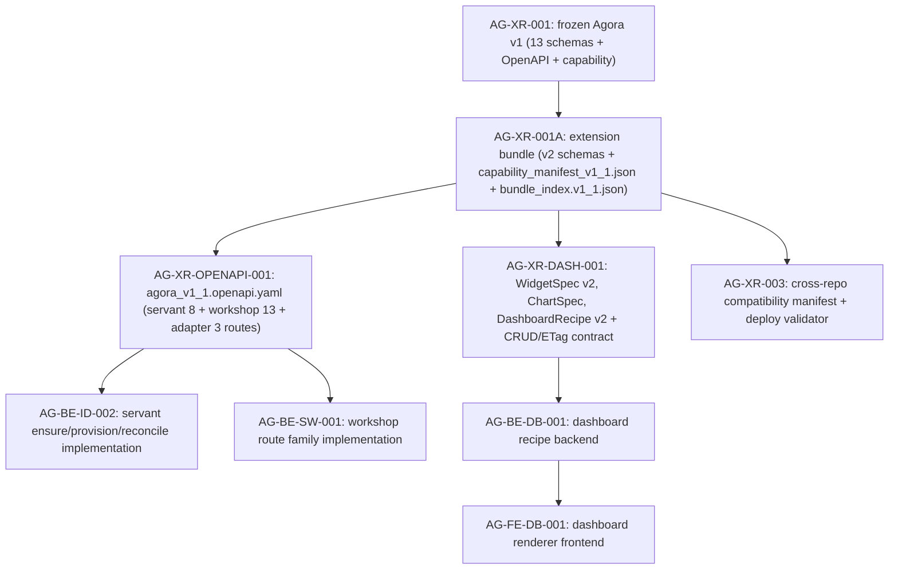

# AG-XR-OPENAPI-001 Sidecar Acceptance Packet

- Parent task: `AG-XR-OPENAPI-001` — Publish Agora OpenAPI v1.1 and capability manifest v1.1
- Helper task: `AG-XR-OPENAPI-001-SIDECAR-ACCEPTANCE`
- Helper kind: `acceptance_packet`
- Owner: `Claude`
- Reviewer: `Claude2`
- Prepared: `2026-06-20`
- Mutates canonical truth: `no`

This is a support artifact only. It does not implement the OpenAPI contract,
modify frozen AG-XR-001 specs, edit capability manifests, generate TypeScript,
or change runtime / registry / governance behavior.

## Purpose

`AG-XR-OPENAPI-001` is responsible for publishing a complete
`services/control-plane/openapi/agora_v1_1.openapi.yaml` covering all servant
(8 routes) and workshop (13 routes) BFF routes, plus confirming that the
capability manifest v1.1 delivered by `AG-XR-001A` accurately represents this
contract surface.

This packet gives the parent owner and reviewer an acceptance checklist,
route inventory, dependency map, gap analysis relative to the seed file, and
handoff guardrails for that implementation slice.

The important scoping distinctions are:

- `AG-XR-001` base schemas and OpenAPI v1 remain immutable; no verification
  hash may change.
- `AG-XR-001A` already delivered the v2 schema artifacts and
  `specs/agora/v2/capability_manifest_v1_1.json`. The capability manifest is
  already hashed in `bundle_index.v1_1.json`.
- `AG-XR-OPENAPI-001` is responsible only for the OpenAPI layer
  (`agora_v1_1.openapi.yaml`), which is currently absent.
- Dashboard routes (`feedback`, `propose-plugin`) are out of scope here; they
  belong to `AG-XR-DASH-001`.

## Sources Read

| Source | Evidence used |
|---|---|
| `AI_COLLABORATION_GUIDE.md` | Sidecar lifecycle, status commands, support-only workflow rules. |
| `ai-status.json` via `python3 scripts/ai_status.py show AG-XR-OPENAPI-001-SIDECAR-ACCEPTANCE` | Confirms owner Claude, reviewer Claude2, status `in_progress`, helper parent `AG-XR-OPENAPI-001`, `mutates_canonical: false`. |
| `.orchestrator/task-briefs/ag_xr_openapi_001_sidecar_acceptance.md` | Confirms this helper prepares acceptance packet + dependency map; does not change canonical truth. |
| `docs/04/pantheon_agora_cross_repo_2026-06-20/contract-closure/ARCHIVE_NOTES.md` | Identifies 8 routes missing from seed (5 servant session routes + 3 workshop routes). |
| `docs/04/pantheon_agora_cross_repo_2026-06-20/contract-closure/07_dispatch_unblock_matrix_v2.md` | Confirms AG-XR-OPENAPI-001 unblocks AG-BE-ID-002 and AG-BE-SW-001; defines execution order and unblock evidence. |
| `docs/04/pantheon_agora_cross_repo_2026-06-20/contract-closure/03_servant_and_workshop_contracts.md` | Canonical servant and workshop route list, capability names, path prefixes, persistence schema, concurrency semantics. |
| `docs/04/pantheon_agora_cross_repo_2026-06-20/contract-closure/agora_openapi_extension_v1_1.yaml` | Seed / illustrative extension file; 24 of 32 total routes; used as starting point only. |
| `docs/04/pantheon_agora_cross_repo_2026-06-20/contract-closure/agora_contract_extension_manifest_v1_1.json` | Seed capability manifest (absorbed into `specs/agora/v2/capability_manifest_v1_1.json` by AG-XR-001A). |
| `services/control-plane/specs/agora/v2/capability_manifest_v1_1.json` | Delivered v1.1 capability manifest; `agora.servant.v1` + `agora.workshop.v1` (with `/bff/agora/workshops` prefix) + `agora.dashboard.v2` all present. |
| `services/control-plane/specs/agora/bundle_index.v1_1.json` | Extension bundle delivered by AG-XR-001A; sha256 hashes for all five v2 artifacts including `capability_manifest_v1_1.json`. |
| `scripts/agora_schema_bundle.py --verify` | Confirmed 15 v1 files still pass digest check; base bundle intact. |
| `docs/04/pantheon_agora_cross_repo_2026-06-20/contract-closure/INDEX.md` | Contract-closure authority note and decision summary. |
| `support/sidecars/AG-XR-001A/AG-XR-001A-SIDECAR-ACCEPTANCE.md` | Sister sidecar; used as structural template; confirms AG-XR-001A dependency chain. |

`current-work.md` and the full `ai-activity-log.jsonl` were not read.

## Current Repository Observation

As of this sidecar packet preparation:

**Already delivered (AG-XR-001A — complete):**

| Artifact | Path | Status |
|---|---|---|
| V1 base schema bundle (13 schemas) | `services/control-plane/specs/agora/*.schema.json` | Frozen ✓ |
| V1 capability manifest | `services/control-plane/specs/agora/capability_manifest.json` | Frozen ✓ |
| V1 bundle index | `services/control-plane/specs/agora/bundle_index.json` | Frozen ✓ |
| V1 OpenAPI | `services/control-plane/openapi/agora_v1.openapi.yaml` | Frozen ✓ |
| V2 schema directory | `services/control-plane/specs/agora/v2/` | Delivered ✓ |
| WidgetSpec v2 | `specs/agora/v2/widget_spec_v2.schema.json` | Hashed ✓ |
| ChartSpec v1 | `specs/agora/v2/chart_spec_v1.schema.json` | Hashed ✓ |
| DashboardRecipe v2 | `specs/agora/v2/dashboard_recipe_v2.schema.json` | Hashed ✓ |
| Compatibility manifest schema | `specs/agora/v2/compatibility_manifest.schema.json` | Hashed ✓ |
| Capability manifest v1.1 | `specs/agora/v2/capability_manifest_v1_1.json` | Hashed ✓ |
| Extension bundle index | `services/control-plane/specs/agora/bundle_index.v1_1.json` | Committed ✓ |

**Still absent (AG-XR-OPENAPI-001 responsibility):**

| Artifact | Expected path | Owner |
|---|---|---|
| Agora OpenAPI v1.1 — complete servant + workshop | `services/control-plane/openapi/agora_v1_1.openapi.yaml` | AG-XR-OPENAPI-001 |

## Route Inventory

The following tables record the complete servant and workshop route set
that `agora_v1_1.openapi.yaml` must cover, cross-referenced against the
seed extension file and the prose authority in `03_servant_and_workshop_contracts.md`.

### Servant Routes (8 routes)

| # | Method | Path | In seed? | operationId |
|---|---|---|---|---|
| 1 | GET | `/bff/agora/servant` | ✓ | `getAgoraServant` |
| 2 | POST | `/bff/agora/servant/ensure` | ✓ | `ensureAgoraServant` |
| 3 | POST | `/bff/agora/servant/reconcile` | ✓ | `reconcileAgoraServant` |
| 4 | POST | `/bff/agora/servant/sessions` | ✗ **MISSING** | `createAgoraServantSession` |
| 5 | GET | `/bff/agora/servant/sessions/{session_id}` | ✗ **MISSING** | `getAgoraServantSession` |
| 6 | POST | `/bff/agora/servant/sessions/{session_id}/messages` | ✗ **MISSING** | `postAgoraServantSessionMessage` |
| 7 | POST | `/bff/agora/servant/sessions/{session_id}/terminate` | ✗ **MISSING** | `terminateAgoraServantSession` |
| 8 | GET | `/bff/agora/servant/sessions/{session_id}/stream` | ✗ **MISSING** | `streamAgoraServantSession` |

Routes 4–8 are missing from the seed; the parent must author them from
`03_servant_and_workshop_contracts.md` as authority.

### Workshop Routes (13 routes)

| # | Method | Path | In seed? | operationId |
|---|---|---|---|---|
| 1 | GET | `/bff/agora/workshops` | ✓ | `listAgoraWorkshops` |
| 2 | POST | `/bff/agora/workshops` | ✓ | `createAgoraWorkshop` |
| 3 | GET | `/bff/agora/workshops/{workshop_id}` | ✓ | `getAgoraWorkshop` |
| 4 | POST | `/bff/agora/workshops/{workshop_id}/messages` | ✓ | `postAgoraWorkshopMessage` |
| 5 | GET | `/bff/agora/workshops/{workshop_id}/events` | ✓ | `listAgoraWorkshopEvents` |
| 6 | GET | `/bff/agora/workshops/{workshop_id}/completeness` | ✓ | `getAgoraWorkshopCompleteness` |
| 7 | GET | `/bff/agora/workshops/{workshop_id}/versions` | ✓ | `listAgoraWorkshopVersions` |
| 8 | POST | `/bff/agora/workshops/{workshop_id}/versions` | ✓ | `createAgoraWorkshopVersion` |
| 9 | POST | `/bff/agora/workshops/{workshop_id}/versions/{version_id}/select` | ✓ | `selectAgoraWorkshopVersion` |
| 10 | POST | `/bff/agora/workshops/{workshop_id}/research-runs` | ✗ **MISSING** | `createAgoraWorkshopResearchRun` |
| 11 | POST | `/bff/agora/workshops/{workshop_id}/consultations` | ✗ **MISSING** | `createAgoraWorkshopConsultation` |
| 12 | POST | `/bff/agora/workshops/{workshop_id}/conclude` | ✗ **MISSING** | `concludeAgoraWorkshop` |
| 13 | GET | `/bff/agora/workshops/{workshop_id}/stream` | ✓ | `streamAgoraWorkshop` |

Routes 10–12 are missing from the seed; the parent must author them from prose.

### Internal Adapter Routes (3 routes — OpenClaw adapter)

These are internal service-to-service routes defined in
`03_servant_and_workshop_contracts.md`. They must appear in `agora_v1_1.openapi.yaml`
under a separate `agora-servant-adapter` tag.

| # | Method | Path | operationId |
|---|---|---|---|
| 1 | POST | `/api/openclaw-adapter/agents/ensure` | `ensureOpenClawAgent` |
| 2 | GET | `/api/openclaw-adapter/agents/{persona_id}` | `getOpenClawAgent` |
| 3 | POST | `/api/openclaw-adapter/agents/{persona_id}/reconcile` | `reconcileOpenClawAgent` |

### Out of Scope for This Task

Dashboard routes (`/bff/agora/dashboard-recipes`, `/bff/agora/widgets`,
`/bff/agora/strategies`) belong to `AG-XR-DASH-001`. The seed file includes
them as an illustrative preview; the parent must not include them in
`agora_v1_1.openapi.yaml` to avoid scope bleed.

The 3 dashboard gap routes (feedback + propose-plugin) are also out of scope:
`AG-XR-DASH-001` owns them.

## Parent Acceptance Checklist

| Check | Expected parent evidence | Sidecar stance |
|---|---|---|
| Preserve AG-XR-001 immutable base | `python3 scripts/agora_schema_bundle.py --verify` still passes; no v1 files modified | Required |
| Preserve AG-XR-001A delivered artifacts | `bundle_index.v1_1.json` sha256 hashes unchanged; v2 schema files unmodified | Required |
| Deliver `agora_v1_1.openapi.yaml` | File exists at `services/control-plane/openapi/agora_v1_1.openapi.yaml`; `openapi: 3.1.0`; `info.version: 1.1.0` | Parent implementation |
| Servant route completeness (8 routes) | All 8 servant routes are present; routes 4–8 authored from `03_servant_and_workshop_contracts.md` prose | Parent implementation; required to unblock AG-BE-ID-002 |
| Workshop route completeness (13 routes) | All 13 workshop routes present; routes 10–12 (research-runs, consultations, conclude) authored from prose | Parent implementation; required to unblock AG-BE-SW-001 |
| Internal adapter routes (3 routes) | `POST /api/openclaw-adapter/agents/ensure`, `GET .../agents/{persona_id}`, `POST .../reconcile` present under `agora-servant-adapter` tag | Parent implementation |
| Capability manifest accuracy | `specs/agora/v2/capability_manifest_v1_1.json` `agora.servant.v1` path prefixes match all servant BFF and adapter paths; `agora.workshop.v1` includes `/bff/agora/workshops` | Verify — manifest already committed |
| Concurrency headers on mutating servant routes | `POST /servant/sessions` and session sub-routes carry `Idempotency-Key` where required by prose | Required by contract |
| Concurrency headers on mutating workshop routes | Mutating workshop routes carry `If-Match` + `Idempotency-Key`; GET aggregate returns `ETag` header | Required by contract |
| No dashboard routes in OPENAPI-001 output | `agora_v1_1.openapi.yaml` does not include dashboard-recipes, widgets, or strategies paths | Required — scope boundary |
| No broker / capital / RuntimeBinding authority | None of the 21+3 routes imply live-order routing, capital binding, RuntimeBinding writes, or management-plane authority | Reviewer must reject violations |
| `Authorization` header requirement on all routes | Top-level `security: [{BearerAuth: []}]` inherited; servant ensure also documents `X-Request-Id` and `Idempotency-Key` required headers | Required by prose |
| Schema references resolve | Any `$ref` to `specs/agora/v2/*.schema.json` or `specs/agora/*.schema.json` in the generated OpenAPI resolves to committed files | Parent implementation |
| Seed-prose gap resolution | Parent confirms 8 missing routes were authored from prose, not left as TODOs | Required before review sign-off |

## Dependency Map



Durable interpretation:

- `AG-XR-001A` is the direct prerequisite; it is done and has been merged.
- `AG-XR-OPENAPI-001` owns only the OpenAPI layer; the capability manifest
  layer is already committed by `AG-XR-001A` and must not be re-authored.
- `AG-XR-OPENAPI-001` completing its deliverable is a hard gate before
  `AG-BE-ID-002` or `AG-BE-SW-001` can begin implementation.
- `AG-XR-003` (compatibility manifest + deploy validator) depends on the
  `bundle_index.v1_1.json` SHA and the committed OpenAPI hash, so its
  sha256-pinning cannot be finalized until `agora_v1_1.openapi.yaml` is
  merged and its digest is stable.

## Reviewer Questions For Claude2

| Question | Expected reviewer stance |
|---|---|
| Does this packet preserve the support-only boundary? | Approve only if no canonical specs, OpenAPI, capability files, runtime code, or registry/governance implementation were edited by this sidecar. |
| Are the missing servant session routes documented correctly? | Approve if the 5 missing routes (4–8) match `03_servant_and_workshop_contracts.md` exactly and are flagged as parent responsibility. |
| Are the missing workshop routes documented correctly? | Approve if the 3 missing routes (research-runs, consultations, conclude) match the prose and are flagged as parent responsibility. |
| Is dashboard scope excluded? | Approve only if dashboard routes are clearly marked out of scope and not included in the OPENAPI-001 acceptance checklist. |
| Does the dependency map match `07_dispatch_unblock_matrix_v2.md`? | Approve if AG-XR-OPENAPI-001 sits after AG-XR-001A and upstream of both AG-BE-ID-002 and AG-BE-SW-001. |
| Are broker/capital/runtime authority limits explicit? | Approve only if no live-order, capital-binding, or RuntimeBinding authority is implied by any route in the checklist. |
| Is the capability manifest pre-delivery observation accurate? | Approve if the observation correctly reflects that `capability_manifest_v1_1.json` is already hashed in `bundle_index.v1_1.json` and should not be re-authored. |

## Suggested Handoff

If this packet is acceptable, reviewer `Claude2` can treat it as the support
acceptance and dependency map for `AG-XR-OPENAPI-001-SIDECAR-ACCEPTANCE`.

Recommended status handoff message:

```text
Support packet ready for AG-XR-OPENAPI-001: acceptance checklist and dependency
map are in support/sidecars/AG-XR-OPENAPI-001/AG-XR-OPENAPI-001-SIDECAR-ACCEPTANCE.md.
The packet confirms the capability manifest is already delivered by AG-XR-001A,
identifies the 8 routes missing from the seed file, and provides the complete
21+3 route inventory for agora_v1_1.openapi.yaml. No canonical truth was changed.
```

## Verification

Commands run while preparing this packet:

```bash
git branch --show-current
git status --short
python3 scripts/ai_status.py show AG-XR-OPENAPI-001-SIDECAR-ACCEPTANCE
python3 scripts/agora_schema_bundle.py --verify
ls services/control-plane/specs/agora/v2/
ls services/control-plane/openapi/
cat services/control-plane/specs/agora/bundle_index.v1_1.json
cat services/control-plane/specs/agora/v2/capability_manifest_v1_1.json
```

Results:

- `git branch --show-current`: `task/AG-XR-OPENAPI-001-SIDECAR-ACCEPTANCE` — correct branch.
- `git status --short`: only `?? .orchestrator/task-briefs/ag_xr_openapi_001_sidecar_acceptance.md`
  untracked at start — no dirty canonical files.
- `python3 scripts/agora_schema_bundle.py --verify`: 15 v1 files all report `OK`; base bundle intact.
- `ls services/control-plane/specs/agora/v2/`: `capability_manifest_v1_1.json`,
  `chart_spec_v1.schema.json`, `compatibility_manifest.schema.json`,
  `dashboard_recipe_v2.schema.json`, `widget_spec_v2.schema.json` — 5 files present as expected.
- `ls services/control-plane/openapi/`: only `agora_v1.openapi.yaml` — `agora_v1_1.openapi.yaml`
  is absent, confirming the parent task work is still needed.
- `bundle_index.v1_1.json`: confirms 5 v2 extension files are hashed; no OpenAPI hash yet.
- `capability_manifest_v1_1.json`: `agora.servant.v1`, `agora.workshop.v1`,
  `agora.dashboard.v2` all present with correct path prefixes.

## Sidecar Completion Criteria

This sidecar is ready for review when:

- this support packet exists at `support/sidecars/AG-XR-OPENAPI-001/AG-XR-OPENAPI-001-SIDECAR-ACCEPTANCE.md`;
- it documents the complete 21+3 route inventory and the 8 seed gaps;
- it maps the dependency and unblock chain without broadening scope;
- it preserves the "no canonical truth changes" sidecar boundary;
- it is handed off to `Claude2` for review and possible absorption by the
  parent task owner.
