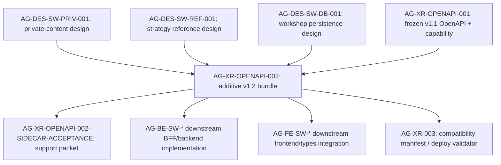

# AG-XR-OPENAPI-002 Sidecar Acceptance Packet

- Parent task: `AG-XR-OPENAPI-002` - Additive Agora v1.2 OpenAPI / capability / schema bundle
- Helper task: `AG-XR-OPENAPI-002-SIDECAR-ACCEPTANCE`
- Helper kind: `acceptance_packet`
- Owner: `Codex2`
- Reviewer: `Codex`
- Generated: `2026-06-21`
- Baseline inspected: `origin/dev` / `c1b18d8d0388baa0d7cf64f44391cbd7770f8916`
- Closeout refresh: `origin/dev` / `a18483216a6499ed60c88bdc7abd6e00cc36e5a4`
  after reviewer sidecar PR `#1988` and FE sidecar closeout PR `#1991`;
  focused checks re-ran clean.
- Parent merge evidence: Pantheon PR `#1983` merged implementation commit `f7e0b2b9`; PR `#1985` merged parent closeout commit `0766e51d`
- Mutates canonical truth: `no`

This is a support artifact only. It does not edit
`agora_v1_2.openapi.yaml`, capability manifests, schema bundle indexes, runtime
registry behavior, BFF/adapter implementation, governance behavior, deployment
workflow, or L1/L2 canonical documents.

## Purpose

`AG-XR-OPENAPI-002` is closed as `done` and delivered the additive Agora v1.2
contract bundle on top of the frozen v1 and v1.1 surfaces. This sidecar packet
gives downstream owners a compact acceptance checklist, dependency map,
evidence notes, and reviewer context for follow-on implementation work.

The sidecar stance is narrow:

- accept the v1.2 bundle as a closed contract artifact after the parent owner
  preserved the frozen v1/v1.1 boundary and recorded closeout;
- keep implementation work in downstream backend/frontend/runtime tasks;
- do not use this sidecar as authority to change canonical truth or live
  execution behavior.

## Sources Read

| Source | Evidence used |
|---|---|
| `AI_NAME=Codex2 ./scripts/ai-status.sh show AG-XR-OPENAPI-002` | Parent status is archived `done`; delivery notes list PR `#1985`, closeout commit `0766e51d`, and 5/5 bundle checks with frozen v1/v1.1 diff guard. |
| `AI_NAME=Codex2 ./scripts/ai-status.sh show AG-XR-OPENAPI-002-SIDECAR-ACCEPTANCE` | Sidecar scope is support-only, owner `Codex2`, reviewer `Codex`, artifact path is this packet. |
| `.orchestrator/task-reviews/ag_xr_openapi_002_review_claude2.md` | Parent review artifact is present on the refreshed `dev` baseline and records an approved review of PR `#1983`, task commit `f7e0b2b9`, 5/5 tests, bundle verifier, and frozen-file diff guard. |
| `services/control-plane/openapi/agora_v1_2.openapi.yaml` | Confirms OpenAPI 3.1.0, info version 1.2.0, additive v1.2 description, v1.1 extension pointer, v1.2 capability manifest pointer, persistence/private-content/strategy-ref pointers, route inventory, lifecycle filter wording, private-content projection rules, and section 9 error codes. |
| `services/control-plane/specs/agora/v3/capability_manifest_v1_2.json` | Confirms manifest version 1.2, extends v1.1 manifest, `extension_by: AG-XR-OPENAPI-002`, workshop lifecycle/status-group authority order, private-content rules, strategy-ref rules, and error-code map. |
| `services/control-plane/specs/agora/bundle_index.v1_2.json` | Confirms bundle version 1.2, exact v1.1 bundle hash, and hashes for six v3 schemas, capability manifest v1.2, and OpenAPI v1.2. |
| `scripts/test_agora_v1_2_bundle.py` | Confirms local test intent: v1.2 extends exact v1.1 bytes, v1.2 file hashes match exact bytes, canonical workshop status filters are present, private-content/projection contracts hold, and capability manifest authority/privacy contracts hold. |
| `python3 -m pytest scripts/test_agora_v1_2_bundle.py -q` | Re-ran the focused v1.2 bundle checks on this baseline; 5 passed. |
| `sha256sum` on v1.1/v1.2 bundle files | Confirms observed hashes for frozen v1.1 and delivered v1.2 artifacts on this baseline. |

`current-work.md` and the full `ai-activity-log.jsonl` were not read.

## Evidence Snapshot

| Surface | Observed state | Acceptance stance |
|---|---|---|
| Parent lifecycle | archived `done`, owner `Codex`, reviewer `Claude2` | Parent owner completed formal closeout through PR `#1985`; this sidecar remains support-only context for downstream work. |
| Review artifact path | `.orchestrator/task-reviews/ag_xr_openapi_002_review_claude2.md` is present on the refreshed baseline. | PASS; review evidence is durable with the parent closeout record. |
| OpenAPI v1.2 | `openapi: 3.1.0`, `info.version: 1.2.0`; info extensions point to v1.1 OpenAPI, v1.2 manifest, persistence/private-content/strategy-ref contracts. | Meets additive contract packaging expectation. |
| Bundle index v1.2 | Extends `bundle_index.v1_1.json` with sha256 `5f875202966d1e373ab325b7107de8355798f1e3f55cdac2548aa74607a821ee`; includes v3 schema, v1.2 manifest, and v1.2 OpenAPI hashes. | Satisfies exact-byte inheritance model. |
| Frozen v1.1 hash | `bundle_index.v1_1.json` sha256 is `5f875202966d1e373ab325b7107de8355798f1e3f55cdac2548aa74607a821ee`; `agora_v1_1.openapi.yaml` sha256 is `16aa660db15a32aaccd63a7f0594abb4339e9ae95afae18353fbee532c2c0749`. | No local diff against `HEAD`; sidecar does not mutate frozen files. |
| v1.2 artifact hashes | `bundle_index.v1_2.json` sha256 `7ea445d379bca1fe142272dd873c59107abe2d9cd5122d0258d40b1791b30f70`; `agora_v1_2.openapi.yaml` sha256 `12a3bf39d467e254f406ba75e4388e967b36647a49971844dcb5ae1e2611a036`; `capability_manifest_v1_2.json` sha256 `57a1edacf34d7466972b6f27c6def9516bda2a5a2c4c6894faacdb09ca5a9f7b`. | Matches bundle index file entries for OpenAPI and manifest. |
| Route inventory | v1.2 contains v1.1 servant, adapter, workshop, and dashboard route families; workshop routes remain 13 under `/bff/agora/workshops`. | v1.2 is additive and does not remove v1.1 families. |
| Lifecycle filters | Workshop status enum is `open`, `in_review`, `concluded`, `archived`; `status_group=active` aliases `open + in_review`; `status=active` is not a v1.2 lifecycle status. | Meets parent requirement to replace v1.1 `active` wording through v1.2 authority order. |
| Private-content creation | `WorkshopCreateRequest` and `WorkshopMessageRequest` accept owner raw text and do not expose client-submitted `private_content_ref`; BFF creates references server-side. | Meets browser/private-content boundary. |
| Projection split | `OwnerWorkshopEventResponse` may include owner-visible `content`; `ManagementWorkshopEventProjection` includes `redacted_summary` and excludes raw `content` / `private_content_ref`. | Meets owner vs management projection rule. |
| Error semantics | `ErrorResponse` includes the private-content, strategy-reference, workshop-state, version, and concurrency error codes from the parent task. | Meets section 9 error-code coverage. |

## Parent Acceptance Checklist

| Parent acceptance surface | Evidence | Sidecar verdict |
|---|---|---|
| v1.2 bundle validates | `python3 -m pytest scripts/test_agora_v1_2_bundle.py -q` returned 5 passed on this baseline. | PASS. |
| Frozen v1/v1.1 bundle files are not edited | `git diff --name-status HEAD --` on v1.1/v1.2 surfaces is empty; v1.2 bundle extends exact v1.1 bundle hash. | PASS for this baseline. |
| `bundle_index.v1_2.json` extends and hashes v1.1 exact bytes | `extends.bundle_index_sha256` equals observed sha256 of `bundle_index.v1_1.json`. | PASS. |
| v1.2 replaces v1.1 `active` lifecycle wording | OpenAPI description and manifest authority order state v1.2 supersedes `status=active`; `active` only remains as `status_group`. | PASS. |
| Workshop create/message do not accept client `private_content_ref` | Parsed schema properties omit `private_content_ref` from `WorkshopCreateRequest` and `WorkshopMessageRequest`. | PASS. |
| Management projection excludes raw content | Parsed `ManagementWorkshopEventProjection` omits `content` and `private_content_ref`; OpenAPI prose says management receives redacted summaries only. | PASS. |
| v3 schema and manifest files are included in v1.2 bundle | Bundle index includes six v3 schema files plus `capability_manifest_v1_2.json`. | PASS. |
| Section 9 error codes are visible in contract and manifest | OpenAPI `ErrorResponse` and manifest `error_codes` include private-content, strategy-ref, state, version, and concurrency errors. | PASS. |
| No runtime / registry / governance implementation is changed by this sidecar | This file is the only intended support artifact. | PASS for sidecar scope. |
| Review file is durable | Parent review file is present on the refreshed baseline and records Claude2 approval. | PASS. |

## Dependency Map



Durable interpretation:

- `AG-XR-OPENAPI-002` is a contract bundle task, not a runtime
  implementation task.
- Downstream BFF/backend work should implement the v1.2 workshop lifecycle,
  server-side private-content reference creation, projection split, persistence
  indexes, and section 9 errors without editing frozen v1/v1.1 files.
- Downstream frontend/types work should treat `status_group=active` as the
  active-list alias and must not submit `private_content_ref` from the browser.
- `AG-XR-003` or later compatibility work should consume the v1.2 bundle hashes
  and preserve the exact-byte inheritance chain.

## Reviewer Attention Items

| Item | Why it matters | Suggested reviewer action |
|---|---|---|
| Parent already closed | Parent `AG-XR-OPENAPI-002` is now archived `done`, so this packet should be treated as downstream support context rather than a prerequisite for parent closeout. | Use the packet to seed follow-on implementation acceptance; do not reopen the closed parent from this sidecar. |
| `origin/dev` advanced during packet prep and closeout | Baseline was refreshed to `c1b18d8d` during packet prep, then to `08390874` after reviewer sidecar PR `#1988`, and finally to `a1848321` after FE sidecar closeout PR `#1991`; the AG-XR v1.2 surfaces did not change in the intervening closeout, FE sidecar, and reviewer sidecar commits. | If reviewing after more dev merges, re-run the focused checks below. |
| Scope separation | This packet is not permission to mutate OpenAPI, runtime, registry, governance, broker, or capital paths. | Review only the support packet and parent acceptance mapping. |

## Suggested Handoff To Reviewer

```text
Support-only acceptance packet ready:
support/sidecars/AG-XR-OPENAPI-002/AG-XR-OPENAPI-002-SIDECAR-ACCEPTANCE.md

Baseline: origin/dev c1b18d8d. Parent AG-XR-OPENAPI-002 is archived done.
Packet verifies the v1.2 acceptance matrix, dependency map, exact-byte v1.1
inheritance, lifecycle/status_group semantics, server-side private_content_ref
boundary, owner/management projection split, and section 9 error coverage.

Attention: parent review evidence is now durable at
.orchestrator/task-reviews/ag_xr_openapi_002_review_claude2.md. This packet is
support-only and should not mutate canonical OpenAPI, runtime, registry,
governance, broker, or capital paths.
```

## Verification

Commands run while preparing the packet:

```bash
git fetch origin dev
git merge --no-edit origin/dev
AI_NAME=Codex2 ./scripts/ai-status.sh show AG-XR-OPENAPI-002
AI_NAME=Codex2 ./scripts/ai-status.sh show AG-XR-OPENAPI-002-SIDECAR-ACCEPTANCE
sha256sum \
  services/control-plane/specs/agora/bundle_index.v1_1.json \
  services/control-plane/openapi/agora_v1_1.openapi.yaml \
  services/control-plane/specs/agora/bundle_index.v1_2.json \
  services/control-plane/openapi/agora_v1_2.openapi.yaml \
  services/control-plane/specs/agora/v3/capability_manifest_v1_2.json
git diff --name-status HEAD -- \
  services/control-plane/specs/agora/bundle_index.v1_1.json \
  services/control-plane/openapi/agora_v1_1.openapi.yaml \
  services/control-plane/specs/agora/bundle_index.v1_2.json \
  services/control-plane/openapi/agora_v1_2.openapi.yaml \
  services/control-plane/specs/agora/v3/capability_manifest_v1_2.json
```

```bash
python3 -m pytest scripts/test_agora_v1_2_bundle.py -q
# -> 5 passed in 2.00s
git diff --check -- support/sidecars/AG-XR-OPENAPI-002/AG-XR-OPENAPI-002-SIDECAR-ACCEPTANCE.md
# -> clean
```

Commands re-run during owner closeout refresh after merging reviewer sidecar
PR `#1988` and FE sidecar closeout PR `#1991` into this task branch:

```bash
git merge --no-edit origin/dev
AI_NAME=Codex2 ./scripts/ai-status.sh show AG-XR-OPENAPI-002-SIDECAR-ACCEPTANCE
python3 -m pytest scripts/test_agora_v1_2_bundle.py -q
# -> 5 passed in 4.84s
git diff --check -- \
  support/sidecars/AG-XR-OPENAPI-002/AG-XR-OPENAPI-002-SIDECAR-ACCEPTANCE.md \
  support/sidecars/AG-XR-OPENAPI-002/AG-XR-OPENAPI-002-SIDECAR-REVIEW.md
# -> clean
git diff --name-status HEAD -- \
  services/control-plane/specs/agora/bundle_index.v1_1.json \
  services/control-plane/openapi/agora_v1_1.openapi.yaml \
  services/control-plane/specs/agora/bundle_index.v1_2.json \
  services/control-plane/openapi/agora_v1_2.openapi.yaml \
  services/control-plane/specs/agora/v3/capability_manifest_v1_2.json
# -> clean
```
